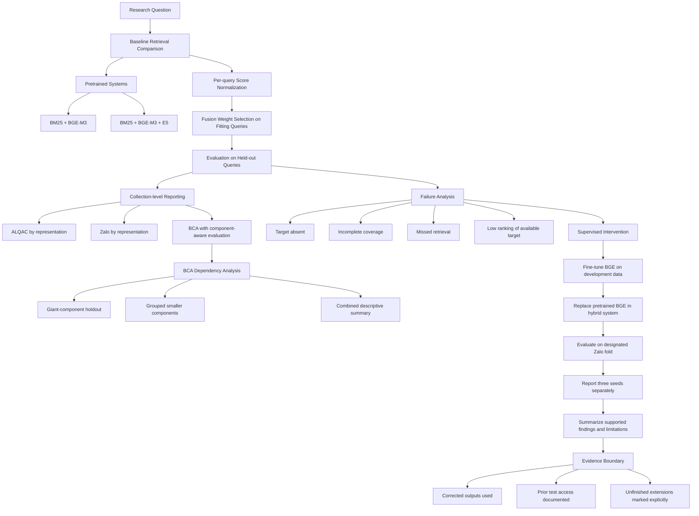
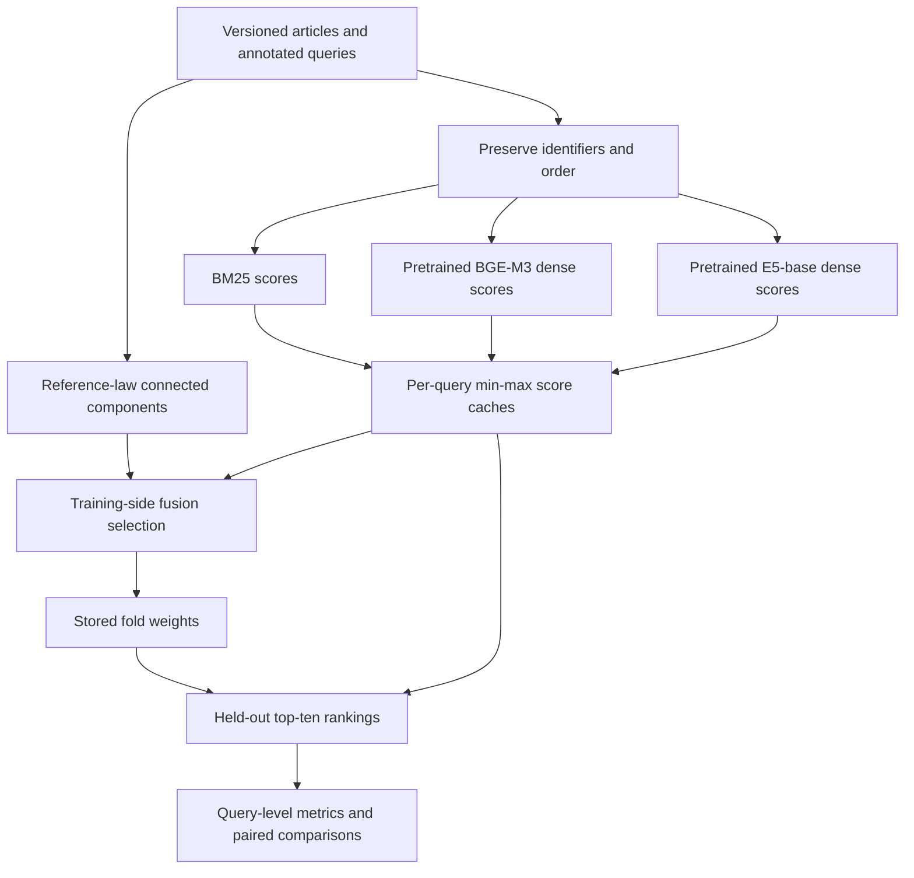
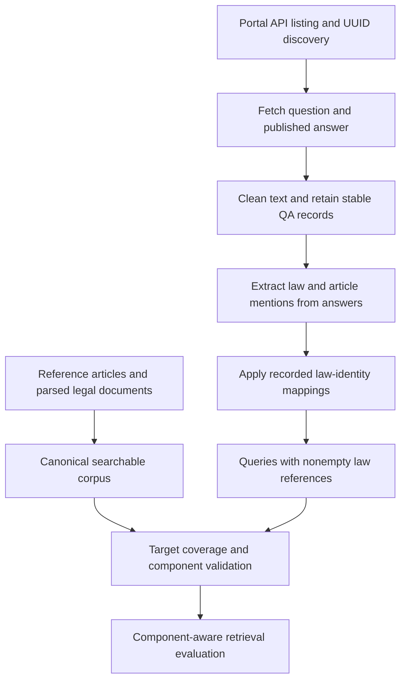
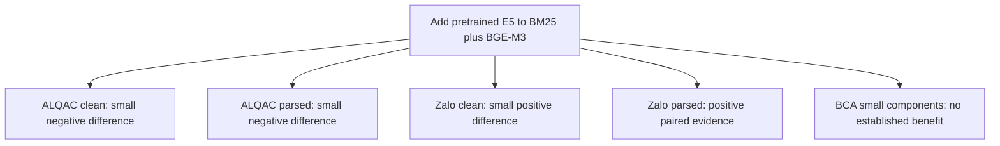
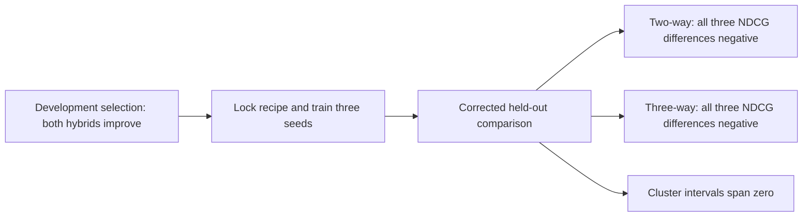

# Hybrid Retrieval and Legal-Domain Adaptation for Vietnamese Legal Information Retrieval

**Master's thesis manuscript**  
**Author:** Nghiem Phan Thanh Tuan  
**Institution:** FPT University  
**Programme:** Master's-level software engineering research; official degree wording pending confirmation  
**Manuscript evidence audit:** 12 September 2026; completed dense and primary fusion evidence integrated  
**Primary artifact:** `pdf/thesisproposalTuan.md`

This single-file manuscript develops the project proposal into a complete evidence-based research account. Completed experiments and corrected analyses are distinguished from unfinished extensions. The reported results concern retrieval, not the quality or legal correctness of generated answers. Formal university formatting and personal front-matter declarations remain subject to author confirmation.

## Declaration of Authorship
I declare that this thesis is my own work and has been prepared in accordance with accepted standards of academic integrity. All sources and materials used in this research have been appropriately acknowledged and cited.

The work presented in this thesis has not been submitted, either in whole or in part, for any other degree or academic qualification at this or any other institution.

I take full responsibility for the content, accuracy, and academic integrity of this thesis.

## Acknowledgements

I would like to express my sincere gratitude to my thesis supervisor, Dr. Doan Nhat Quang, for his invaluable guidance, constructive feedback, and continuous support throughout this research. His academic advice and technical insights played an important role in shaping the direction of the study and refining the proposed framework.

I am also grateful to the faculty and staff of the FPT School of Business & Technology (FSB) for providing a supportive and well-structured academic environment, as well as for the knowledge and experience shared throughout the Master's programme. I would also like to thank my colleagues and peers for their valuable discussions, suggestions, and feedback during the research process.

Finally, I would like to express my heartfelt appreciation to my family for their patience, encouragement, and continued support throughout my graduate studies.

Nghiem Phan Thanh Tuan -- 2026

## Abstract

Vietnamese legal information retrieval requires ranking relevant provisions despite differences between question language and legal text, competing articles, and imperfect corpus coverage. This thesis investigates sparse–dense hybrid retrieval and legal-domain adaptation using preserved project artifacts. The baseline combines BM25 and pretrained BGE-M3 and tests the incremental contribution of multilingual-E5-Base. ALQAC and Zalo are evaluated under clean and parsed corpus conditions with law-component grouped selection. BCA uses a corrected component-aware protocol that separates a giant-component holdout from small-component inference. NDCG@10 is the primary ranking metric; Hit@1/5/10, MRR@10, and MAP@10 retain their actual implemented meanings.

The project also creates the Bộ Công an QA collection by collecting published website questions and answers through the portal API, cleaning text, extracting answer-based citations, and aligning legal identifiers with the retrieval corpus. Its canonical source snapshot contains 652 QA records, with 546 retained for retrieval evaluation. This dataset-construction contribution provides the basis for the BCA coverage and component-aware analysis; extracted citations are not presented as independently exhaustive expert judgments.

Read-only reaggregation of canonical score caches supplies standalone comparators and reproduces the published hybrid aggregates exactly. Hybrid scores exceed the fixed BM25 baseline across the reported conditions, but the second dense retriever has condition-dependent value. Adding E5 changes NDCG@10 by approximately −0.002093 and −0.001154 on ALQAC clean and parsed, +0.001292 on Zalo clean, and +0.013010 on Zalo parsed. The strongest supplied paired evidence favors parsed Zalo. Corrected BCA small-component inference does not establish an incremental advantage, while corpus diagnostics identify unavailable and partially available targets.

A completed legal-domain BGE-M3 adaptation study selects its configuration on development queries and evaluates three training seeds in fixed-weight two-way and three-way hybrids. The corrected selection uses two epochs, learning rate 2e-5, and query batch four. Development gains of +0.060945 and +0.068882 NDCG@10 do not persist in the corrected 640-query held-out comparison: mean changes are −0.052045 and −0.024891, respectively. Every tested seed has lower primary effectiveness than its corresponding pretrained hybrid. Stored cluster-bootstrap intervals span zero, so the numerical regressions are not described as statistically established population-level harm. The analysis is explicitly corrective and post-hoc following an earlier document-identity error.

The completed later study closes the dense-only result gap: mean NDCG@10 increases by 0.018866, but mean Recall@100 decreases by 0.009115. Under pretrained-locked weights, the two-way hybrid changes by −0.004295 and the three-way hybrid by +0.000898 NDCG@10. Neither hybrid reaches the specified +0.01 improvement threshold. These results demonstrate why encoder gains must be evaluated again inside the complete hybrid. The later study is a post-hoc fixed-corpus query benchmark with previously observed official test data. It does not establish generalization to unseen laws, future legal text, or a pristine confirmatory test. Cross-collection fine-tuning transfer, secondary retuned-weight outcomes, and controlled serving costs remain evidence requirements. The earlier corrected hybrid regressions remain a separate result for a different training recipe. 
Sources: 
[dense results](../experiments/LEGAL_BGE_DENSE_BENCH_20260830T054623Z_6a8c7b00/official_dense_benchmark_results.json), 
[two-way results](../experiments/LEGAL_BGE_DENSE_BENCH_20260830T054623Z_6a8c7b00/two_way_fusion_results.json), and [three-way results](../experiments/LEGAL_BGE_DENSE_BENCH_20260830T054623Z_6a8c7b00/three_way_fusion_results.json).

**Keywords:** Vietnamese legal retrieval; BM25; BGE-M3; multilingual-E5; hybrid retrieval; contrastive fine-tuning; NDCG; generalisation; reproducibility.

## Table of Contents

- [1. Introduction](#1-introduction)
- [2. Literature Review](#2-literature-review)
- [3. Theoretical Background](#3-theoretical-background)
- [4. Proposed Methodology](#4-proposed-methodology)
- [5. Experimental Evaluation](#5-experimental-evaluation)
- [6. Conclusion and Future Work](#6-conclusion-and-future-work)
- [References](#references)
- [Appendix A. Dataset Details](#appendix-a-dataset-details)
- [Appendix B. Full Hyperparameter Search Space](#appendix-b-full-hyperparameter-search-space)
- [Appendix C. Complete Verified Metric Tables](#appendix-c-complete-verified-metric-tables)
- [Appendix D. Fine-Tuning Configurations](#appendix-d-fine-tuning-configurations)
- [Appendix E. Failure-Case Examples](#appendix-e-failure-case-examples)
- [Appendix F. Reproducibility Instructions](#appendix-f-reproducibility-instructions)
- [Appendix G. Additional Figures, Evidence Audit, and Remaining Requirements](#appendix-g-additional-figures-evidence-audit-and-remaining-requirements)

## List of Figures

- Figure 4.1. Baseline scoring and evaluation architecture.
- Figure 4.2. Construction of the project-created Bộ Công an QA retrieval dataset.
- Figure 4.3. Training and evaluation evidence flow.
- Figure G.1. Direction of the incremental E5 result by evaluation condition.
- Figure G.2. Development and corrected held-out outcome of hybrid adaptation.

## List of Tables

- Table 2.1. Prior research grouped by task, intervention, and evaluation role.
- Table 4.1. Canonical baseline evaluation conditions.
- Table 4.2. Worked BCA question-to-target transformation.
- Table 4.3. Baseline dense-model identity.
- Table 4.4. Training groups and protected folds in the completed hybrid fine-tuning study.
- Table 4.5. Locked configuration for the completed final-training runs.
- Table 5.1. System identities and comparison boundaries.
- Table 5.2. Pretrained standalone and hybrid results, query-macro OOF population.
- Table 5.3. Hybrid NDCG@10 changes relative to fixed BM25.
- Table 5.4. Incremental E5 contribution on the canonical ALQAC/Zalo populations.
- Table 5.5. Complete corrected BCA protocol and coverage views.
- Table 5.6. Deterministically selected real baseline boundary cases.
- Table 5.7. Corrected passage-512 learning-rate and epoch pilot: development NDCG@10.
- Table 5.8. Corrected batch ablation at the selected learning rate and epoch.
- Table 5.9. Corrected Zalo fold-0 two-way hybrid evaluation.
- Table 5.10. Corrected Zalo fold-0 three-way hybrid evaluation.
- Table 5.11. Stored corrected paired statistics for NDCG@10.
- Table 5.12. Availability of completed fine-tuned evaluation evidence.
- Table 5.13. Query-level changes after fine-tuning, corrected seed 42.
- Table 5.14. Representative corrected seed-42 two-way ranking changes.
- Table 5.15. Later post-hoc dense benchmark on 640 official queries.
- Table 5.16. Later primary fusion outcomes under pretrained-locked weights.
- Table 5.17. Later-study NDCG changes by query, using mean fine-tuned seed metric minus pretrained.
- Table 5.18. Earlier corrected hybrid study with a matched BM25 reference.
- Table A.1. Canonical baseline cache identities.
- Table B.1. Selected canonical fold weights, ordered BM25 / BGE-M3 / E5.
- Table C.1. Full ALQAC/Zalo standalone and hybrid metrics.
- Table C.2. Seed-specific corrected held-out metrics.
- Table C.3. Fine-tuned seed variation in NDCG@10.

## List of Abbreviations


## List of Abbreviations

| Abbreviation | Meaning | Explanation |
|---|---|---|
| ALQAC | Automated Legal Question Answering Competition | A benchmark and competition for evaluating legal question answering and information retrieval systems. |
| BCA / MPS | Bộ Công an / Ministry of Public Security collection | The legal question–document collection derived from data associated with Vietnam's Ministry of Public Security. |
| BM25 | Best Matching 25 lexical ranking function | A term-based retrieval method that ranks documents according to query-term matches, term frequency, and document length. |
| BGE-M3 | BGE-M3 multilingual embedding model | A multilingual embedding model used in this thesis as a dense retrieval component. |
| CV | Cross-validation | An evaluation procedure that partitions data into multiple subsets for model selection and performance estimation. |
| E5 | E5 text-embedding model family | A family of dense embedding models; this thesis evaluates the `multilingual-e5-base` variant. |
| FT / PT | Fine-tuned / Pretrained | Distinguishes a model adapted using task-specific training data from the original pretrained model. |
| IR | Information Retrieval | The task of retrieving and ranking documents that are relevant to a user's information need. |
| MAP | Mean Average Precision | A ranking metric that averages precision across relevant results and then across queries. |
| MRR | Mean Reciprocal Rank | A ranking metric based on the reciprocal rank of the first relevant result for each query. |
| NDCG | Normalized Discounted Cumulative Gain | A ranking metric that rewards relevant documents appearing higher in the ranked result list. |
| OOF | Out-of-fold | Predictions or results produced for samples that were excluded from the corresponding model-fitting fold. |
| RAG | Retrieval-Augmented Generation | An architecture that retrieves relevant external information before or during text generation. |
| RQ | Research Question | A specific question that the thesis is designed to investigate empirically. |
| SHA-256 | 256-bit Secure Hash Algorithm | A cryptographic hash function used to verify artifact identity and integrity. |
| SD | Standard Deviation | A statistical measure describing the dispersion of values around their mean. |


# 1. Introduction


## 1.1 Research Context and Motivation

Here is a shorter version with the RAG introduction kept concise.

Retrieval-Augmented Generation (RAG) has become important as large language models are increasingly used in domains that require accurate, traceable, and evidence-grounded answers. In a RAG system, relevant documents are retrieved from an external corpus and used as context for generation. The quality of retrieval therefore directly affects the reliability of the final answer, especially in specialised domains such as law.

This thesis focuses on the retrieval component of Vietnamese legal RAG. Given a legal question, the task is to rank legal articles or indexed legal documents according to their relevance. Effective legal retrieval requires identifying the specific provisions that address the question, not merely documents that are topically similar. Small differences in conditions, actors, exceptions, or procedures can determine whether a provision is legally relevant.

The research problem is defined as follows: given a fixed collection of legal documents, questions, and relevance annotations, which combination of lexical and dense retrieval signals produces the most effective ranking? The thesis evaluates retrieval effectiveness only. It does not assess the correctness of generated legal advice, determine whether a law is currently in force, or judge whether an answer is legally sufficient.

BM25 is used as the lexical baseline because legal questions may contain terms, document numbers, or phrases that also appear in relevant provisions. Its strength is transparent term matching, but it may fail when users express their needs in everyday language while legal texts use formal terminology. Dense retrievers address this limitation by ranking documents through learned vector representations. This thesis evaluates BGE-M3 and multilingual-E5-Base as pretrained dense models.

However, semantic similarity is not the same as legal relevance. A dense model may retrieve conceptually related texts while missing legally decisive distinctions. Therefore, the value of dense retrieval must be measured empirically against the same corpus, queries, and relevance judgments used for BM25.

The thesis evaluates hybrid retrieval systems that combine lexical and dense signals. The two-way system combines BM25 and BGE-M3, while the three-way system additionally includes multilingual-E5-Base. The additional model is useful only if it contributes ranking information not already captured by the existing components. Its value is therefore evaluated against a competitive BM25+BGE-M3 hybrid, not only against BM25.

The experiments also compare multiple corpus representations. The `A_clean` and `B_parsed` conditions distinguish curated and parsed document versions. These conditions help examine whether retrieval conclusions remain stable when document representation changes, while avoiding unsupported claims that performance differences are caused by a single type of preprocessing noise.

The evaluated collections include ALQAC, Zalo, and BCA. ALQAC contains 811 queries with 3,363 clean documents and 3,381 parsed documents. Zalo contains 3,196 queries and 61,425 documents in both conditions. BCA contributes 546 evaluated queries and 14,789 retrieval units. These datasets are used to test the boundaries of retrieval findings across different collection structures rather than to make simple claims based only on corpus size.

Fine-tuning is examined as a second intervention. A pretrained dense encoder can be adapted using legal question–document pairs, but training loss or development-set improvement alone does not prove generalisation. The fine-tuned model must be evaluated on held-out queries and within the full hybrid retrieval pipeline.

Overall, the thesis aims to determine what the experiments actually support: whether lexical–dense hybrid retrieval improves ranking, whether a third dense component adds value, whether fine-tuning improves retrieval, and whether any observed improvement persists beyond development data. The contribution lies in providing an evidence-based analysis of Vietnamese legal retrieval for RAG, including both positive results and limitations.


## 1.2 Challenges and Research Approach

This study follows two main stages: baseline comparison and supervised intervention. The baseline stage evaluates pretrained retrieval systems using two-way and three-way weighted fusion. Scores from each retrieval component are normalized per query before combination, and fusion weights are selected on designated fitting queries. Final effectiveness is then measured on queries outside that fitting subset.

The ALQAC and Zalo results are reported separately by collection and corpus representation rather than merged into a single average. BCA is evaluated separately because its connected citation structure creates dependency between queries. In particular, many BCA queries share legal targets, so treating them as fully independent would overstate the reliability of standard evaluation splits.

BCA also shows why evaluation design is part of the research contribution. A corrected analysis identifies one giant query component and a much smaller set of outside queries. The protocol therefore distinguishes three views: a giant-component holdout, grouped evaluation of smaller components, and a combined descriptive summary. The combined score describes observed performance, while component-aware inference accounts for query dependence.

Failure analysis is conducted after the baseline stage. It separates target absence, incomplete target coverage, missed retrieval, and low ranking of available targets. This prevents broad explanations, such as semantic dilution, from being claimed without supporting rank or coverage evidence. The analysis therefore links observed retrieval failures to the motivation for representation-based intervention.

The fine-tuning stage adapts the BGE component using development data and evaluates the resulting hybrid systems on a designated Zalo test fold. The main comparison keeps fusion weights fixed between pretrained and fine-tuned versions, so the experiment measures the effect of replacing the pretrained BGE component with its adapted version. It does not claim to find the best possible system after unrestricted parameter retuning. Results from three training seeds are reported separately and summarized.

The study also records an important correction. An earlier held-out analysis was superseded after a document-key mismatch was found in baseline weight selection. The thesis uses the corrected outputs and documents the prior access history. This correction improves result accuracy, but it also means the affected test set can no longer be treated as completely untouched.

Overall, empirical claims in this thesis are tied to reproducible outputs, manifests, or direct result derivations. External methodological claims are tied to primary literature. Reports and tickets are used to locate evidence but do not override experimental outputs. Remaining items, such as cross-dataset transfer and secondary retuning, are treated as open evidence requirements unless quantitative results are available.



## 1.3 Research Objectives

The main objective is to establish the effectiveness and limits of hybrid Vietnamese legal retrieval and legal-domain BGE-M3 adaptation through traceable comparisons. The first sub-objective is to compare fixed lexical and dense representations with sparse–dense fusion. The second is to measure E5-base’s incremental contribution beyond BM25+BGE-M3. The third is to determine whether adaptation selected on development data yields useful changes in the held-out complete hybrid. A supporting resource objective is to construct and evaluate the BCA QA collection with explicit acquisition, mapping, and coverage boundaries.

Each objective has an observable endpoint: the standalone and hybrid tables for the first, the paired two-way/three-way comparisons for the second, corrected development and held-out results for the third, and source/coverage audits plus BCA evaluation for the resource objective. No objective assumes a favorable outcome. The primary ranking endpoint is NDCG@10, and changes are interpreted within the collection and protocol that produced them.

## 1.4 Research Questions

The thesis adopts three research questions that match the evidence available for analysis. They separate the benefit of combination from the benefit of an additional model and from the generalisation of adaptation.

**RQ1. What improvement over lexical retrieval is supported by the available sparse–dense benchmark evidence?** This question concerns the relationship between BM25 and the implemented hybrid systems on the evaluated collections. Its answer is restricted to comparisons that can be verified from canonical outputs or reaggregated from their preserved score caches. It does not assume universal hybrid superiority or equate an observed difference with a causal explanation for that difference.

**RQ2. Does adding pretrained multilingual-E5-Base improve BM25+BGE-M3 across legal collections and corpus conditions?** This question directly corresponds to the canonical two-way versus three-way experiment. The word “across” requires separate examination of ALQAC clean, ALQAC parsed, Zalo clean, Zalo parsed, and corrected BCA evidence. A favorable result in one condition is an answer about that condition; it is not sufficient to establish a general three-way advantage. Effect magnitude, other metrics, and the applicable uncertainty analysis are considered together.

**RQ3. Do development improvements from legal-domain BGE-M3 fine-tuning persist in the complete hybrid system on held-out Zalo queries?** This question links the model-selection process to the corrected evaluation of both two-way and three-way systems. It asks whether development selection predicts useful performance outside the selection fold. Its answer must preserve any reversal between development and held-out results, distinguish fixed-weight system replacement from retuning, and acknowledge the correction and access history of the held-out analysis.

The later fixed-corpus study now supplies the dense-only comparison needed to interpret adaptation at both encoder and hybrid levels. Section 5.12 reports it as a completed extension of RQ3. The original three research questions are retained, while their evidence base is expanded. Cross-dataset fine-tuning transfer remains unestablished, and the later post-hoc result is not merged with the earlier law-component evaluation.

## 1.5 Research Contributions

The primary contribution is an experimental investigation of the incremental value and limits of hybrid legal retrieval. It separates improvement over BM25 from improvement over an already strong BM25+BGE-M3 reference, using condition-specific comparisons rather than a universal superiority claim. Chapter 5 demonstrates the contribution through standalone, hybrid, and paired component results.

The second contribution is an experimental evaluation of legal-domain adaptation inside complete hybrids. Development selection and the corrected three-seed held-out comparison expose whether the chosen training recipe generalizes under fixed fusion weights. The observed regressions are part of this contribution; the thesis does not define successful research as a positive model result.

The third contribution is a resource and application contribution: construction of the Bộ Công an QA retrieval collection from published website questions and answers. Acquisition, cleaning, stable identifiers, citation extraction, and mapping connect the published records to a searchable article corpus. Section 4.3 documents this process, and Section 5.5 demonstrates its use and coverage limitations. The original ministry content is not claimed as authored by this project, and automated citations are not presented as exhaustive expert relevance judgments.

The fourth contribution is an evaluation account of coverage and reference-law dependence, particularly the component-aware BCA analysis. It distinguishes the outcome of the complete data-and-ranking pipeline from ranking conditional on available targets. This is an implemented protocol contribution, not a claim to invent grouped evaluation or resampling.

The fifth contribution is a reproducible analysis of comparison identities and query-level rank failures. Preserved configurations, ordered inputs, source checks, and deterministic case selection support verification of observed outcomes. The analysis describes recovered, lost, and persistent matches without assigning unsupported legal causes. Appendix E supplies the detailed cases and Appendix F the reproduction procedure.

The project uses established retrievers and objectives. Its contributions concern the dataset, experiments, and defensible interpretation of their results; using pretrained models or linear score fusion alone is not claimed as algorithmic novelty.

## 1.6 Scope of the Thesis

## Scope of the Thesis

This thesis focuses on measuring the effectiveness of retrieval approaches when applied to a Vietnamese legal question-answering system. The study examines how well different retrieval configurations rank relevant Vietnamese legal documents or provisions for a given legal question. Although some evaluated models are multilingual encoders, the experiments are limited to Vietnamese legal collections. Therefore, “multilingual” describes the model family, not the evaluation scope across languages or jurisdictions.

The retrieval task is evaluated using the retrieval units and relevance judgments defined in the project datasets. Legal relevance is operationalized through these annotations. The thesis does not claim to measure full legal adequacy, the current validity of legal documents, or the completeness of professional legal reasoning. Questions whose relevant targets are absent from the index are still considered important, because they reveal a practical limitation of retrieval-based legal Q&A systems: a system cannot return evidence that is not present in its searchable corpus.

The evaluated outcome is retrieval effectiveness, primarily the quality of ranked results under recorded relevance judgments. Metrics such as NDCG@10 are used to assess whether one retrieval approach ranks relevant legal texts better than another. A higher retrieval score is interpreted as improved document ranking, not as proof that a downstream generated answer would be legally correct, faithful, or useful to users.

Answer generation is therefore outside the main evaluated scope. The retrieval methods studied here may support a future Retrieval-Augmented Generation system, but this thesis does not evaluate generated legal answers, citation sufficiency, user satisfaction, deployment latency, or operational cost. These require separate downstream and system-level evaluations.

Overall, the thesis is bounded to empirical evaluation of retrieval approaches for Vietnamese legal Q&A. It aims to determine which retrieval configurations are supported by the available evidence, where their limitations appear, and which claims require further evaluation.


## 1.7 Thesis Organization

Chapter 2 synthesizes related research into lexical, neural, fusion, adaptation, and evaluation families and identifies the empirical research gap. Chapter 3 develops the theoretical background and notation needed to understand the comparison. Chapter 4 formalizes the task and presents corpus construction, representations, fusion, ranking, and training.

Chapter 5 reports experimental setup, baseline comparisons, component analysis, BCA reliability, failure analysis, and development-to-held-out adaptation results. It follows the investigation from the pretrained reference through the intervention and re-evaluation. Chapter 6 answers the research questions, states the achieved contributions, and connects limitations to future work. Appendices preserve complete metric tables, dataset identities, search spaces, configurations, cases, and reproduction instructions.


# 2. Literature Review

The research gap concerns the value of additional retrieval capacity under legal collection and evaluation constraints. This review groups prior work by the problem it addresses: lexical evidence, learned semantic matching, fusion, adaptation, and benchmark design. Mathematical definitions are developed separately in Chapter 3. Findings on other languages, jurisdictions, and retrieval units motivate experiments here; their numerical outcomes are not transferred to Vietnamese article retrieval.

## 2.1 Legal Retrieval and Evidence

Legal information retrieval identifies and ranks legal materials in response to an information need. The retrieval unit may be a judgment, statute, article, paragraph, or other passage. These units define different tasks. Finding a precedent relevant to a case is different from identifying an article that supplies the rule needed to answer a short question. COLIEE makes this distinction explicit by separating case retrieval, case entailment, statute retrieval, and statute entailment. Its statute tasks use Japanese bar-examination questions; its case tasks concern Canadian case law. [Goebel et al., 2024] therefore provides a useful taxonomy, rather than a directly interchangeable benchmark for Vietnamese law. ([COLIEE 2024 overview](https://coliee.org/documents/waivers/overview_COLIEE2024.pdf))

For this thesis, relevance is operationalized through the dataset's question-to-provision judgments. The ALQAC 2024 organizers define relevant articles as those that can be used to answer the question. The competition distinguishes document retrieval from question answering and describes its data as manually annotated Vietnamese statute-law questions. This task definition supports evaluating retrieval independently from answer generation. It does not imply that every retrieved article constitutes a complete answer or that the available judgments exhaust every legally defensible supporting provision. [ALQAC Organizers, 2024]. ([Official ALQAC 2024 task description](https://sites.google.com/view/alqac-2024/home))

The distinction between semantic association and evidential relevance is fundamental to the analysis developed here. Consider an illustrative question about a deadline for submitting an application. A document discussing the same application may receive a high semantic score while describing a different procedural stage. Conversely, a short provision giving the required deadline may share few words with a conversational question. This example is an analytical illustration, not an observed project failure. It explains why both lexical and semantic signals deserve evaluation: one may preserve distinctive terminology, while the other may connect different formulations of the same information need. Neither signal explicitly proves that all conditions of the question are satisfied.

Article-level retrieval also introduces a boundary decision. An article may contain a rule, several exceptions, and cross-references. Dividing it into smaller passages can make a particular sentence easier to match, but the resulting passage may omit context necessary to interpret it. Retaining the complete article preserves context but forces the ranking representation to accommodate several subtopics. There is no representation-independent answer to this tradeoff. If the ground truth identifies articles, passage-level predictions must be mapped back to articles before effectiveness is compared. Otherwise, a change in retrieval unit is confounded with a change in the number and definition of relevant items.

Vietnamese preprocessing requires similar care. PhoBERT explicitly uses Vietnamese word segmentation before subword processing and evaluates language-specific NLP tasks [Nguyen and Nguyen, 2020]. Its evidence establishes that segmentation is a substantive modeling decision in Vietnamese NLP; it does not establish that a particular segmenter improves this thesis's retriever. ([PhoBERT paper](https://aclanthology.org/2020.findings-emnlp.92/)) The implication for lexical retrieval is that whitespace units and segmented words define different vocabularies and frequency statistics. The implication for dense retrieval is different: its input should follow the encoder's documented preprocessing contract. Applying a lexical segmenter's output to an encoder without checking that contract would introduce another experimental variable.

The broader motivation includes retrieval-augmented generation. Lewis et al. combine a parametric generator with retrieved nonparametric information and evaluate knowledge-intensive NLP tasks [Lewis et al., 2020]. ([Original RAG paper](https://arxiv.org/abs/2005.11401)) This establishes an architectural connection between retrieval and generation. The present thesis nevertheless treats retrieval effectiveness as a separate construct. A ranking metric describes the ordering of judged evidence; it does not directly measure whether a generator interprets that evidence correctly, cites it faithfully, or produces an appropriate legal answer. Any downstream benefit inferred from retrieval improvements must therefore remain a hypothesis until generation is evaluated.

## 2.2 Lexical Retrieval as a Serious Reference

The lexical family ranks documents using observable term evidence. Its attraction in legal retrieval is the direct relationship between score contributions and the indexed wording. [Robertson and Zaragoza, 2009] develop the probabilistic relevance framework underlying BM25; [Rosa et al., 2021] provide a legal case-retrieval example in which a vanilla BM25 submission is competitive. These sources play different roles: the former explains a scoring framework, while the latter demonstrates that a lexical comparator cannot be dismissed simply because neural methods are available.

The case-retrieval finding does not settle article retrieval in Vietnamese. A named legal concept may be expressed differently in a conversational question, and a matched term may occur in a provision addressing a different procedural condition. The relevant gap is therefore whether a learned signal adds useful ordering evidence under the same candidate collection and judgments. A weakly specified BM25 baseline would make that question difficult to answer because preprocessing and article boundaries affect its vocabulary and document statistics.

This thesis retains BM25 as the fixed lexical reference. It does not introduce word segmentation or a new lexical representation as a demonstrated contribution without a matched experiment. The mathematical treatment of term saturation and length normalization appears in Section 3.2; the actual tokenizer and implementation are specified in Section 4.4.1.

## 2.3 Multilingual Neural Retrieval

The neural family replaces explicit vocabulary coordinates with learned representations. Sentence-BERT and DPR provide influential approaches to separate query/document encoding and supervised retrieval [Reimers and Gurevych, 2019; Karpukhin et al., 2020]. Their methodological relevance is that document representations can be prepared before a query arrives. Their evaluation tasks do not independently establish effectiveness on the legal collections studied here.

BGE-M3 and multilingual E5 extend the motivation to multilingual retrieval [Chen et al., 2024; Wang et al., 2024]. The BGE-M3 paper describes multiple retrieval functions, while the E5 technical report describes a model family with distinct checkpoints and training configurations. The present study uses BGE-M3 dense vectors and E5-base as separately identified channels. This restriction matters: a result for one dense configuration cannot support a conclusion about all model modes or all members of a model family.

A single-vector representation supplies an efficient separation between document encoding and query-time comparison, but it compresses the document before seeing the query. ColBERT explores a different design through contextualized token representations and late interaction [Khattab and Zaharia, 2020]. That alternative identifies a limitation of the studied design space; it is not an evaluated solution to this project’s observed failures.

These studies justify testing multilingual representations while leaving two local questions unresolved: whether their rankings improve on the lexical reference, and whether their disagreements are useful after fusion. The latter cannot be answered by a standalone leaderboard position. It requires comparing the complete hybrid against the hybrid it extends.

## 2.4 Sparse–Dense and Multi-Retriever Fusion

Fusion studies address how heterogeneous rankings or scores can be combined. [Cormack et al., 2009] introduce reciprocal rank fusion, while [Bruch et al., 2022] analyze lexical–semantic fusion including convex score combination. The distinction is substantive: rank fusion uses positions, whereas weighted score fusion retains information about score distances after a specified normalization. Their behavior depends on candidate policy and parameter selection; the literature does not justify a universal ordering independent of those settings.

The hypothesis behind sparse–dense fusion is complementarity. Lexical evidence and learned similarity may recover different relevant items or order the same items differently. Adding a second dense retriever poses a stricter question: it must contribute beyond a system that already combines lexical and semantic information. Strong standalone performance is insufficient if the added channel repeats evidence already supplied by the other components.

The project tests that stricter question by comparing BM25+BGE-M3 with a search space that additionally permits E5-base. Because the larger weight simplex includes zero-weight boundaries, selection can ignore the new channel. An improved selection score could reflect a wider search rather than stable additional evidence. The evaluation must therefore inspect held-out rankings and condition-specific changes, not only selected weights.

This reasoning motivates RQ1 and RQ2 while defining their limits. The thesis evaluates the implemented score fusion; RRF, alternative normalization, and candidate-depth changes remain related approaches unless matched experimental outputs support a comparison.

## 2.5 Legal-Domain Adaptation and Hard Negatives

Domain adaptation can concern language modeling or retrieval supervision. LEGAL-BERT studies legal language representations, whereas DPR trains query–passage matching [Chalkidis et al., 2020; Karpukhin et al., 2020]. Legal text exposure alone therefore does not identify the retrieval objective optimized by a model. For this thesis, the intervention is supervised contrastive adaptation of a dense encoder using query–article groups.

Hard-negative research examines how informative competitors affect retrieval training. [Zhan et al., 2021] investigate training strategies that change the source or refresh of difficult examples. This makes the mining procedure a substantive part of the experiment: the source retriever, corpus, and filtering rules determine the distinctions the learner is asked to acquire. In legal collections, excluding known positive identifiers is necessary but does not establish that every remaining competitor is legally irrelevant.

The system-level question remains after training. An adapted dense model may change its overlap with BM25, so its value inside a hybrid cannot be inferred from training loss or from a separate dense-only score. Fixed fusion weights test replacement of one component; retuning weights on permissible selection data tests an additional system adjustment. Neither design should be confused with selecting weights from final test outcomes.

RQ3 addresses the completed fixed-weight hybrid experiments. The hypothesis is that development-selected adaptation supplies useful ranking changes outside the selection cohort. The later dense study now measures both dense-only and locked-weight hybrid outcomes, allowing the thesis to distinguish encoder improvement from system improvement. Its different recipe and previously observed test remain explicit in Section 5.12.

## 2.6 Benchmarks and Evaluation Design

The literature supplies several kinds of evidence, each answering a different question. ALQAC specifies a directly relevant Vietnamese statute-retrieval task. COLIEE distinguishes retrieval from entailment and supplies legal benchmarks in other jurisdictions. BEIR studies generalization across heterogeneous retrieval collections. Model papers establish representation methods, while training studies investigate optimization. A defensible related-work synthesis separates these evidential roles rather than treating every reported score as a comparable estimate of legal retrieval quality.

**Table 2.1. Prior research grouped by task, intervention, and evaluation role.**

| Source | Task and language scope | Representation or intervention | Evaluation emphasis | Relevance and boundary for this thesis |
|---|---|---|---|---|
| ALQAC Organizers [2024] | Vietnamese statute articles retrieved for questions | Competition task definition | Identifying answer-supporting articles | Direct task motivation; project-specific corpus versions still require local provenance |
| Goebel et al. [2024] | Canadian case law and Japanese statute tasks | Multiple competition submissions | Task-specific retrieval and entailment evaluation | Defines legal task distinctions; jurisdiction and retrieval unit differ |
| [Rosa et al., 2021] | COLIEE legal case retrieval | Vanilla BM25 submission | Competition retrieval outcome | Supports a serious lexical baseline; does not establish Vietnamese article performance |
| Thakur et al. [2021] | Heterogeneous general retrieval collections | Lexical, dense, sparse, reranking, and late interaction | Zero-shot transfer across tasks | Motivates reporting generalization separately from development gains |
| Chen et al. [2024] | Multilingual and multiple-granularity retrieval | M3-Embedding | Model benchmark evaluation | Establishes BGE-M3 capabilities; dense-only deployment is a restricted configuration |
| Wang et al. [2024] | Multilingual embedding and retrieval tasks | E5 model family | Training recipe and benchmark evaluation | Supplies E5 context; base, large, and instruction-tuned variants remain separate |
| [Bruch et al., 2022] | Lexical–semantic fusion experiments | Convex combination and RRF | Fusion behavior and tuning | Motivates explicit fusion specification; local gains need local evaluation |
| [Zhan et al., 2021] | Dense retrieval training | Hard-negative strategies | Ranking optimization | Motivates negative-source provenance; legal label validity remains a separate issue |

The table synthesizes the cited primary sources; it deliberately omits incompatible numerical leaderboards. For example, a case-retrieval F-measure and article-level NDCG at a fixed cutoff summarize different outputs. Comparing their magnitudes would create an apparent ranking of methods without a common task, relevance set, or metric. The appropriate transfer from prior work is a methodological argument: include a strong lexical comparator, distinguish representation from scoring, and evaluate model selection independently from final performance.

BEIR is particularly useful for that argument. Thakur et al. introduce heterogeneous zero-shot retrieval evaluation and report that BM25 remains robust, while reranking and late-interaction approaches offer strong average effectiveness with additional computational cost. They also identify generalization limitations of evaluated dense and sparse systems [Thakur et al., 2021]. ([Peer-reviewed BEIR paper](https://datasets-benchmarks-proceedings.neurips.cc/paper/2021/hash/65b9eea6e1cc6bb9f0cd2a47751a186f-Abstract-round2.html)) This does not mean that dense retrieval cannot generalize. It means that in-domain improvement is insufficient evidence of transfer. A thesis about multilingual legal adaptation should report each dataset and its selection status rather than allow an aggregate to conceal different outcomes.

Ranking metrics introduce another layer of task definition. Discounted cumulative gain was developed to account for relevance gains at different ranking positions [Järvelin and Kekäläinen, 2002]. ([Authors' institutional publication record](https://researchportal.tuni.fi/en/publications/cumulated-gain-based-evaluation-of-ir-techniques)) In the usual normalized construction, observed discounted gain is divided by the gain of an ideal ranking under the same judgments. The interpretation depends on the labels. Binary article judgments evaluate the order of known relevant items; they do not produce a scale of legal importance simply because the metric can also accommodate graded labels.

The difference between finding any relevant article and retrieving the complete labeled evidence set is equally important. For a query with several relevant articles, a hit indicator becomes one as soon as one is found. Recall instead depends on how many labeled relevant articles are recovered relative to their total number. The two coincide for a single-positive query but need not coincide otherwise. This is a consequence of their definitions and explains why legacy metric names must be checked against evaluator code before being used in a comparison with the literature.

Legal benchmarks also require attention to unavailable targets. If a labeled article is absent from the indexed corpus, a ranking model cannot retrieve that identifier. Evaluating only answerable questions estimates ranking quality conditional on corpus coverage. Evaluating every question estimates the combined outcome of coverage and ranking. These are different estimands, and neither should silently replace the other. This distinction is especially relevant when an experimental representation is obtained by extraction or mapping, because the data pipeline can change whether a target is represented at all.

Related architectures provide boundaries rather than promised solutions. A cross-encoder reranker can evaluate a query and candidate jointly, while ColBERT retains token-level matching [Reimers and Gurevych, 2019; Khattab and Zaharia, 2020]. ([Sentence-BERT architectural comparison](https://aclanthology.org/D19-1410/); [ColBERT](https://arxiv.org/abs/2004.12832)) Such methods are relevant alternatives when a single-vector representation loses a distinguishing condition. Their presence in the literature does not establish that they would resolve the specific failures observed here. A future comparison would need fixed candidate sets, comparable relevance judgments, and explicit computation measurements.

## 2.7 Research Gap and Positioning

This thesis is positioned as a controlled empirical investigation of Vietnamese legal retrieval. Its purpose is not to introduce BM25, multilingual embeddings, contrastive learning, or linear fusion as new algorithms. The contribution lies in determining what these components accomplish under the project's documented legal collections, representation conditions, and evaluation constraints. The literature makes the comparisons worthwhile; the project artifacts determine which conclusions can be sustained.

Three distinctions organize that investigation. First, lexical–dense combination is separated from the addition of another dense channel. Demonstrating that a hybrid improves on BM25 would not establish that every further retriever adds useful evidence. Second, dense adaptation is separated from hybrid adaptation. An improvement in the dense component would not by itself establish an improvement in the combined ranking. Third, development performance is separated from held-out and cross-dataset performance. A configuration selected using a particular collection cannot be described as unselected generalization evidence on that same collection.

Representation conditions are another substantive part of the study. The clean or parsed text supplied to a model is part of the experimental treatment, as are article boundaries and target mappings. Treating these merely as preprocessing details would obscure why a model gains or loses evidence. At the same time, the thesis should not attribute every score change to parser quality when candidate coverage, text content, and normalization populations may change together. The empirical analysis therefore distinguishes directly measured outcomes from explanations that require further intervention or manual inspection.

The reviewed sources support hypotheses about lexical–semantic complementarity, multilingual representation, and the value of difficult training examples. They do not warrant assuming that all three hypotheses will succeed simultaneously. A limited contribution from E5, a dense-only improvement without hybrid benefit, or a development gain that fails to transfer can each answer a valid research question. Negative findings are particularly informative when the comparison fixes the corpus, evaluation, and model identities sufficiently to make the failure interpretable.

Chapter 4 translates the theoretical definitions into an auditable retrieval pipeline. It specifies the indexed units, query processing, component scores, normalization population, fusion selection, and cache provenance. The experimental evaluation can then interpret an observed difference as evidence about a defined system rather than about an ambiguous model name. Where a fine-tuning evaluation has not been completed or validated, the thesis must preserve that boundary instead of turning theoretical motivation or training progress into an empirical result.

## 2.8 Chapter Summary

Prior work establishes relevant model families and evaluation principles, but it does not determine their incremental value on these particular Vietnamese legal collections. The thesis therefore asks three increasingly restrictive questions: whether fusion improves a lexical reference, whether another dense channel improves an existing hybrid, and whether development-selected adaptation improves the held-out hybrid. Chapter 3 defines the concepts needed to formalize these comparisons.


# 3. Theoretical Background

The literature motivates comparing retrieval families; this chapter defines the quantities required to implement and interpret that comparison. The notation distinguishes raw component scores, normalized scores, fusion weights, training objectives, and target-aware ranking metrics. General formulations explain the design space, while Chapter 4 identifies the settings actually executed.

## 3.1 Queries, Articles, and Relevance

A retrieval collection consists of query texts, candidate article texts, and judgments connecting each query to one or more target identifiers. Denote the ordered corpus by \(D\), the query population by \(Q\), and the deduplicated targets of query \(q\) by \(R_q\). A candidate ranking is a sequence of article identities rather than a generated answer. Coverage asks whether targets exist in the corpus; ranking asks where available targets occur. These questions must be separated because changing a scorer cannot retrieve an identifier that the corpus does not contain.

The benchmark uses article identifiers and, in some records, whole-law targets. A target is an annotation unit, and it need not be identical to one independent document-level relevance label. The metric section therefore defines gain through the executed target matcher rather than silently expanding a whole-law annotation into many independent positives.

## 3.2 Lexical Scoring and BM25

### 3.2.1 TF–IDF as a Conceptual Starting Point

A sparse lexical representation assigns weights to vocabulary terms. Its coordinates have an explicit relation to the indexed text, and most coordinates are absent for any individual document. TF–IDF provides the basic intuition: occurrences within a document contribute evidence, while terms that occur throughout the collection are less discriminative. This chapter does not introduce TF–IDF as an additional experimental baseline. It supplies the conceptual bridge to BM25, whose treatment of frequency and length is the lexical scoring mechanism of interest. The probabilistic relevance framework provides the relevant theoretical development [Robertson and Zaragoza, 2009]. ([BM25 monograph](https://www.nowpublishers.com/article/DownloadEBook/INR-019))

### 3.2.2 BM25

A common single-field BM25 formulation is

\[
\operatorname{BM25}(q,d)=\sum_{t\in q}\operatorname{IDF}(t)
\frac{f(t,d)(k_1+1)}{f(t,d)+k_1\left(1-b+b|d|/\operatorname{avgdl}\right)}.
\]

Here, \(q\) is the query, \(d\) is a candidate document, \(t\) is an indexed query term, \(f(t,d)\) is its term frequency within \(d\), \(|d|\) is the document length in indexed tokens, and \(\operatorname{avgdl}\) is the collection's average document length. \(\operatorname{IDF}(t)\) is an inverse-document-frequency weight. \(k_1\) controls term-frequency saturation, and \(b\) controls document-length normalization. BM25 implementations differ in their IDF conventions; this theoretical expression does not override the implementation documented in the methodology. [Robertson and Zaragoza, 2009]. ([The probabilistic relevance framework](https://www.nowpublishers.com/article/DownloadEBook/INR-019))

The equation clarifies two consequences without requiring an assumption about experimental effectiveness. Increasing the number of occurrences of a query term increases its contribution, but the fraction approaches a finite limit rather than growing indefinitely. A lengthy article therefore cannot gain unlimited evidence simply by repeating the same term. Separately, length enters through a ratio to the collection average. Altering article boundaries or removing extracted material can change that ratio even when the occurrences of the query terms remain unchanged. A parsing intervention is consequently capable of changing lexical scores through both vocabulary content and length statistics.

An illustrative example helps separate these mechanisms. Suppose a clean article contains the needed term once, together with several unrelated administrative clauses. If extraction removes only unrelated clauses, the article becomes shorter and its lexical score can increase. If extraction instead removes the needed term, its contribution disappears. These are consequences of the scoring function, not predictions that one type of parser error dominates. They explain why a clean-versus-parsed comparison should examine actual text changes rather than presume that every departure from the clean representation must lower every ranking score.

BM25 remains necessary as a serious baseline. Rosa et al. describe a vanilla BM25 submission that placed second in COLIEE 2021 case retrieval [Rosa et al., 2021]. ([Author paper](https://arxiv.org/abs/2105.05686)) The pertinent lesson is limited but useful: sophisticated architectures should be compared with a credible lexical system rather than assumed superior because they are neural. That case-law result does not determine which model is strongest on Vietnamese articles. In this thesis, BM25 supplies an identifiable lexical reference against which dense-only and hybrid systems can be assessed.

The model's limitations follow from its representation. A lexical match requires corresponding indexed terms; an unrepresented paraphrase cannot be recovered merely by adjusting frequency saturation. Conversely, a term match does not establish applicability to a particular factual situation. These limitations motivate a complementary representation, but they do not demonstrate its benefit in advance. Dense retrieval is introduced to test whether learned representations improve the ranking under the same candidate collection and relevance judgments.

## 3.3 Dense Representations and Similarity

Dense retrieval maps text to continuous vectors. In a bi-encoder architecture, the query and candidate document are encoded separately, allowing document representations to be computed before a query arrives. Sentence-BERT established a widely used approach to producing comparable sentence representations through Siamese and triplet structures [Reimers and Gurevych, 2019]. Dense Passage Retrieval demonstrated a dual-encoder retriever trained from question–passage supervision for open-domain question answering [Karpukhin et al., 2020]. ([Sentence-BERT](https://aclanthology.org/D19-1410/); [DPR](https://aclanthology.org/2020.emnlp-main.550/)) These studies motivate learned matching, while their tasks and training conditions remain distinct from this thesis.

Let \(E_q\) and \(E_d\) be query and document encoders, respectively. They may share parameters, depending on the model. For vectors \(u=E_q(q)\) and \(v=E_d(d)\) in \(\mathbb{R}^m\), where \(m\) is the embedding dimension, common scores are

\[
s_{\mathrm{dot}}(q,d)=u^\top v,
\qquad
s_{\mathrm{cos}}(q,d)=\frac{u^\top v}{\|u\|_2\|v\|_2}.
\]

The superscript \(\top\) denotes transpose and \(\|\cdot\|_2\) the Euclidean norm. For nonzero vectors individually normalized to unit length, these two expressions are equal. The equivalence concerns the score calculation; it does not make different encoders, pooling operations, or text inputs equivalent. Encoder revision, pooling, normalization, and truncation jointly define the representation whose effectiveness is being measured.

Separate encoding imposes an information constraint. A single document vector must support comparisons against many queries, including questions focused on different clauses. It cannot recompute a detailed token interaction for every new query unless another ranking stage is added. ColBERT represents a different design point by retaining contextualized token vectors and applying late interaction [Khattab and Zaharia, 2020]. ([ColBERT paper](https://arxiv.org/abs/2004.12832)) This alternative helps identify the scope of a single-vector comparison: a result for dense BGE-M3 is evidence about that configuration, not a test of every neural retrieval architecture.

### 3.3.1 BGE-M3

M3-Embedding, released as BGE-M3, combines multilingual support, several retrieval functions, and different input granularities. Its peer-reviewed paper describes dense, sparse, and multi-vector retrieval, alongside support for inputs up to 8,192 tokens [Chen et al., 2024]. ([M3-Embedding, Findings of ACL 2024](https://aclanthology.org/2024.findings-acl.137/)) These are model capabilities. They must be distinguished from the subset activated by an experiment. Using its dense vector does not implicitly include its learned sparse scores or token-level interactions, and a model's supported maximum does not establish the token length actually used to produce a cache.

This distinction matters especially for the word *hybrid*. BM25 plus a dense BGE-M3 score combines two external retrieval channels. A combination of BGE-M3's own dense, learned sparse, and multi-vector scores is a different system. The two have different representations and computational requirements. Calling both simply “BGE hybrid” would obscure the intervention and prevent an accurate interpretation of results. Throughout the thesis, model capability provides context, while the pipeline description identifies the score channels actually evaluated.

The research reason to include BGE-M3 is its relevance as a multilingual retrieval encoder with an explicit dense retrieval function. Its inclusion does not require the claim that multilingual pretraining has learned the necessary Vietnamese legal distinctions. That is an empirical question. Likewise, fine-tuning the dense representation should be evaluated against the same pretrained dense configuration. Comparing a fine-tuned single-vector model against a pretrained model using additional scoring heads would not isolate the effect of adaptation.

### 3.3.2 Multilingual-E5

The multilingual E5 technical report describes small, base, and large models trained through multilingual contrastive pretraining followed by supervised fine-tuning [Wang et al., 2024]. It also describes an instruction-tuned model, which is a separate configuration. The source is a technical report and arXiv preprint; it is not presented here as a peer-reviewed conference paper. ([Microsoft Research report](https://www.microsoft.com/en-us/research/?p=1100727); [Author preprint](https://arxiv.org/abs/2402.05672))

The relevant checkpoint is `intfloat/multilingual-e5-base`. Its official card specifies 12 layers, 768-dimensional embeddings, attention-mask-aware mean pooling, normalized vectors, and a 512-token input limit. It instructs retrieval users to prefix questions with `query: ` and candidate texts with `passage: `, including for non-English inputs [Wang et al., 2024, model documentation]. ([Official E5-base model card](https://huggingface.co/intfloat/multilingual-e5-base)) These details identify a model-specific encoding contract. Results for E5-large or an instruction-tuned variant must not be substituted for E5-base, and its mean pooling must not be silently replaced by a pooling operation copied from another encoder.

E5-base is useful here as a second independently parameterized dense signal. Different training recipes can motivate testing complementarity, but different model names alone do not prove complementary errors. Two strong encoders may retrieve nearly identical documents. A comparatively weaker encoder may still supply useful evidence on queries that the first misses. Consequently, the value of E5 in a three-way system must be measured relative to the two-way system it extends, not inferred solely from E5's standalone score or a published leaderboard.

Input limits create an additional interpretive issue. If two encoders receive different effective text prefixes because their tokenizers and truncation settings differ, their disagreement may partly concern available evidence rather than semantic modeling. This is not automatically an invalid comparison: it can be a legitimate comparison of practical configurations. It must, however, be described as such. An explanation claiming that one encoder understands a legal distinction better requires more than a score difference when one of the models may never have received the distinguishing clause.

## 3.4 Normalization and Fusion

### 3.4.1 Sparse–Dense Hybrid Retrieval

A sparse–dense hybrid combines a lexical score with a learned representation score. Its motivating hypothesis is that the channels provide different evidence about relevance. A lexical channel can reward distinctive matched wording, while a dense channel can associate alternative formulations. The appropriate research question is conditional: does the combined ranking improve over its component rankings for the target task? The fusion analysis of Bruch et al. directly examines lexical–semantic combination and documents both the promise and parameter sensitivity of fusion choices [Bruch et al., 2022]. ([Author fusion study](https://arxiv.org/abs/2210.11934))

The distinction between retrieval and fusion deserves precision. In full-corpus score fusion, every candidate receives every component score before the combined ranking is formed. In candidate-union fusion, only documents returned by one or more first-stage retrievers are available. A relevant item excluded by every first-stage candidate list cannot be recovered by changing fusion weights. Candidate depth is thus a separate intervention from the scoring equation. Method comparisons should identify both the scoring channels and the candidate policy.

### 3.4.2 Multi-Retriever Fusion

Let \(\widetilde S_b\), \(\widetilde S_g\), and \(\widetilde S_e\) denote normalized BM25, BGE-M3 dense, and E5-base dense scores for the same query–document pair. A three-way linear fusion is

\[
S(q,d)=w_b\widetilde S_b(q,d)+w_g\widetilde S_g(q,d)+w_e\widetilde S_e(q,d),
\quad w_b,w_g,w_e\geq0,\quad w_b+w_g+w_e=1.
\]

Each \(w\) is the nonnegative weight assigned to its indexed channel. A two-way BM25+BGE-M3 model is obtained by fixing \(w_e=0\). These constraints make the two-way system a boundary case of the three-way search space, provided that normalization and all other settings remain identical. The equation is a definition of the studied model class, not a claim that its best development configuration will improve an unseen test set.

That nesting yields an important methodological observation. If a search includes the two-way boundary, it can retain a configuration that ignores E5. An apparent development advantage may therefore reflect the additional opportunities offered by a larger search. The final evaluation asks whether selecting from those opportunities generalizes. A zero E5 weight is meaningful evidence that the selected configuration did not use the additional channel; it should not be described as successful three-channel contribution merely because three score arrays were available.

Complementarity is also rank dependent. A second encoder might help recover relevant articles outside the first retriever's short list, yet fail to order the highest-ranked candidates more effectively. Alternatively, it might improve the first relevant position without increasing the fraction of relevant articles retrieved. These possible patterns motivate reporting several metrics alongside the primary ranking metric. They cannot be inferred from average dense similarity or from the mere presence of positive fusion weights.

### 3.4.3 Score Normalization and Fusion

Scores from different retrievers need not have comparable scales. For channel \(j\), query \(q\), and a specified normalization candidate set \(C_q\), min–max normalization is

\[
\widetilde S_j(q,d)=\frac{S_j(q,d)-a_j(q)}{b_j(q)-a_j(q)},
\quad a_j(q)=\min_{x\in C_q}S_j(q,x),
\quad b_j(q)=\max_{x\in C_q}S_j(q,x).
\]

Here \(S_j\) is the raw channel score, \(x\) ranges over candidates, and \(a_j\) and \(b_j\) are the observed minimum and maximum. The formula applies when \(b_j(q)>a_j(q)\). A constant-score channel needs an explicit deterministic rule, such as assigning a constant normalized value. A constant contributes no within-query ordering evidence, but undefined arithmetic can still invalidate an implementation.

For comparison, z-score normalization is

\[
Z_j(q,d)=\frac{S_j(q,d)-\mu_j(q)}{\sigma_j(q)},
\]

where \(\mu_j(q)\) and \(\sigma_j(q)>0\) are the mean and standard deviation over \(C_q\). Unlike min–max normalization, z-scores are not restricted to the unit interval. Both definitions depend on the candidate population. Adding distractors can change normalization statistics even if the raw scores of existing documents do not change. This mathematical consequence provides another reason to record whether normalization uses the full corpus or a truncated union.

Reciprocal rank fusion instead combines positions:

\[
\operatorname{RRF}(d)=\sum_{j\in J_d}\frac{1}{c+r_j(d)}.
\]

Here \(r_j(d)\) is the one-based rank of \(d\) in ranking \(j\), \(J_d\) is the set of rankings containing that document, and \(c>0\) is a rank-smoothing constant. RRF was introduced as a rank-based fusion method by [Cormack et al., 2009]. ([Original RRF paper](https://plg.uwaterloo.ca/~gvcormac/cormacksigir09-rrf.pdf)) Because it operates on positions, it discards raw score distances. This avoids direct score-scale comparison but makes candidate inclusion and rank depth consequential.

Bruch et al. compare convex score combination with RRF and report that RRF is sensitive to its parameters, while a tuned convex combination performs favorably in their evaluated settings [Bruch et al., 2022]. ([Fusion analysis](https://arxiv.org/abs/2210.11934)) The thesis does not convert that finding into a universal ordering of methods. Instead, it justifies treating normalization, weights, candidate depth, and selection data as parts of the experimental specification. An unevaluated alternative remains related work rather than an additional result.

## 3.5 Contrastive Adaptation and Negative Sampling

Domain adaptation changes the representation using additional data. Continued language-model pretraining and supervised retrieval fine-tuning are distinct interventions. LEGAL-BERT investigates adapting language representations to legal text [Chalkidis et al., 2020], whereas DPR learns query–passage retrieval through a supervised dual-encoder objective [Karpukhin et al., 2020]. ([LEGAL-BERT](https://aclanthology.org/2020.findings-emnlp.261/); [DPR](https://aclanthology.org/2020.emnlp-main.550/)) A model trained on legal prose is therefore not automatically a model trained to rank the provisions answering a legal question. The distinction matters when identifying what the thesis's contrastive intervention is intended to change.

### 3.5.1 Contrastive Learning

Contrastive learning encourages an encoded query to score its relevant examples above competing examples. A single-positive InfoNCE-style retrieval loss can be written as

\[
\mathcal L(q)=-\log\frac{\exp(s(q,d^+)/\tau)}{\exp(s(q,d^+)/\tau)+\sum_{d^-\in N(q)}\exp(s(q,d^-)/\tau)}.
\]

Here \(d^+\) is a labeled positive document, \(N(q)\) is the selected negative set, \(d^-\) denotes one negative, \(s\) is the trainable similarity score, and \(\tau>0\) is the temperature. Contrastive Predictive Coding provides the original InfoNCE context [van den Oord et al., 2018]. ([Author preprint](https://arxiv.org/abs/1807.03748)) The equation expresses a retrieval adaptation of the contrastive classification idea; it is not a claim that this project reproduces the original predictive-coding architecture.

Temperature rescales the logits before normalization. From the expression, smaller temperature values make relative score differences more pronounced in the exponential terms. It does not follow that a smaller temperature is universally better: it changes the optimization problem and its sensitivity to competing candidates. Learning rate, batch composition, and negative quality must be considered with it. Training loss is an optimization diagnostic, while held-out retrieval metrics determine whether the learned ordering is useful.

Multiple-positive queries require an explicit convention. One possible set-positive extension places \(\sum_{p\in P(q)}\exp(s(q,p)/\tau)\) in the numerator, where \(P(q)\) is the set of known positive documents, and includes positives and valid negatives in the denominator. Another approach averages separate positive-specific losses while masking other known positives out of negative positions. These are not interchangeable objectives. The fine-tuning methodology identifies the actual implemented loss and masking rule rather than rely on the generic label “InfoNCE.” The purpose of this distinction is to avoid claiming that an implementation encourages every known positive in exactly the same way when it may optimize a different aggregation.

### 3.5.2 Negative Sampling

A random negative is sampled without requiring that the current retriever rank it highly. An in-batch negative reuses another example's document as a competitor. A hard negative is selected because it is difficult for the retrieval model, often because it ranks highly despite lacking a positive label. DPR supplies an influential supervised retrieval setting using negative examples, while Zhan et al. analyze hard-negative training and propose methods that alter how these examples are obtained [Karpukhin et al., 2020; Zhan et al., 2021]. ([DPR](https://aclanthology.org/2020.emnlp-main.550/); [Hard-negative study](https://arxiv.org/abs/2104.08051))

The distinction between “unlabeled” and “irrelevant” is crucial for the thesis's legal setting. A negative selected by excluding known positive identifiers is mechanically consistent with the labels, but that exclusion is not an independent semantic judgment. An article may supply a related exception or an alternative basis that was not annotated. This is a limitation of the inference made from the labels, not proof that the project's negative set contains a particular number of false negatives. Identifier checks, same-document exclusions, and semantic review provide different kinds of assurance and should be reported separately.

Multi-positive questions make the issue concrete. If two documents are known to support a query, using one as the positive and the other as an unmasked in-batch negative gives the optimizer contradictory supervision. The existence of the second positive is already available in the judgments, so its exclusion is a matter of implementation correctness. Unknown positives present a harder problem because they cannot be removed by consulting the existing labels alone. This separation helps distinguish a detectable training bug from residual annotation uncertainty.

### 3.5.3 Hard-Negative Mining

Hard-negative mining runs a retriever over a candidate collection and selects plausible competitors after applying eligibility rules. Static mining fixes this set before training; dynamic approaches refresh it as the model changes. Zhan et al. investigate hard-negative optimization and introduce STAR and ADORE, including a dynamic sampling approach intended to improve dense retrieval training [Zhan et al., 2021]. ([Original study](https://arxiv.org/abs/2104.08051)) This supports examining the sampling process rather than treating the number of negatives as the only relevant training parameter.

For a reproducible experiment, the miner's checkpoint, corpus snapshot, ranking range, and filtering rules define the training examples. The same query can produce different negatives after a corpus change or model update. Mining with a pretrained model provides an interpretable record of what that baseline confuses. Refreshing negatives can target emerging confusions, but it also creates another changing component that must be logged. Neither choice guarantees improvement; the choice determines which hypothesis is tested and what information is needed to repeat the study.

Fine-tuning must finally be evaluated at the level of the complete system. A dense model could improve primarily on cases already solved by BM25, leaving the hybrid nearly unchanged. It could also lose useful disagreement with BM25 even while improving its average dense-only ranking. These are possible consequences of combining rankings, not claims about completed project experiments. The appropriate sequence is to compare pretrained and adapted dense models under a fixed representation protocol, then compare hybrids with clearly specified weight policies. Retaining pretrained fusion weights tests a component substitution; retuning weights on permissible development data tests adaptation of the full system. Both questions are legitimate, but their answers should not be merged.

## 3.6 Target Matching and Evaluation Metrics

The combined score matrix is processed in query blocks. The implementation selects ten candidates with `argpartition` and orders those candidates by decreasing score. The evaluator then checks article identities against unmatched relevance targets. A target with an empty article identifier or the value `toanvan` is treated as a law-level wildcard; otherwise, both law and article identifiers must match. Each target can contribute at most once. Duplicate retrieval of articles satisfying an already matched target does not repeatedly increase relevance credit.

This matching policy means that the evaluation is partly target-based rather than a simple binary judgment over independent document identifiers. In particular, multiple articles from a law do not automatically provide multiple relevant hits for one whole-law target. The policy is defensible as a way of preventing duplicated credit, but it should remain explicit. It can differ from an evaluator that expands a whole-law judgment into a list of every relevant article. For unusual mixtures of whole-law and article-level references, matching order is also an implementation detail deserving explicit tests in a future evaluator audit.

For query \(q\), let \(y_{q,r}\) indicate whether the article at rank \(r\) matches a previously unmatched target. The primary metric is

\[
\mathrm{NDCG}@10(q)=\frac{\sum_{r=1}^{10}y_{q,r}/\log_2(r+1)}{\sum_{r=1}^{\min(|R_q|,10)}1/\log_2(r+1)},
\]

where \(R_q\) is the deduplicated set of targets. If there are no targets, the implementation returns zero. Unavailable targets remain in the ideal-gain denominator. This makes corpus coverage consequential even when a retriever ranks every available target highly. NDCG@10 evaluates discounted recovery of the annotated target set; it does not certify that every unannotated article is legally irrelevant.

The hit metric is

\[
\mathrm{Hit}@k(q)=\mathbb{1}\left[\sum_{r=1}^{k}y_{q,r}>0\right].
\]

It is reported at cutoffs one, five, and ten. This is not target-level Recall@k, which would divide the number of recovered targets by \(|R_q|\). The two quantities coincide for a single-target query, but they differ for queries with multiple targets. The canonical August schema correctly labels these values as Hit@k. Earlier uses of “Recall@10” must not be copied onto these numbers. The thesis therefore reports Hit@10 and explicitly marks true target-level recall, including Recall@100, as unavailable in the canonical baseline aggregate.

MRR@10 is the reciprocal of the first matching rank if one appears within ten, and zero otherwise. The artifact's MAP@10 is the mean of query-level average precision using denominator \(\min(|R_q|,10)\), with a floor of one. It is not an untruncated MAP over the entire ranked corpus. These distinctions prevent superficially comparable labels from concealing different estimands. Aggregate metrics are query-macro means of the corresponding query-level values, including zero-score queries, unless an answerable-only cohort is explicitly stated.


For completeness, with \(Q\) denoting an evaluated query cohort and \(r_q^*\) its first matching rank, the reported reciprocal-rank aggregate is

\[
\mathrm{MRR}@10=\frac{1}{|Q|}\sum_{q\in Q}\frac{\mathbf 1[r_q^*\leq10]}{r_q^*},
\]

where a missing match contributes zero rather than an undefined division. Query average precision and its aggregate are

\[
P_q(r)=\frac{1}{r}\sum_{j=1}^{r}y_{q,j},\qquad
\mathrm{AP}@10(q)=\frac{\sum_{r=1}^{10}y_{q,r}P_q(r)}{\max(1,\min(|R_q|,10))},\qquad
\mathrm{MAP}@10=\frac{1}{|Q|}\sum_{q\in Q}\mathrm{AP}@10(q).
\]

Here \(P_q(r)\) is precision at rank \(r\), and the other symbols follow the target-matching definition above. For comparison, true target recall would be \(\mathrm{Recall}@k(q)=\sum_{r=1}^{k}y_{q,r}/|R_q|\) for a nonempty target set, with duplicate targets matched only once. The baseline tables do not substitute Hit for that quantity. These formulas describe the inspected truncated evaluator and identify its average-precision denominator, which need not match another library's definition.

## 3.7 Grouped Evaluation and Statistical Interpretation

The unit used to aggregate retrieval scores need not be the unit supplying independent information. Queries may share target laws, and laws can be connected by questions citing several provisions. Grouping those connected references prevents the same reference-law component from crossing a fusion-selection boundary. It does not remove the full searchable corpus from either side, establish unseen-document evaluation, or certify the pretraining history of the encoder.

A query-macro score gives each query equal weight. A mean of component scores gives each component equal weight, and a mean of fold scores gives each fold equal weight. These quantities differ when group sizes differ. The reported estimator must identify its denominator, and confidence intervals must be interpreted with the resampling unit that produced them. A seed standard deviation describes variation among trained models on the same queries; it is not uncertainty over a new jurisdiction or query population.

The thesis therefore reports the implemented tests alongside their scope. A small numerical difference can be a valid observed outcome without supporting a population-level claim. Conversely, an interval spanning zero does not erase an observed regression or prove equivalence. Chapter 5 uses these distinctions to interpret the stored baseline tests and corrected adaptation analysis.

## 3.8 Chapter Summary

BM25 provides an explicit lexical score, bi-encoders provide separately computed semantic representations, and fusion combines aligned channel evidence. Contrastive adaptation changes the representation using positive and competing examples. Target-aware metrics then measure the ordering of annotated evidence under a stated corpus and population. These definitions support the methodology that follows without predicting that every added channel or training intervention will succeed.


# 4. Proposed Methodology

The methodology treats additional retrieval capacity as an intervention whose value must be measured. It first fixes the retrieval task and corpus identities, then defines lexical and dense representations, their fusion, and the legal-domain training procedure. The project contribution is the construction and evaluation of these configurations, including the BCA resource, rather than a new mathematical definition of lexical or neural retrieval. Chapter 5 tests the configurations and preserves outcomes that contradict their motivating hypotheses.

## 4.1 Problem Formulation

Let \(D=\{d_1,\ldots,d_n\}\) be the ordered corpus of \(n\) legal articles. An article contains text and a law–article identifier pair. A query \(q\) expresses a legal information need; its deduplicated annotation set \(R_q\) supplies evaluation targets. The system returns a permutation prefix \(\pi_q=(d_{(1)},\ldots,d_{(k)})\), where \(k=10\) in the canonical evaluation, ordered by a scoring function \(S_\theta(q,d)\). The parameter vector \(\theta\) includes fusion weights and, for an adapted retriever, trained encoder parameters. It does not include the unknown relevance of a new query.

The selection objective is mean NDCG@10 over a designated selection population \(Q_{\mathrm{sel}}\):

\[
\theta^*=\arg\max_{\theta\in\Theta}\frac{1}{|Q_{\mathrm{sel}}|}\sum_{q\in Q_{\mathrm{sel}}}\mathrm{NDCG}@10(\pi_q(\theta),R_q).
\]

Here \(\Theta\) is the actual candidate configuration set, not the set of all possible retrieval systems. Encoder optimization uses the contrastive training loss; selection among training recipes uses development retrieval scores. Evaluation on another query population estimates the outcome of the selected procedure. The objective therefore defines model selection, not a guarantee that a selected configuration will improve held-out performance.

The expected behavior is to rank annotated supporting provisions early while exposing failures caused by missing targets or poor ordering. A target absent from \(D\) remains unretrievable irrespective of \(\theta\). The inference inputs contain query text and the indexed corpus, but no relevance judgments for the new query. Generation, legal entailment, and adjudication of whether an answer is legally complete are outside this task.

## 4.2 System Architecture

The baseline architecture establishes which gains can be obtained from pretrained lexical and dense retrievers before changing model parameters. Its principal comparison is between a two-way system, BM25 plus BGE-M3, and a three-way system that adds multilingual-E5-base. A complementary comparison with individual retrievers determines whether fusion improves on lexical matching alone and whether improvements merely reflect the strength of the strongest dense component. These comparisons address different questions. A gain over BM25 demonstrates the usefulness of the combined retrieval architecture for the evaluated collection. A gain over the two-way system tests the incremental contribution of an additional dense signal after lexical and semantic evidence are already combined.

The unit returned by the system is a legal article represented by text and a pair of law and article identifiers. Queries are legal information needs with reference annotations. Retrieval quality is measured against these annotations, rather than against answers generated by a language model. Consequently, the evidence concerns article retrieval for a possible downstream legal question-answering or retrieval-augmented generation system. It does not measure the correctness, completeness, citation faithfulness, or safety of generated legal advice. A successfully retrieved article is a necessary form of evidence for many such applications, but the present evaluation does not establish sufficient conditions for successful generation.

The architecture is deliberately simple enough to expose the contribution of each component. Each retriever produces a score for every article in the relevant corpus. Scores are normalized separately for each query and retriever and combined by weighted addition. The top ten articles are evaluated. There is no learned query router, cross-encoder reranker, generated query expansion, or answer-generation stage in the canonical baseline comparison. BGE-M3 is used for its dense representation; its other possible retrieval modes should not be mistaken for additional components of this implementation. The name “three-way” refers to three score sources, not to multiple BGE-M3 output modes.

The evidence base for this chapter is the August 2026 canonical pipeline, especially [the shared retrieval implementation](../scratch/retrieval_cv_core.py), [the cross-validation runner](../scratch/run_true_three_way_cross_validation.py), and [the canonical input validation](../experiments/true_three_way_input_validation.json). The BCA analysis uses [the subsequent reliability pipeline](../scratch/run_bca_component_aware_evaluation.py). Historical experiments involving MiniLM or different preprocessing remain part of the development history and are not relabeled as BGE-M3 experiments. The later fine-tuning studies are treated separately because they change both the intervention and the evaluation protocol.

**Figure 4.1. Baseline scoring and evaluation architecture.** The diagram distinguishes corpus construction, fixed representation scoring, label-dependent weight selection, and held-out evaluation. It is a process diagram rather than a timing profile.



## 4.3 Data and Corpus Construction

The pipeline evaluates three collections and five collection–index conditions. ALQAC and Zalo each have a clean-reference index, denoted A, and a parsed-text index, denoted B. BCA has a canonical article-level corpus whose evaluation required a component-aware correction. An index condition is not an independent dataset: ALQAC A and B share queries, as do Zalo A and B. This pairing is valuable for examining sensitivity to corpus construction, but it prevents an interpretation of the five conditions as five independent samples of Vietnamese legal retrieval.

**Table 4.1. Canonical baseline evaluation conditions.**

| Condition | Queries | Articles | Query source and evaluation boundary |
|---|---:|---:|---|
| ALQAC A, clean | 811 | 3,363 | `train.json` followed by `private_test_GOLD.json`; law-component grouped OOF |
| ALQAC B, parsed | 811 | 3,381 | Same ordered queries; separately constructed parsed articles; grouped OOF |
| Zalo A, clean | 3,196 | 61,425 | `zalo/zalo_question.json`; law-component grouped OOF |
| Zalo B, parsed with fallback | 3,196 | 61,425 | Same ordered queries; replacement text with clean fallback; grouped OOF |
| BCA, canonical v2 evaluation | 546 | 14,789 | Mapped BCA queries; giant-component holdout plus small-component OOF |

Sources: `datasets.*.*.query_count` and `corpus_count` in [canonical results](../experiments/true_three_way_cv_results.json), and the top-level counts in [BCA v2 results](../experiments/bca_component_aware_results.json). “Clean” identifies the reference representation; it is not a claim that the text or annotations contain no errors.

ALQAC A is flattened from the law-level structure in `law.json`. Each article keeps its original law identifier, article identifier, and text. The query order concatenates the original training and private-test gold files. This is an important protocol boundary: the canonical August analysis is a new grouped cross-validation study over the combined query pool. Its aggregate cannot be presented as performance on the untouched original ALQAC private test. A query has out-of-fold predictions with respect to fusion-weight selection, but that fact does not restore the original benchmark partition after the query pools have been combined.

ALQAC B is loaded from the cached parsed corpus. Its construction follows mappings between named laws and source HTML documents, extracts articles, removes a leading article heading where present, and retains extracted article records. Because parsing determines which records exist, A and B do not have identical article counts. More records in B do not imply better target coverage: an extracted record can have an incorrect boundary, an unexpected identifier, or text that no longer corresponds to the reference article. Corpus size is therefore a bookkeeping property, whereas target coverage is a relevance-mapping property. These properties must be inspected separately.

Zalo A is likewise flattened into article records. The source construction of Zalo B iterates the reference article sequence and uses parsed text only when it can match the relevant article and obtain nonempty cleaned content. Otherwise, it preserves the original article text. This fallback explains why A and B have identical article counts and why the B condition is not a controlled injection of HTML noise into every document. It is a mixture of successfully replaced parsed text and reference text. The evidence for that behavior is the corpus-construction loop in [the E5 precomputation source](../scratch/precompute_e5_remaining.py), rather than the label “parsed” alone.

The BCA canonical loader begins with articles in `law.json`, supplements the corpus with parsed legal documents, deduplicates article identifiers within laws, excludes the internal-document placeholder, and retains records with nonempty text. Query references are corrected through the stored law-mapping table; queries without mapped references are excluded by the canonical construction. This procedure produces the stable 546-query, 14,789-article evaluation universe. It does not imply that every mapped reference is present in the searchable corpus. Coverage is measured explicitly in the reliability analysis, and missing references remain consequential for end-to-end retrieval metrics.

The evaluation identity of an article is formed from normalized law and article identifiers. Leading and trailing whitespace is removed, case is normalized, and duplicate reference pairs are removed. This identity normalization is distinct from text preprocessing. Two articles can have similar text but different legal identities; conversely, changes to the text associated with an unchanged identifier can alter retrieval without changing relevance matching. Reproducibility therefore requires preserving both document order and the mapping from positions to identifiers, as well as preserving text and embedding provenance.

### 4.3.1 Creating the Bộ Công an QA collection

The BCA collection is a dataset created within this project from questions and published answers on the Bộ Công an portal. Its creation is a separate contribution from applying retrieval models to an existing benchmark. The acquisition script converts website content into structured question–answer records, derives candidate legal references from the answer text, and preserves identifiers through subsequent corpus alignment. This produces a bridge between naturally occurring public-service questions and an article-retrieval evaluation. The published answer provides the source of citation supervision; the question remains the input to the evaluated retriever. The project does not generate the answers or claim that the extracted citations constitute independent expert annotations. Source: [the QA crawler and citation extractor](../script/crawQABCA.py).

The saved QA JSON contains 652 records and 652 distinct `question_id` values. Applying the canonical condition that at least one extracted reference has a nonempty law identifier retains 546 records. Both the QA file and the correction mapping match their SHA-256 entries in the [canonical BCA input manifest](../experiments/bca_v2_input_manifest.json). The raw-collection count is therefore a descriptive count of the snapshot actually used by the canonical study, rather than a claim about the number of questions currently available online. The 546-query evaluation count remains the denominator used in the result chapters. Its 440 answerable queries are a later coverage classification, not the result of the initial citation-based inclusion rule.

### 4.3.2 Discovery, detail acquisition, and resumption

The full-collection path in `crawl_all` uses HTTP requests to the website's backend API. It requests the `/backend-portal/question-answers/search` endpoint on `api-portal.bocongan.gov.vn` with empty category, sender-type, and keyword filters. Pagination begins at page one with a requested page size of 100. The loop accumulates metadata until an empty page is returned or the accumulated count reaches the response's reported total. Each request has a 15-second timeout and checks the HTTP response status before decoding JSON. These are implementation settings, not measurements of the site's response time or evidence that every attempted acquisition completed.

Each metadata item supplies `question_answer_id` or, as a fallback, `id`. A detail request then accesses `/backend-portal/question-answers/{uuid}`. The durable local identifier is formed as `bca_{uuid}`. Existing records are loaded into an identifier-keyed map, and full-crawl mode skips identifiers already present. This makes an interrupted or repeated acquisition capable of adding new records without duplicating known IDs. It does not refresh changed answers automatically: an existing identifier is skipped in full-crawl mode. The separate single-page path extracts a UUID from a URL containing `chi-tiet-cau-hoi/` and updates or appends that record.

Detail requests run through a thread pool. The command-line defaults are five workers and a 0.2-second delay before each detail request; optional arguments can limit the number of newly fetched items or change these settings. Because workers run concurrently, the delay is per task and must not be described as a guaranteed global request rate. A failed detail request is logged and returns no record. A list-request failure terminates pagination, so successful execution of part of the script does not prove complete portal coverage. Full-crawl mode also contains an explicit UUID exclusion. Its presence is documented as a selection rule; the code does not supply a scientific rationale that would justify inferring one here.

After the submitted detail requests finish, full-crawl mode merges successful records, sorts them by `question_id`, and writes Unicode-preserving, indented JSON. Sorting removes dependence of final record order on thread-completion order. However, saving occurs after the detail batch, rather than after each successful response; a process failure before that save can lose progress from the current batch. These details explain both the intended repeatability and its limits. They follow the code, rather than a retrospective assumption of a fully fault-tolerant harvesting system. Source for the complete acquisition path: [functions `fetch_single_detail`, `crawl_single`, and `crawl_all`](../script/crawQABCA.py).

### 4.3.3 Text cleaning and record structure

The detail response's `content` and `answer` fields become the stored question and answer. The acquisition function replaces HTML-tag spans with spaces and collapses repeated whitespace. This produces text suitable for subsequent extraction and encoding while preserving Vietnamese characters. It is a lightweight regular-expression cleaning procedure, not a layout-aware HTML parser. It does not establish preservation of table structure, complete decoding of HTML entities, or removal of every kind of boilerplate. The import of BeautifulSoup in the script does not change the actual cleaning performed in this function.

The saved record contains five fields: `question_id`, `text`, `answer`, `relevant_articles`, and `category_name`. Category names come from listing metadata in full-crawl mode, whereas single-page mode supplies the generic category “Hỏi đáp.” The `relevant_articles` field contains extracted pairs of `law_id` and `article_id`. The source UUID supports identity continuity, but the QA schema does not store a per-record acquisition timestamp, raw response, or source-version history. These omissions limit reconstruction of the live website state at acquisition time. The canonical manifest fixes the saved snapshot for the reported experiments; a future crawl should be treated as a new dataset version.

The answer is retained as source evidence for extraction and possible later QA work. In the canonical retrieval evaluation, the scoring input is the query's `text`; the answer is not appended to the query. This distinction prevents the dataset's answer-derived references from being mistaken for answer text supplied to the retriever. It also clarifies the contribution's scope: the project creates a QA resource and derives a retrieval task from it, while the thesis evaluates the retrieval task. Sources: [record construction](../script/crawQABCA.py) and [canonical loader and scoring functions](../scratch/retrieval_cv_core.py).

### 4.3.4 Deriving legal references from published answers

The extraction function first normalizes the answer to Unicode NFC and divides it into sentence-like spans with punctuation-aware regular expressions. Within each span, it locates article markers such as “Điều” followed by a number and optional letter suffix. It separately detects legal-instrument keywords, including laws, codes, circulars, decrees, constitutions, decisions, ordinances, regulations, and resolutions. Position offsets allow the algorithm to reason about the ordering of article mentions and instrument mentions rather than matching them independently.

Vietnamese legal-reference extraction requires disambiguating ordinary language from document titles. For example, the implementation requires a following number for ambiguous keywords such as “quy định,” “quyết định,” and “nghị quyết.” It filters common non-citation continuations and identifies draft references. Title-cleaning rules stop at selected grammatical or punctuation boundaries while preserving selected conjunctions within known title patterns. Further rules trim dangling parentheses, trailing connectors, and text after a detected document number. These hand-written decisions address concrete ambiguity in the extraction task, but they are heuristic rules rather than a learned or legally exhaustive citation parser.

Article–law association prefers the next law mention if the intervening path contains only permitted connector words. If that fails, it examines the preceding law under a broader backward-connector set. This supports both article-before-law and law-before-article formulations while reducing attachment across unrelated phrases. A law mention without an associated article is retained with an empty article identifier. The canonical evaluator subsequently treats such a reference as a law-level target. The extractor deduplicates case-normalized pairs, removes shorter contained law names for the same article where applicable, suppresses generic empty entries when a concrete citation exists, and restores mention order before removing temporary position fields.

The code also contains a document-specific override associated with the literal `Nghị định số 73/2010/NQ-CP`, forcing article 10. This exception is part of the inspected algorithm and limits any claim that extraction consists solely of general linguistic rules. It is documented as a code rule, not endorsed as a verified legal correction. Similarly, the presence of hand-authored examples in [the extraction test file](../script/test_extract_citations.py) and anomaly checks in [the validation script](../script/validate_citations.py) does not provide an independently measured precision or recall over the entire QA collection. The separate [reprocessing utility](../script/reprocess_bocongan_citations.py) can re-extract references from saved answers without recrawling, but it writes revised citations back to the dataset. Reproduction of the thesis therefore requires the frozen snapshot, not unversioned reprocessing.

### 4.3.5 Linking citations to a searchable corpus

Extracted titles are not always the identifiers used by the legal corpus. The project consequently maintains [a correction mapping](../data/bocongan/corrected_mappings.json), associating an extracted law string with a corrected identifier, a retrieved title, and a local parsed-document path where available. The supporting [legal-document acquisition script](../scratch/crawl_batch_laws.py) includes explicit search overrides for ambiguous titles, retrieves document pages through a browser, records source URLs in parsed documents, saves raw HTML, and writes parsed articles and mappings. This legal-document acquisition stage is distinct from the HTTP API path used to collect QA records.

The mapping is not an unconditional guarantee of correct legal identity. The support script can assign an `INTERNAL_DOCUMENT` placeholder after an unsuccessful search for a string containing “BCA”; that is a heuristic outcome, not proof of restricted document status. The canonical corpus loader excludes that placeholder from added searchable documents, but query references can still remain unavailable. This behavior helps explain why mapped query inclusion and corpus answerability must be evaluated separately.

The canonical loader starts from the reference article corpus, adds nonduplicate articles from sorted parsed-document files, and retains nonempty article text. For each QA record it ignores empty law strings, applies a correction when present, otherwise preserves the extracted identifier, and normalizes article identifiers. A question enters the retrieval set when this produces a nonempty reference list. The loader does not require every reference to resolve to an indexed article. The resulting 546-query, 14,789-unit benchmark is then assessed for coverage and legal-component structure, producing the corrected BCA analysis in Chapter 5. Source: [function `load_bca_canonical`](../scratch/retrieval_cv_core.py).

**Figure 4.2. Construction of the project-created Bộ Công an QA retrieval dataset.** The diagram separates content acquisition, answer-derived supervision, corpus alignment, and benchmark validation. It describes the implemented processing logic; it is not a claim that all extracted targets have been independently adjudicated.



### 4.3.6 Research value and boundaries of the dataset contribution

The contribution is the transformation of published public-service Q&A into a structured, traceable research collection with an operational retrieval task. It adds a source of questions beyond the existing competition collections and makes corpus-coverage and citation-dependence problems observable. Its value is demonstrated by the benchmark and failure analyses, including questions with partial or absent targets. Excluding those difficult cases merely to improve aggregate scores would remove a central property of the constructed collection.

The evidence does not establish a representative sample of all citizens' legal information needs, complete portal coverage, or fully manual relevance annotation. Publication selection, the explicit crawl exclusion, acquisition failures, heuristic title extraction, and corpus mapping all affect the resulting sample. Preserving these boundaries permits dataset creation to be stated as a substantive project contribution without claiming ownership of the source answers, novelty over every other legal QA dataset, or annotation quality that has not been measured.

### 4.3.7 Worked Example: From Published Question to Retrieval Targets

The saved record `bca_09e82f82-d470-463a-8c72-ca99609a1f6e` asks: “Bộ Công an cho tôi hỏi có quy định bắt buộc nào về các trang thiết bị, dụng cụ phòng cháy chữa cháy đối với nhà chung cư không?” This is an example of the stored input representation, not a reconstructed raw API response. The preserved answer contains references to Nghị định số 79/2014/NĐ-CP, and the saved extraction contains both an empty article identifier and specific article identifiers.

**Table 4.2. Worked BCA question-to-target transformation.**

| Stage | Preserved or derived representation | Interpretation |
|---|---|---|
| Stored query | Original Vietnamese question above | Query text supplies the retrieval input; the answer is not appended to it |
| Stored extracted references | `Nghị định số 79/2014/NĐ-CP` with article identifiers empty, `9`, and `15` | The extraction records a whole-law reference and two article references |
| Corrected law mapping | `79/2014/NĐ-CP` | The correction aligns the extracted law string with corpus identity |
| Canonical target identity | Lowercased law identifier with the corresponding article identifier | Identity normalization is separate from encoder tokenization |
| Lexical and dense input | Query text and candidate article text processed by their respective retrievers | Neither citation labels nor the published answer become query-time relevance features |

This example makes a modeling boundary visible: the existence of three extracted references does not establish three independent, exhaustively adjudicated legal relevance judgments. The whole-law and article-specific targets require the actual matching policy described in Section 3.6. Sources are the [saved BCA collection](../data/bocongan/bocongan.json) and [corrected mapping](../data/bocongan/corrected_mappings.json). The example describes the frozen research record; it makes no assertion about the current applicability of the cited legislation. Raw QA response snapshots are unavailable, so the table does not invent a before-cleaning HTML example.

## 4.4 Lexical and Dense Representations

The two representation paths preserve the same article identities. Their scores may disagree because they encode different evidence, but fusion requires their matrix columns to refer to the same articles. The following implementation details define the actual compared representations.

### 4.4.1 Lexical Representation

BM25 provides a lexical baseline that can reward explicit legal terminology, names, and other matching tokens. The canonical code constructs `BM25Okapi` over the article corpus without supplying alternative parameter values. The project specification identifies the default BM25 settings as \(k_1=1.5\) and \(b=0.75\). In this implementation, the tokenization function lowercases the string, replaces characters outside the regular expression classes for word characters and whitespace with spaces, and splits on whitespace. It does not invoke Underthesea or PyVi.

This distinction matters because earlier ledger records identify Underthesea segmentation in some historical runs. Those labels cannot describe the later canonical score cache when its generating implementation uses a different tokenizer. Vietnamese lexical segmentation affects what is treated as a matching unit, so silently carrying the older label into the thesis would change the described method. The correct description of the canonical baseline is regular-expression cleaning and whitespace tokenization. The earlier segmented experiments may motivate a future controlled tokenizer comparison, but they cannot serve as a tokenizer ablation for the present results without matching corpora, query order, and selection protocol.

For a query \(q\) and article \(d\), BM25 combines matching-token contributions with term-frequency saturation and document-length normalization. In the current architecture, this produces one score for every article. Lexical matching is included because dense similarity need not preserve every exact distinction that matters to an annotated legal target. Equally, BM25 need not retrieve an article when the query expresses its subject through different wording. The empirical purpose of combining BM25 and BGE-M3 is to test whether these signals improve one another in the actual retrieval collections. This rationale is a hypothesis about complementarity; the results chapter determines its observed extent.

The implementation does not tune BM25's \(k_1\) or \(b\) within the canonical comparison. Its optimization budget is concentrated on the fusion weights. As a result, “BM25 baseline” refers to this fixed preprocessing and parameterization. A positive hybrid comparison establishes improvement over that baseline and should not be expanded into a claim that every possible lexical system has been surpassed. This qualification is especially relevant for legal corpora, where alternative indexing of identifiers, headings, phrases, and article structure could plausibly change lexical scores but was not evaluated here.

### 4.4.2 Dense Representation and Encoding Provenance

The dense components are pretrained `BAAI/bge-m3` and `intfloat/multilingual-e5-base`. Corpus and query embeddings are cached in NumPy arrays. In the canonical artifacts, BGE-M3 produces 1,024-dimensional embeddings and E5-base produces 768-dimensional embeddings. The metadata identify maximum sequence length 512 for the baseline arrays. The local configuration must be reported rather than substituting a model's advertised maximum context length. A model may support a longer input while a particular experiment truncates inputs at a smaller limit.

**Table 4.3. Baseline dense-model identity.**

| Property | BGE-M3 | Multilingual-E5-base |
|---|---|---|
| Model identifier | `BAAI/bge-m3` | `intfloat/multilingual-e5-base` |
| Recorded revision | `5617a9f61b028005a4858fdac845db406aefb181` | `d128750597153bb5987e10b1c3493a34e5a4502a` |
| Embedding dimension | 1,024 | 768 |
| Recorded baseline maximum sequence length | 512 | 512 |
| Baseline status | Pretrained | Pretrained |
| Native BCA v2 query prefix | Empty | `query: ` |
| Native BCA v2 passage prefix | Empty | `passage: ` |

Sources: [BGE metadata](../embeddings_cache/alqac_emb_bge_m3_a.meta.json), [E5 metadata](../embeddings_cache/zalo_emb_e5_b.meta.json), and the `MODELS` contract in [BCA reliability core](../scratch/bca_reliability_core.py). Some earlier arrays have reconstructed legacy provenance; a recorded revision in a reconstructed sidecar is not equivalent to proof that the original generation command pinned the revision. Native BCA v2 artifacts provide a stronger provenance contract.

For each dense model, the pipeline normalizes both query and article vectors to unit length and takes their matrix product. If \(\mathbf{u}_q\) and \(\mathbf{v}_d\) are the query and article embeddings, the score is

\[
s_{\mathrm{dense}}(q,d)=\frac{\mathbf{u}_q^\top\mathbf{v}_d}{\max(\lVert\mathbf{u}_q\rVert_2,10^{-10})\max(\lVert\mathbf{v}_d\rVert_2,10^{-10})}.
\]

The denominator floor guards normalization of vectors with negligible norm. It is separate from the denominator floor used for min–max score normalization. The source arrays are opened read-only and copied before in-place normalization, preserving the stored embeddings. This protects reproducibility because a scoring operation cannot silently change the underlying cached model outputs.

Dense scoring searches the complete fixed corpus through matrix multiplication. It does not use an approximate nearest-neighbor candidate stage whose recall might constrain the final result. Therefore, an article absent from the top ten under these scores is a scoring or representation outcome, assuming the article exists in the corpus and the target mapping is correct. It is not evidence of an approximate-index miss. That separation makes the baseline useful for investigating representation quality, while limiting claims about deployment efficiency because exhaustive scoring costs differ from a production index.

The E5 source adds the documented role prefixes to queries and passages. The BCA v2 model contract records the prefixes directly. The earlier precomputation code also demonstrates `query: ` and `passage: ` construction for ALQAC and Zalo. Prefixes form part of the embedding input and should not be introduced or removed when replaying cached experiments. Likewise, a fine-tuned encoder with different pooling or length settings is not interchangeable with these pretrained vectors merely because it is descended from the same named base model.

The native BCA embedding generator loads `SentenceTransformer` at the recorded revision and delegates pooling to the model's packaged modules, with `max_seq_length=512`. It uses corpus batches of 32 and query batches of 64, writes float32 vectors, and leaves explicit normalization to the scoring stage. These are encoding batch sizes, not contrastive training batches. The older E5 generator likewise calls the packaged encoder, with batch size 64, but does not pin a revision in its constructor. The legacy sidecars do not independently record pooling-module hashes. Accordingly, the E5 mean-pooling procedure described in Chapter 3 is the documented model procedure, while exact production-time pooling provenance for every legacy array remains limited. The completed fine-tuning study's directly implemented first-token pooling is separately verified in Chapter 4. Sources: [native BCA generator](../scratch/precompute_bca_embeddings_v2.py) and [legacy E5 generator](../scratch/precompute_e5_remaining.py).

## 4.5 Two-Way and Three-Way Fusion

BM25 and dense scores have different ranges and are not added directly. For retriever \(r\), let \(s_r(q,d)\) denote its raw score for article \(d\), and let \(C\) be the searchable article corpus. The implemented normalization is

\[
\widetilde{s}_r(q,d)=\frac{s_r(q,d)-\min_{d'\in C}s_r(q,d')}{\max\left(\max_{d'\in C}s_r(q,d')-\min_{d'\in C}s_r(q,d'),\epsilon\right)}.
\]

The maximum and minimum are calculated separately for every query and retriever over the complete corpus. The current `row_minmax` implementation sets the denominator floor to \(10^{-8}\). An all-equal score row consequently becomes zero. This operation retains the within-retriever ordering when the scores are not all equal, but changes the scale on which the retriever contributes to fusion. The normalization does not learn from relevance labels. Its dependence on the candidate corpus is nevertheless important: adding distractors can alter extrema and therefore alter the relative contribution of the components even if some article scores remain unchanged.

There is a provenance inconsistency that must remain visible. The original true-three-way score-cache metadata state `normalization_epsilon: 1e-10`, whereas the shared code uses \(10^{-8}\). The BCA v2 score metadata record \(10^{-8}\), matching the implementation. The thesis preserves the stored normalized matrices and their result values; it does not silently edit the metadata or regenerate caches to reconcile the discrepancy. The reaggregation audit reproduces the canonical hybrid metrics from those matrices, but such agreement cannot reconstruct the precise source version that generated every floating-point row. The discrepancy is a reproducibility limitation rather than evidence that the measured model ordering is wrong.

The two-way score is

\[
S_2(q,d)=w_b\widetilde{s}_{b}(q,d)+(1-w_b)\widetilde{s}_{g}(q,d),
\]

where \(b\) denotes BM25 and \(g\) denotes BGE-M3. The three-way score is

\[
S_3(q,d)=w_b\widetilde{s}_{b}(q,d)+w_g\widetilde{s}_{g}(q,d)+w_e\widetilde{s}_{e}(q,d),\quad w_b+w_g+w_e=1,
\]

where \(e\) denotes E5-base and all weights are nonnegative. The two-way grid contains 11 candidates with \(w_b\in\{0,0.1,\ldots,1\}\). The three-way function enumerates all 66 triples on the corresponding simplex, including zero-weight boundaries. It is therefore inaccurate to describe this search as restricted to strictly positive three-component mixtures. The selected canonical configurations can use three positive weights even though the search space permits effectively two-component or single-component candidates.

For each split, candidates are evaluated on the training-side query indices and the configuration with the largest mean NDCG@10 is selected. A strict greater-than comparison means an exact tie retains the first enumerated candidate. Selected weights are then evaluated on the held-out fold. The models themselves are not fine-tuned in this process. “Training” in the baseline cross-validation runner means fitting the fusion configuration, not gradient updates to encoder parameters. The distinction prevents confusion with the later legal-domain fine-tuning study.

The larger grid contains the two-way grid as a boundary. Accordingly, its best training-side objective cannot be lower in exact arithmetic. This does not imply that its held-out objective must improve. A larger configuration family can exploit collection-specific or fold-specific variation. The baseline investigation is precisely about whether the additional freedom produces useful out-of-fold gains. Reporting only the best training score would obscure that question and bias the account toward three-way retrieval.

## 4.6 Ranking and Fusion Selection

The inference procedure receives three aligned score vectors and a previously selected weight vector. It normalizes each raw channel over the full candidate corpus when constructing the score cache, forms the weighted sum, and returns the top ten article identities. Relevance labels enter only the evaluation and selection procedures. Because the completed baseline uses full-corpus scores, no separate candidate-union cutoff precedes fusion.

**Algorithm 4.1. Grouped selection of fusion weights and out-of-fold evaluation.** This pseudocode summarizes [the executed cross-validation runner](../scratch/run_true_three_way_cross_validation.py) and [its evaluator](../scratch/retrieval_cv_core.py).

```text
Input: ordered queries Q, corpus D, aligned normalized score matrices,
       reference-law component folds, ordered candidate weight grid W
Output: selected weights per fold and held-out query metrics
For each fold f:
    Let T be the training-side query indices and V the held-out indices
    Set best_score = -1 and best_weights = undefined
    For w in W, in its recorded enumeration order:
        Rank D for every query in T by the weighted score sum
        Compute mean query NDCG@10 using the canonical target matcher
        If this mean is strictly greater than best_score:
            Replace best_score and best_weights
    Rank queries in V using best_weights without fitting on V
    Store each held-out query's metrics, fold, and selected weights
Aggregate held-out query rows; do not average unequal fold means instead
```

The strict comparison preserves the first candidate under an exact objective tie. This is a tie rule for weight selection, not a deterministic document-identifier tie rule for ranking. The actual top-ten routine uses NumPy partial partitioning followed by descending sorting of the selected scores. Equal-score document order must therefore be reproduced with the preserved arrays and implementation rather than replaced by an invented secondary sort.

**Algorithm 4.2. Article ranking with a locked hybrid configuration.**

```text
Input: query q, corpus D, locked encoders and fusion weights w
Produce lexical and dense scores in the same document order
Normalize each channel using its per-query full-corpus extrema
For each article position i:
    combined[i] = w_b * bm25[i] + w_g * bge[i] + w_e * e5[i]
Select ten positions with the executed partial-partition routine
Sort those selected positions by descending combined score
Return their law identifiers, article identifiers, and stored text
```

With cached scores, combining channels touches each candidate score for each query. Dense document encoding belongs to offline preparation; query encoding belongs to an online implementation. This procedural accounting identifies work that would need timing, but it supplies no empirical latency or throughput claim. A second dense channel introduces another score source even when its selected weight is zero; a production implementation could omit unused computation, but that optimization has not been benchmarked here.

### 4.6.1 Grouping and Reproducibility Contracts

Queries that reference the same law can share legal content and target structure. Random query splitting may therefore put closely related legal material on both sides of a model-selection boundary. The canonical baseline connects laws that co-occur in a query, obtains connected components over that relation, and assigns queries to the component containing their reference laws. GroupKFold then keeps components intact. The diagnostic check compares all reference-law identifiers in the training and validation sides and requires an empty intersection.

This strategy protects a specific boundary: reference-law overlap across the fusion-selection split. It does not imply that the searchable corpus has been partitioned into unseen laws. All queries still retrieve from the complete corpus. Nor does it establish that pretrained encoders have never encountered any of the legal text. “No leakage” should therefore be expanded into the actual tested condition rather than treated as a universal property. The framework improves the credibility of weight selection while leaving pretraining exposure and broader semantic similarity outside its guarantees.

The score-cache metadata record shape, type, source embedding hashes, corpus-identity hash, and query-text hash. Input validation checks dimensions and finite values. The read-only thesis audit additionally checks the current corpus and query ordering against the stored cache hashes, evaluates fixed single-retriever weights, and replays every stored hybrid fold configuration. The exact canonical evaluator function bodies are extracted from the source without importing optional training dependencies. No model is loaded, no parameter is optimized, and no experiment artifact is changed. The audit's separate report JSON records score-file hashes and the maximum discrepancy against canonical hybrid aggregates.

## 4.7 Legal-Domain Fine-Tuning

The adaptation hypothesis is that retrieval-specific supervision can change the dense score ordering in ways useful to the complete hybrid. The baseline failure analysis in Section 5.7 tests the motivation for this intervention; the held-out comparison in Section 5.8 tests its outcome. Neither decreasing training loss nor passing the development gate is taken as the final result.

### 4.7.1 Training Pairs and Negatives

#### 4.7.1.1 Positive Pairs

Training examples originate from the canonical Zalo query–article mappings. Each eligible query is associated with its full set of known relevant document keys. The data builder identifies relevant articles that have both clean and parsed representations, sorts the shared keys, and chooses the first shared relevant key as the positive article for the executable group. It then creates two groups for the same query: one uses the `A_clean` positive text and the other uses the `B_parsed` positive text. Thus, balanced views refer to two text representations of the selected article; they do not denote two independent questions or two independently annotated positive articles. The policy is explicit in the [training manifest](../experiments/LEGAL_BGE_FT_20260815T150627Z_686566d5/hard_negatives/manifest.json) and implemented in [the training-data builder](../scratch/legal_bge_ft_data.py).

**Table 4.4. Training groups and protected folds in the completed hybrid fine-tuning study.**

| Stage | Query folds used for training | Queries | A/B training groups | Protected folds | Protected laws | Recorded law overlap |
|---|---|---:|---:|---|---:|---:|
| Pilot | 2, 3, 4 | 1,917 | 3,834 | 0, 1 | 258 | 0 |
| Final training | 1, 2, 3, 4 | 2,556 | 5,112 | 0 | 110 | 0 |

Source: [hard-negative manifest, `artifacts.pilot_train` and `artifacts.final_train`](../experiments/LEGAL_BGE_FT_20260815T150627Z_686566d5/hard_negatives/manifest.json). The final counts are independently restated in the [confirmatory contract, `training_evidence`](../experiments/LEGAL_BGE_FT_20260815T150627Z_686566d5/confirmatory_contract/contract.json).

The distinction between queries and groups is important when judging training scale. The final dataset contains repeated query texts under two article representations. Reporting the number of groups as the number of independent training questions would overstate the supervision available. Conversely, the two representations are not redundant in the methodological sense: they expose the encoder to text as it appears in the clean reference and the parsed retrieval pipeline. This is an attempt to make the same query–article relation recognizable under both conditions. The completed experiment does not isolate this choice against clean-only or parsed-only training, so no separate benefit can be attributed to view balancing.

The selected-positive policy also limits the interpretation of “multi-positive” supervision. All known relevant articles are retained as metadata for filtering, but the executable positive list supplied by this training path contains one article per group. The objective described in Section 4.7.2 does not distribute probability mass across every relevant article. This differs materially from the later dense benchmark, whose specification calls for a mask over all known positives. A thesis description that applied the later multi-positive method retrospectively to the completed study would be incorrect.

The zero-overlap checks support a precise claim: under the project's normalized law identifiers and connected-component allocation, the training examples contain no positive or negative from the protected law sets. They do not prove that every phrase, legal concept, cross-reference, or substantively equivalent passage is absent from the training collection. Legal documents can refer to one another, and a law identifier is an operational grouping key rather than a comprehensive semantic leakage detector. The study nevertheless uses a stronger exclusion than merely holding out query rows while allowing their associated law texts to appear in supervised examples.

#### 4.7.1.2 Negative Examples

Every executable group contains one positive and seven explicit negatives. All explicit negatives use parsed article text, even when the corresponding positive uses the clean view. Candidate negatives are removed if their document key is already relevant to the query, if the key has already been selected, if the document is unavailable, or if its law belongs to a protected stage-specific set. The builder fails if it cannot assemble the required group size. It does not silently reduce the number of negatives or fill the remainder with arbitrary documents. These behaviors are visible in `build_query_training_groups` and `_valid_candidates` in [the data builder](../scratch/legal_bge_ft_data.py).

The exclusion of every known relevant key prevents an avoidable error: selecting one positive does not permit another judged-positive article to become an explicit negative for the same query. This is valuable for legal questions that require more than one supporting provision. However, a negative that passes these checks is only nonrelevant according to the available judgments and mechanical rules. The filtering does not create exhaustive legal relevance judgments, and it cannot establish that an unjudged article is substantively irrelevant. The completed study therefore supports the phrase “filtered hard negatives,” not a claim that every negative has undergone expert semantic verification.

An additional distinction concerns in-batch negatives. Explicit-negative filtering occurs when groups are constructed. During the actual forward pass, passages from other groups enter the shared denominator of the cross-entropy loss. The inspected completed-study training loop supplies a single target index per query and does not apply a per-query all-positive mask over those other groups. Consequently, the construction guarantees for explicit negatives do not establish that every cross-group passage is a valid negative for every other query. This is a plausible source of noisy contrastive supervision, although the present evidence does not measure its incidence or isolate its contribution to the observed regression.

#### 4.7.1.3 Hard-Negative Mining

The mining procedure uses frozen rankings from BM25 and pretrained BGE-M3 on Zalo `B_parsed`. It considers up to 256 candidates from each source. After filtering, it alternates sources while avoiding duplicate document keys until seven negatives have been selected. With an odd group size and potentially overlapping lists, “balanced” denotes the alternating selection policy rather than a claim that every group contains identical counts from the two retrievers. The score-cache paths and SHA-256 values are preserved in the [hard-negative manifest, `score_sources`](../experiments/LEGAL_BGE_FT_20260815T150627Z_686566d5/hard_negatives/manifest.json).

This choice connects the training data to the baseline retrieval problem. BM25 contributes documents that share query vocabulary; pretrained BGE-M3 contributes documents that the initial representation considers similar. Requiring the positive to outrank both kinds of competitor tests whether supervised adaptation can resolve mistakes made by the existing components. Because the negatives are mined once and frozen, changes in results are not confounded with an unrecorded sequence of mining updates. The same property limits adaptation: a negative that becomes easy after training is not automatically replaced by a newly difficult example.

The training manifest records provenance for the source condition and selected articles. This enables later auditing of how a passage entered a group. It also matters for reproduction because hard-negative selection depends on corpus ordering, document identity, rank ordering, and the original score matrices. Recreating only the query text and selected positive would not reproduce the training problem. A faithful reconstruction must use the frozen group files, or regenerate identical groups from the recorded canonical inputs and verify the resulting hashes.

### 4.7.2 Implemented Training Objective

The completed study implements dense-only, full-encoder contrastive learning directly with PyTorch and Transformers. For a tokenized input, the encoder returns the hidden state at the first token position, and the code L2-normalizes that vector in floating-point arithmetic. Query and passage embeddings are therefore compared by a dot product after normalization. The relevant implementation is `dense_vectors` and the training loop in [the direct runner](../colab/run_legal_bge_ft_direct.py). The description here follows that code rather than assuming that every training mode supported by the BGE-M3 model family was used.

Let a forward-pass batch contain \(B\) query groups. Each group contains \(G=8\) passages, with its selected positive first. Flattening the groups produces passage embeddings \(\mathbf p_0,\ldots,\mathbf p_{BG-1}\). Let \(\mathbf q_i\) be the normalized embedding of query \(i\), and let its positive target index be \(y_i=iG\), using zero-based indexing. With temperature \(\tau=0.02\), the implementation minimizes

\[
\mathcal L_{\mathrm{batch}}=-\frac{1}{B}\sum_{i=0}^{B-1}
\log\frac{\exp(\mathbf q_i^\top\mathbf p_{y_i}/\tau)}
{\sum_{j=0}^{BG-1}\exp(\mathbf q_i^\top\mathbf p_j/\tau)}.
\]

Here \(B\) is the contrastive query batch size, \(G\) is the number of passages explicitly assembled for each query group, and \(\tau\) controls the scale of logits supplied to cross-entropy. All vectors in the similarity expression have unit L2 norm. The code constructs targets as `arange(len(selected)) * 8` and evaluates `cross_entropy((q_vectors @ p_vectors.T) / 0.02, labels)`. This formula is thus the actual single-target in-batch objective of the completed run, not a generic multi-positive contrastive objective.

For each query, the numerator rewards its selected positive. The denominator includes that positive, its seven explicit negatives, and passages contributed by other groups. Increasing the query batch therefore changes the contrastive task even if the optimizer receives an update after the same number of accumulated query groups. In the selected configuration, \(B=4\), giving 32 passage positions in a forward pass. Their identities need not all be distinct across groups. Gradient accumulation over eight forward passes yields an optimizer effective batch of 32 query groups, but it does not make the denominator equivalent to a single forward pass with 32 queries and all their passages. The [locked configuration](../experiments/LEGAL_BGE_FT_20260815T150627Z_686566d5/pilot_decision_epoch2_passage512.json) explicitly distinguishes these batch quantities.

The objective updates the encoder parameters. It does not include lexical-weight learning, a sparse retrieval loss, a multi-vector loss, knowledge distillation, or E5 adaptation. It also does not train the fusion weights jointly with the encoder. The [study specification](../.scratch/legal-bge-domain-finetuning/spec.md) excludes LoRA, sparse loss, ColBERT loss, and distillation from this study. Therefore, the earlier study’s “BGE-M3 fine-tuning” means this particular dense representation intervention. It does not claim to reproduce a complete multi-mode BGE-M3 training recipe.

A falling loss shows that the model is becoming more effective at separating the supplied selected positives from the supplied contrastive passage pools. It does not show that the representation preserves every useful pretrained distinction or improves retrieval across the full article corpus. In particular, the loss sees a restricted set of candidates and sampled query groups, while the evaluator ranks the full collection and assesses held-out law groups. This difference between the training problem and the evaluation problem motivates checkpoint selection by retrieval effectiveness rather than training loss.

### 4.7.3 Training Configuration

**Table 4.5. Locked configuration for the completed final-training runs.**

| Parameter | Verified value |
|---|---|
| Base encoder | `BAAI/bge-m3` |
| Model and tokenizer revision | `5617a9f61b028005a4858fdac845db406aefb181` |
| Dense dimension | 1,024 |
| Adaptation | Full encoder; dense-only in-batch cross-entropy |
| Epochs | 2 |
| Learning rate | 0.00002 |
| Contrastive query batch | 4 |
| Gradient accumulation | 8 |
| Optimizer effective batch | 32 query groups |
| Passage group | 1 selected positive and 7 explicit negatives |
| Query / passage maximum length | 256 / 512 tokens |
| Temperature | 0.02 |
| Pooling / normalization | First-token hidden state / L2 |
| Optimizer | AdamW |
| Schedule / warmup ratio | Linear / 0.1 |
| Tail policy | Pad each epoch with its seeded shuffled prefix to a full effective batch |
| Seeds | 42, 43, 44 |
| Precision | FP16 |
| Recorded accelerator, seed 42 | NVIDIA L4 |
| Recorded PyTorch / Transformers / NumPy | `2.11.0+cu128` / `5.15.0` / `2.1.3` |
| Frozen E5 component | `intfloat/multilingual-e5-base`, revision `d128750597153bb5987e10b1c3493a34e5a4502a` |

Sources: [confirmatory contract](../experiments/LEGAL_BGE_FT_20260815T150627Z_686566d5/confirmatory_contract/contract.json), [seed-42 configuration](../experiments/LEGAL_BGE_FT_20260815T150627Z_686566d5/confirmatory/confirmatory_seed42/config.json), [seed-42 environment](../experiments/LEGAL_BGE_FT_20260815T150627Z_686566d5/confirmatory/confirmatory_seed42/environment.json), and [training implementation](../colab/run_legal_bge_ft_direct.py). The hardware row identifies what that environment artifact records; no unrecorded GPU memory capacity or total computational budget is inferred.

The runtime configuration is more specific evidence than a planned dependency list. The contract refers to a FlagEmbedding environment requirement, whereas the run identifies its implementation as `direct_dense_inbatch_infonce_v2` and records the PyTorch, Transformers, and NumPy versions actually present. It would be misleading to describe the execution solely as a FlagEmbedding trainer run because that package appears in a contract. The reproducibility record should preserve both the planned environment and the actual implementation, giving priority to the child-run configuration when describing how training was performed.

The epoch-tail policy is also part of the experimental definition. The final group count does not divide evenly by the effective batch. The runner deterministically appends a prefix of the shuffled epoch ordering to complete the optimizer batch, rather than silently discarding the last examples. As a result, examples in that prefix are repeated within the epoch. Reproduction must retain that policy because replacing it with dropping or variable accumulation changes the update sequence. The seed, epoch-dependent shuffle, precision, optimizer state, and scheduler state together define the recorded training trajectory.

### 4.7.4 Model Selection and Evaluation Boundaries

Parameter optimization, model selection, and final evaluation have different roles. Pilot encoder weights are optimized on folds 2–4. Fold 1 selects learning rate, epoch, and contrastive batch size using hybrid NDCG@10. After those choices are locked, final encoders are trained on folds 1–4. Fold 0 is reserved for evaluating the resulting models. The [confirmatory contract](../experiments/LEGAL_BGE_FT_20260815T150627Z_686566d5/confirmatory_contract/contract.json) records that allocation and the final seeds.

The development fold is reused for several decisions, so its final score is a selected outcome. It should not be interpreted as an unbiased estimate of the chosen recipe's effectiveness on new law groups. In addition, the selected pilot checkpoint is not the final checkpoint evaluated on fold 0. Final training starts from the pinned pretrained model using the locked recipe on the larger permitted training partition. The experiment therefore tests whether the recipe selected on development transfers when retrained, rather than testing whether a particular pilot checkpoint memorized a favorable development ranking.

The learning-rate and epoch search compares the two-way hybrid as the primary selection criterion. The three-way score is observed as a secondary check. When candidate primary scores differ by less than 0.002, the specification favors an earlier epoch. The batch search subsequently holds the selected learning rate and epoch constant and compares forward-pass query batches while preserving the effective optimizer batch. A gate requires at least +0.01 two-way development NDCG@10 and no more than 0.01 deterioration in three-way NDCG@10, together with model-update, coverage, overlap, reload, and determinism checks. These are the predeclared procedures in [the study specification](../.scratch/legal-bge-domain-finetuning/spec.md).


The historical held-out evaluation required a document-identity correction after prior inspection. Section 5.8 records that history; the corrected comparison is explicitly post-hoc. The planned allocation of training and selection data is not presented as proof of an untouched final test.

**Figure 4.3. Training and evaluation evidence flow.** The diagram shows where optimization, selection, and corrected final evaluation occur; it encodes no unobserved metric.


### 4.7.5 Completed Later Dense Training Recipe

The later fixed-corpus study uses 2,555 eligible Zalo training groups after excluding one near-duplicate of an official-test query from the 2,556-query training partition. Its corpus contains 61,425 parsed/fallback articles and its official test contains 640 queries. The model and tokenizer revision is `5617a9f61b028005a4858fdac845db406aefb181`, using CLS pooling, L2 normalization, and query/passage limits of 256/512. These identities belong to the later study and do not replace the earlier checkpoint identities.

The declared recipe uses five explicit negatives, temperature 0.05, BF16, a cosine schedule, and warmup ratio 0.05. It requires a true contrastive batch of at least 32, preferably 64; gradient accumulation alone does not meet that requirement. The inspected training implementation forms an all-positive mask over the contrastive candidate set. With similarity logits (z_{ij}=s(q_i,d_j)/	au), positive candidate positions (P_i), candidate positions (C_i), and batch size (B), its objective is

[
mathcal L=-rac{1}{B}sum_{i=1}^{B}left[logsum_{jin P_i}exp(z_{ij})-logsum_{jin C_i}exp(z_{ij})
ight].
]

This set-positive objective differs from the earlier single-positive loss. It represents known positives within the candidate pool; it cannot establish that every unlabeled article is irrelevant. The saved audit acceptance explicitly waives manual semantic review and accepts mechanical checks. The thesis therefore reports provenance and label-filter checks without claiming expert-verified negative relevance.

The first passing data stage is Zalo-only. Screening selects learning rate 2e-5 and step 60; the final manifest records seed-42/43/44 checkpoints at step 60, each trained and reload-validated. It records an NVIDIA L4 environment, PyTorch 2.11.0+cu128, and Transformers 5.16.1. These are reported execution metadata, not a claim that the current local runtime matches that environment. The official-test isolation statement during final training is compatible with, and does not remove, the manifest's broader prior-test-exposure qualification.

Sources: [study manifest](../experiments/LEGAL_BGE_DENSE_BENCH_20260830T054623Z_6a8c7b00/study_manifest.json), [training groups](../experiments/LEGAL_BGE_DENSE_BENCH_20260830T054623Z_6a8c7b00/training/manifest.json), [semantic-review waiver](../experiments/LEGAL_BGE_DENSE_BENCH_20260830T054623Z_6a8c7b00/training/audit_acceptance.json), [three-seed manifest](../experiments/LEGAL_BGE_DENSE_BENCH_20260830T054623Z_6a8c7b00/training_runs/ticket09_three_seeds/three_seed_training_manifest.json), and [implemented multi-positive loss](../scratch/legal_bge_dense_training.py).

## 4.8 Method Summary

The method fixes article identities, aligns score channels, selects fusion weights on the training side of each evaluation split, and evaluates the locked ranking procedure. Adaptation changes BGE-M3 encoder parameters under a documented recipe while preserving the lexical and E5 references. This design separates the value of combination, the incremental value of another dense signal, and the generalization of adaptation. The following chapter establishes which of these intended benefits is observed.


# 5. Experimental Evaluation

The evaluation follows the research questions in order: lexical versus hybrid retrieval, the incremental contribution of E5, and the held-out effect of legal-domain adaptation. Baseline failures provide the empirical bridge to the training intervention. Each result belongs to a specified query population and selection procedure; the comparisons are not pooled into a single cross-protocol score.

## 5.1 Datasets, Coverage, and Evaluation Populations

Table 4.1 defines the collection sizes and retrieval units; Section 4.3 explains their construction. ALQAC and Zalo clean/parsed conditions share queries and are paired representations, not independent datasets. BCA uses a distinct component-aware evaluation. The study reports both end-to-end and answerable-only BCA populations because missing targets and ranking failure are different limitations. Appendix A retains detailed identities and the missing judgment-count and length statistics.

## 5.2 Experimental Setup

The baseline evaluation asks whether sparse–dense fusion improves on fixed single retrievers and whether a second dense model contributes beyond BM25 plus BGE-M3. It also examines whether the observed pattern changes between clean-reference and parsed-text index conditions. These questions are answered with the same metric implementation and stable score caches. The comparison does not assume that adding a model must help. Regressions, negligible differences, and gains concentrated in one condition are all relevant outcomes.

The principal ALQAC and Zalo results come from `TRUE3_20260801T183206Z`. Its aggregate values are query-weighted out-of-fold means. The artifact also contains means and standard deviations over fold means; those are not substituted for the OOF aggregate because folds can differ in size. BCA uses the later `BCA_V2_20260802` reliability run. The older BCA value remains preserved in the history, but the corrected protocol determines the thesis's BCA conclusions. Pooling the older BCA row with the newer reliability inference would mix distinct provenance and evaluation conditions.

Single-retriever metrics for ALQAC and Zalo are reconstructed from the canonical normalized score caches in a separate read-only audit. Fixed weights \((1,0,0)\), \((0,1,0)\), and \((0,0,1)\) select BM25, BGE-M3, and E5 respectively. These weights are not chosen on the test data: they define the methods. The audit is an additional aggregation of existing scores, not a newly trained or tuned experiment. Its validity is checked by reproducing both published hybrids with the stored fold configurations. BCA BM25 and BGE-M3 values already occur directly in the canonical v2 result artifact.

All comparisons below are bounded by their data and evaluator. The tables provide numerical evidence that hybrid retrieval improves the fixed BM25 baseline in the evaluated conditions. Formal statistical evidence for that particular comparison is not supplied by the stored baseline tests, which compare the two hybrids. The difference between a consistent numerical pattern and a formally tested claim remains explicit. The analysis uses “higher” or “lower” for numerical differences and reserves statistical interpretation for the comparisons actually tested.

### 5.2.1 Baselines and Configuration Matrix

**Table 5.1. System identities and comparison boundaries.**

| Configuration | Baseline status | Fine-tuning status |
|---|---|---|
| BM25 | Fixed standalone cache derivation; direct BCA v2 result | Unchanged lexical component |
| BGE-M3 dense | Fixed standalone cache derivation; direct BCA v2 result | No completed separate dense-only endpoint in corrected hybrid study |
| E5-Base dense | Fixed standalone cache derivation on ALQAC/Zalo | Pretrained and frozen; no E5 fine-tuning claimed |
| BM25+BGE-M3 | Canonical selected two-way OOF | Corrected fixed-weight pretrained/fine-tuned comparison |
| BM25+E5 or BGE+E5 | Permitted boundary points of simplex search; not separate named aggregate experiments | No separate reported experiment |
| BM25+BGE-M3+E5 | Canonical selected three-way OOF | Corrected fixed-weight pretrained/fine-tuned comparison |

The presence of a boundary point in a search grid does not create a separately evaluated named baseline. This matrix distinguishes configured possibilities from actually reported outcomes.

### 5.2.2 Metrics and Implementation

NDCG@10 is the primary endpoint. Chapter 3 defines the actual target-aware NDCG, Hit, MRR, and MAP calculations. Secondary metrics distinguish first-hit ordering and evidence recovery within the stored cutoff. The retrievers and encoding provenance are specified in Section 4.4; the executed fine-tuning configuration is in Section 4.7.3. Hardware and training telemetry recorded there do not supply a controlled online benchmark. The same nominal metric does not make different population definitions interchangeable.

### 5.2.3 Statistical Analysis and Units of Inference

The ALQAC and Zalo stored paired tests apply the Wilcoxon signed-rank procedure to query-level OOF NDCG@10 and MRR@10 values with `zero_method="zsplit"`. Query pairing is essential: the two systems are evaluated on the same questions, so their score differences should be compared directly. The median query difference is zero in each condition. A nonzero mean can therefore arise from a minority of changed rankings even when many queries have identical metrics. The mean gain and the distribution of changes provide complementary information.

These p-values are not a universal guarantee of significance across legal topics. Grouped selection reduces reference-law leakage, but query-level test observations can still be dependent within legal components. In addition, several condition–metric comparisons are reported and the original artifact does not supply a predeclared multiple-testing correction. The very small Zalo B p-value is informative within that framework; the thesis does not upgrade it to proof of broad cross-domain improvement. Future confirmatory work should specify the independent unit and testing family in advance.

BCA v2 explicitly separates descriptive query-level Wilcoxon statistics from component-based inference. For the 62 small-component queries, the query-macro mean NDCG difference is approximately −0.003711. The component procedure averages differences within each of the 49 components, performs 100,000 random sign-flip permutations of those component means, and bootstraps component means with 10,000 replicates. It records permutation p approximately 0.562704 and a 95% bootstrap interval of approximately [−0.009204, 0.006807]. The interval spans zero and the test provides no evidence of a positive three-way advantage across these small components.

The unit distinction must be made precisely. The JSON's `mean_delta` is query-macro, while its component test and bootstrap interval operate on equally weighted component means. They are related summaries but not identical estimands when component sizes differ. Presenting the component interval as an interval for the query-macro mean without qualification would be inaccurate. The giant-component query bootstrap likewise measures within-component query variation; it cannot estimate variation across multiple giant legal components because only one exists in this sample.

The BCA small-component result is a useful negative finding despite its limited sample. It prevents the small positive combined NDCG difference from being advertised as a reliable generalization benefit. The corrected protocol exposes where independent variation is scarce and where inference is possible. This contribution is methodological as well as empirical: evidence quality improves when the graph structure and coverage problem are made visible rather than concealed inside an overall mean.

## 5.3 RQ1 — Lexical and Hybrid Retrieval

**Table 5.2. Pretrained standalone and hybrid results, query-macro OOF population.**

| Condition | Method | NDCG@10 | MRR@10 | MAP@10 | Hit@10 |
|---|---|---|---|---|---|
| ALQAC A | BM25 | 0.798559 | 0.764812 | 0.762140 | 0.911221 |
| ALQAC A | BGE-M3 pretrained | 0.843673 | 0.813447 | 0.810847 | 0.943280 |
| ALQAC A | E5-Base pretrained | 0.812562 | 0.772872 | 0.772214 | 0.937115 |
| ALQAC A | BM25+BGE-M3 | 0.880484 | 0.853426 | 0.851555 | 0.969174 |
| ALQAC A | BM25+BGE-M3+E5 | 0.878391 | 0.851880 | 0.850394 | 0.963009 |
| ALQAC B | BM25 | 0.647916 | 0.617497 | 0.615928 | 0.747226 |
| ALQAC B | BGE-M3 pretrained | 0.668433 | 0.640095 | 0.638163 | 0.762022 |
| ALQAC B | E5-Base pretrained | 0.651015 | 0.617673 | 0.616533 | 0.758323 |
| ALQAC B | BM25+BGE-M3 | 0.706676 | 0.681161 | 0.679747 | 0.790382 |
| ALQAC B | BM25+BGE-M3+E5 | 0.705522 | 0.680490 | 0.679269 | 0.786683 |
| Zalo A | BM25 | 0.526366 | 0.473117 | 0.468224 | 0.709950 |
| Zalo A | BGE-M3 pretrained | 0.642396 | 0.591661 | 0.585000 | 0.823529 |
| Zalo A | E5-Base pretrained | 0.563954 | 0.510354 | 0.504645 | 0.750939 |
| Zalo A | BM25+BGE-M3 | 0.680464 | 0.629761 | 0.623545 | 0.858260 |
| Zalo A | BM25+BGE-M3+E5 | 0.681755 | 0.631688 | 0.625375 | 0.857635 |
| Zalo B | BM25 | 0.561996 | 0.509871 | 0.504975 | 0.740613 |
| Zalo B | BGE-M3 pretrained | 0.688891 | 0.643068 | 0.636596 | 0.852628 |
| Zalo B | E5-Base pretrained | 0.625874 | 0.574792 | 0.568925 | 0.805382 |
| Zalo B | BM25+BGE-M3 | 0.721422 | 0.676682 | 0.670464 | 0.878911 |
| Zalo B | BM25+BGE-M3+E5 | 0.734431 | 0.691256 | 0.684547 | 0.888924 |

Hybrid values are the canonical `oof` aggregates; standalone values are read-only derivations from the same normalized caches. All four conditions reproduce both original hybrid aggregates with maximum absolute metric discrepancy 0.0. Sources: [canonical results](../experiments/true_three_way_cv_results.json) and [audited derivation with cache hashes](../report/thesis_baseline_derived_20260905.json).

BGE-M3 has the highest standalone NDCG@10 among the three fixed retrievers in each of these four conditions. E5-base also exceeds BM25 on this endpoint, but its standalone ordering does not establish its incremental value inside a hybrid. Both hybrids exceed the strongest standalone NDCG@10 in these conditions. The result therefore supports examining combination as well as representation strength; it does not identify a causal mechanism for the gain. The following table expresses each hybrid’s absolute and relative difference from the lexical reference.

**Table 5.3. Hybrid NDCG@10 changes relative to fixed BM25.**

| Condition | Hybrid | BM25 | Hybrid score | Absolute change | Relative change |
|---|---|---|---|---|---|
| ALQAC A | BM25+BGE-M3 | 0.798559 | 0.880484 | +0.081925 | +10.259% |
| ALQAC A | BM25+BGE-M3+E5 | 0.798559 | 0.878391 | +0.079832 | +9.997% |
| ALQAC B | BM25+BGE-M3 | 0.647916 | 0.706676 | +0.058760 | +9.069% |
| ALQAC B | BM25+BGE-M3+E5 | 0.647916 | 0.705522 | +0.057606 | +8.891% |
| Zalo A | BM25+BGE-M3 | 0.526366 | 0.680464 | +0.154097 | +29.276% |
| Zalo A | BM25+BGE-M3+E5 | 0.526366 | 0.681755 | +0.155389 | +29.521% |
| Zalo B | BM25+BGE-M3 | 0.561996 | 0.721422 | +0.159426 | +28.368% |
| Zalo B | BM25+BGE-M3+E5 | 0.561996 | 0.734431 | +0.172435 | +30.683% |
| BCA combined descriptive | BM25+BGE-M3 | 0.168652 | 0.228324 | +0.059672 | +35.382% |
| BCA combined descriptive | BM25+BGE-M3+E5 | 0.168652 | 0.229663 | +0.061011 | +36.176% |

These are descriptive paired-population differences; the stored ALQAC/Zalo significance tests compare two-way with three-way, not either hybrid with BM25. BCA uses its separate corrected component-aware protocol. Relative changes use unrounded scores.

### 5.3.1 Interpreting Sparse–Dense Complementarity

The individual-retriever results serve two purposes. First, they prevent a misleading comparison in which the hybrid is evaluated only against the weaker lexical component. Second, they help distinguish the addition of semantic retrieval from the marginal benefit of blending signals. On ALQAC A, pretrained BGE-M3 alone has higher NDCG@10 than BM25, and the two-way system exceeds both. This ordering supports complementarity in aggregate: the mixture is not merely replicating the best fixed component. However, the observation does not identify which individual linguistic phenomena account for the gain. Establishing that mechanism requires matched query-level inspection, not just a performance table.

The same distinction matters more on Zalo. Its larger article inventory provides more candidates that can share vocabulary or subject matter with a query. The observed difference between BM25 and dense retrieval is larger in NDCG terms than on ALQAC, and the two-way combination adds further improvement. It would nevertheless be incorrect to attribute that difference solely to corpus size. The collections differ in question construction, law coverage, target annotations, article text, and parsing behavior. The available comparison is cross-collection robustness evidence, not a controlled scaling experiment in which the same query set receives only additional distractors.

Three-way fusion should not be described as the universal culmination of this trend. Adding E5 has a different effect from adding the first dense component. A strong two-way baseline already combines exact lexical evidence and BGE-M3 similarity. If E5 mostly agrees with one existing component, its incremental value can be small even when it is a competent standalone retriever. Conversely, E5 may provide useful alternative ordering in a particular text condition. The purpose of the paired two-versus-three comparison is to measure this incremental value empirically.

For BCA, BM25 has combined end-to-end NDCG@10 of approximately 0.1687, BGE-M3 approximately 0.2137, and the two-way method approximately 0.2283. The hybrid therefore exceeds each reported individual component in this descriptive combined view. The scale of these scores must be interpreted with coverage and multiple targets in mind. It is not evidence that the retrievers have become intrinsically worse than on ALQAC by a comparable proportion. BCA's annotation structure and missing-target burden change what ideal retrieval means under the same evaluator.

## 5.4 RQ2 — Incremental Value of E5

**Table 5.4. Incremental E5 contribution on the canonical ALQAC/Zalo populations.**

| Condition | Two-way NDCG | Three-way NDCG | Absolute change | Relative change | Stored Wilcoxon p |
|---|---|---|---|---|---|
| ALQAC A | 0.880484 | 0.878391 | -0.002093 | -0.238% | 0.44981077 |
| ALQAC B | 0.706676 | 0.705522 | -0.001154 | -0.163% | 0.74490996 |
| Zalo A | 0.680464 | 0.681755 | +0.001292 | +0.190% | 0.15479617 |
| Zalo B | 0.721422 | 0.734431 | +0.013010 | +1.803% | 5.1598144e-07 |

Source: [paired tests](../experiments/true_three_way_paired_tests.json). Values are unadjusted source tests; reference-law dependence and multiple comparisons limit interpretation as discussed in Section 5.2.3.

### 5.4.1 Condition-Specific Results

On ALQAC A, adding E5 reduces mean NDCG@10 by about 0.0021 and Hit@10 by about 0.0062. On ALQAC B, the NDCG decrease is about 0.0012 and Hit@10 also decreases slightly. These are negative numerical findings. The paired Wilcoxon results do not provide evidence of a systematic difference at the conventional 0.05 level. The appropriate interpretation is that the experiment does not establish an incremental benefit from E5 on either ALQAC representation. It does not establish exact equivalence of the two systems, because an equivalence claim would require a specified margin and a corresponding analysis.

On Zalo A, three-way fusion has a small positive NDCG difference of approximately 0.0013, accompanied by a small MRR increase but a slight Hit@10 reduction. The contrast between ranking quality and top-ten hit probability illustrates why the primary metric should remain fixed. A method can move existing successes upward while losing a small number of marginal hits, or vice versa. A single headline success rate would hide those tradeoffs. The stored Wilcoxon p-value for NDCG is about 0.1548, so the numerical increase should not be framed as statistically established.

Zalo B is the clearest positive condition for the additional dense component. Mean NDCG@10 increases from approximately 0.7214 to 0.7344, an absolute gain of about 0.0130. Hit@10 increases from approximately 0.8789 to 0.8889, while MRR@10 also increases. The NDCG Wilcoxon p-value is approximately \(5.16\times10^{-7}\). Unlike the other ALQAC and Zalo comparisons, the direction and magnitude are supported by a small stored paired-test p-value. The inference remains conditional on the query-level test assumptions and the fixed corpus; it is not a guarantee of an equivalent gain in a new legal collection.

The practical meaning of 0.0130 should not be confused with thirteen percentage points. It is an absolute NDCG increase of 1.30 percentage points on a zero-to-one scale, corresponding to roughly a 1.80% relative increase over the two-way NDCG value. Relative improvement divides by the baseline score; absolute improvement subtracts scores directly. Both are useful, but they answer different questions. The generated tables preserve this distinction and calculate differences from unrounded canonical values.

The evidence therefore supports a conditional account of E5 complementarity. The second dense model provides the strongest benefit on Zalo B, has little numerical impact on Zalo A, and does not improve the ALQAC OOF means. The BCA reliability result is similarly limited. A research contribution can consist of identifying this boundary: a larger fusion system does not yield uniformly higher retrieval effectiveness, even though its search space contains the smaller system. The result motivates targeted interventions and held-out evaluation rather than an assumption that model count is a reliable proxy for quality.

### 5.4.2 Clean and Parsed Representations

The A/B comparison changes the corpus representation while retaining the query pool. For ALQAC, two-way NDCG@10 decreases by approximately 0.1738 from A to B, and three-way NDCG@10 decreases by approximately 0.1729. Hit@10 also falls substantially. This establishes a large retrieval-quality difference associated with the parsed index construction. It is consistent with the project's concern that extraction and mapping can damage article retrieval. However, the evaluation does not independently manipulate every possible cause, so the observed difference cannot be assigned entirely to a particular parser error category without additional analysis.

ALQAC B has more article records than A yet retrieves fewer annotated targets successfully. That combination demonstrates why article count alone cannot validate a parser. A parser can increase record count by splitting articles, retaining extra sections, or extracting material that differs from the reference representation. The effect relevant to retrieval is whether the annotation identities and useful article content survive in forms that the scoring models can use. A complete parser evaluation would inspect coverage, boundary correctness, text differences, and identifiers alongside retrieval metrics.

Zalo exhibits the opposite direction: B has higher retrieval metrics than A under both hybrids. Two-way NDCG@10 increases by approximately 0.0410, and three-way increases by approximately 0.0527. This does not refute the ALQAC finding, because the index-construction policies differ. Zalo B preserves the reference article universe and falls back to clean text when parsing fails. Successful replacements may offer useful wording or content, while fallback protects article availability. The result concerns that combined construction policy, not the abstract proposition that noise improves semantic retrieval.

The fallback mechanism has not been isolated by a canonical no-fallback ablation in these artifacts. Consequently, the experiment cannot quantify how much of Zalo B's result arises from successful replacement text, fallback preservation, source-document selection, or their interaction. The project guidelines explicitly identify fallback ablation as unfinished. The thesis retains this gap instead of turning an architectural behavior into an independently demonstrated causal contribution.

> **TODO — Evidence required:** A matched Zalo A/B/no-fallback evaluation using the same query order, article identity policy, fixed retriever outputs or reproducibly regenerated outputs, and leakage-controlled fusion selection is required to quantify the independent effect of fallback.

The cross-collection result also limits the original scaling narrative. ALQAC and Zalo differ in corpus size, but the comparison does not expand a common corpus while holding queries and relevant articles fixed. A controlled distractor experiment would be needed to isolate scaling. The defensible conclusion here is that architecture effectiveness varies across collections and corpus representations. That conclusion is already useful for system design because it discourages transfer of a favorable weight or parsing claim without local validation.

## 5.5 BCA Coverage and Component-Aware Evaluation

**Table 5.5. Complete corrected BCA protocol and coverage views.**

| Protocol | Cohort | Method | N | NDCG@10 | MRR@10 | MAP@10 | Hit@10 |
|---|---|---|---|---|---|---|---|
| giant component holdout | all end to end | BM25 | 484 | 0.166983 | 0.246921 | 0.109758 | 0.454545 |
| giant component holdout | all end to end | BGE-M3 pretrained | 484 | 0.215294 | 0.314310 | 0.145273 | 0.545455 |
| giant component holdout | all end to end | BM25+BGE-M3 | 484 | 0.227517 | 0.341436 | 0.157263 | 0.551653 |
| giant component holdout | all end to end | BM25+BGE-M3+E5 | 484 | 0.229504 | 0.341291 | 0.155997 | 0.570248 |
| giant component holdout | answerable only | BM25 | 394 | 0.205126 | 0.303324 | 0.134830 | 0.558376 |
| giant component holdout | answerable only | BGE-M3 pretrained | 394 | 0.264472 | 0.386107 | 0.178457 | 0.670051 |
| giant component holdout | answerable only | BM25+BGE-M3 | 394 | 0.279488 | 0.419429 | 0.193186 | 0.677665 |
| giant component holdout | answerable only | BM25+BGE-M3+E5 | 394 | 0.281928 | 0.419251 | 0.191631 | 0.700508 |
| small component oof | all end to end | BM25 | 62 | 0.181680 | 0.215655 | 0.138191 | 0.338710 |
| small component oof | all end to end | BGE-M3 pretrained | 62 | 0.201467 | 0.239247 | 0.159722 | 0.338710 |
| small component oof | all end to end | BM25+BGE-M3 | 62 | 0.234619 | 0.292070 | 0.186546 | 0.387097 |
| small component oof | all end to end | BM25+BGE-M3+E5 | 62 | 0.230908 | 0.283756 | 0.181452 | 0.387097 |
| small component oof | answerable only | BM25 | 46 | 0.244873 | 0.290666 | 0.186258 | 0.456522 |
| small component oof | answerable only | BGE-M3 pretrained | 46 | 0.271543 | 0.322464 | 0.215278 | 0.456522 |
| small component oof | answerable only | BM25+BGE-M3 | 46 | 0.316226 | 0.393659 | 0.251432 | 0.521739 |
| small component oof | answerable only | BM25+BGE-M3+E5 | 46 | 0.311224 | 0.382453 | 0.244565 | 0.521739 |
| combined oof descriptive | all end to end | BM25 | 546 | 0.168652 | 0.243370 | 0.112987 | 0.441392 |
| combined oof descriptive | all end to end | BGE-M3 pretrained | 546 | 0.213724 | 0.305787 | 0.146913 | 0.521978 |
| combined oof descriptive | all end to end | BM25+BGE-M3 | 546 | 0.228324 | 0.335831 | 0.160588 | 0.532967 |
| combined oof descriptive | all end to end | BM25+BGE-M3+E5 | 546 | 0.229663 | 0.334758 | 0.158887 | 0.549451 |
| combined oof descriptive | answerable only | BM25 | 440 | 0.209281 | 0.302000 | 0.140207 | 0.547727 |
| combined oof descriptive | answerable only | BGE-M3 pretrained | 440 | 0.265211 | 0.379453 | 0.182306 | 0.647727 |
| combined oof descriptive | answerable only | BM25+BGE-M3 | 440 | 0.283329 | 0.416735 | 0.199275 | 0.661364 |
| combined oof descriptive | answerable only | BM25+BGE-M3+E5 | 440 | 0.284991 | 0.415404 | 0.197165 | 0.681818 |

Source: [BCA v2 `views`](../experiments/bca_component_aware_results.json). These rows are overlapping views of one collection, not independent datasets. Appendix B preserves the selected weights.

### 5.5.1 Reliability and Connected Components

BCA's corrected evaluation addresses a structural problem that aggregate metrics alone would conceal. The reference-law graph contains 50 components, with 484 of 546 queries in one giant component and only 62 queries across the other 49. There are 349 multi-law queries. Treating the resulting data as a conventional balanced five-fold benchmark would misrepresent the amount of independent legal variation. A fold can be free of reference-law overlap yet still be dominated by the unusual size distribution of connected components.

The v2 protocol first tunes on the 62 small-component queries and evaluates on the 484-query giant component. It then divides the small components into four groups containing 16, 16, 15, and 15 queries. Each small validation group is held out while the remaining queries, including the giant component, are available for fusion selection. Every query receives one held-out prediction, but the training-set sizes and legal distributions are profoundly asymmetric. The concatenated OOF result is consequently labeled descriptive, not a balanced five-fold estimate.

Coverage is separately important. Of the 546 queries, 440 have at least one target present in the corpus and 106 have none. A further 229 are partial-target cases: some, but not all, annotated targets are available. The partial category overlaps the answerable category rather than forming a third disjoint population. The end-to-end metric includes all 546 queries, thereby accounting for corpus and mapping failures as part of the user's retrieval experience. The answerable-only view restricts the cohort to 440 queries but still includes partial-target queries and preserves their original metric denominators.

For an unanswerable query, no ranking method over the fixed corpus can achieve a positive Hit@10. Its zero score cannot be repaired merely by changing dense embeddings or fusion weights. The maximum end-to-end hit rate implied by the coverage inventory is therefore 440/546, or approximately 80.59%, even if every answerable query succeeds. This is an upper bound from corpus availability, not an achieved performance result. It also does not yield an equally simple NDCG upper bound because partial-target annotations and the top-ten cutoff affect ideal gain.

The v2 combined view shows three-way Hit@10 higher than two-way while MRR@10 and MAP@10 are slightly lower. NDCG@10 is only slightly higher. This tradeoff suggests that additional tail successes can coexist with regressions in the first relevant rank or in recovery of multiple targets. It is consistent with the metric definitions, not a contradiction. The result gives a reason to retain the primary NDCG endpoint and report auxiliary metrics rather than select whichever metric makes a preferred method appear strongest.

## 5.6 Component Analysis and Fusion-Weight Selection

Selected weights are evidence about the score combination that performed best on each training-side fold under the chosen objective and grid. They are not intrinsic measures of a model's semantic usefulness. A component with a small weight can change close rank decisions, while a component with a large weight can provide a strong but redundant signal. Because normalization is query-specific, a weight also cannot be interpreted as a fixed proportion of explanatory power across all queries.

The grid has resolution 0.1, which makes the search transparent and reproducible but limits the precision of the selected mixture. There is no evidence that the reported weights are global optima over continuous weights. The selected configurations should therefore be presented as the best tested grid points on each fold. A future finer-grid or learned-fusion study would answer a different optimization question and would need a fresh selection boundary to avoid testing many alternatives on the same held-out queries.

The OOF procedure permits each held-out fold to use a different training-selected configuration. Consequently, its mean measures a weight-selection procedure rather than one deployable global weight vector. Choosing a final deployment vector by inspecting all OOF results would create an additional model-selection step. The thesis does not substitute an averaged or favored vector for the measured fold-specific procedure. The full weight table supports reproduction and shows whether the extra retriever was actually active in the measured predictions.

The larger three-way search space also affects interpretation of small training-side gains. Since two-way configurations are available as boundary points, a nonnegative difference on the selection data is expected from the nesting of candidate sets. The informative observation is the held-out difference. The ALQAC results demonstrate that a selected configuration can yield a slightly higher training objective yet a slightly lower OOF objective. This is a warning against reporting an optimized mixture's fit score as if it were evidence of generalization.

### 5.6.1 Supported Ablations and Missing Controls

The available experiments support component inclusion comparisons between fixed singles, the two-way family, and the three-way family. They support paired A/B corpus-condition comparisons with the construction qualifications already described. They also support BCA cohort and component views. These are meaningful ablations of architecture and evaluation scope, but they do not exhaust the design space.

There is no canonical matched comparison of min–max normalization against z-score normalization or reciprocal rank fusion. There is no isolated tokenizer ablation within the canonical August result set, no continuous weight optimizer, and no matched reranking experiment. The presence of these alternatives in project plans or background literature is not evidence that they were evaluated. A methodological discussion may explain why they are plausible alternatives, but the results section must not assign them performance values or explain the observed gain as if one had been ruled out experimentally.

The result artifacts record elapsed runtime for some pipeline operations. Those durations include implementation-specific activities such as cache access, grid evaluation, and reporting, and do not constitute a controlled per-query serving benchmark. No defensible latency, throughput, or cost superiority claim follows from them. The extra E5 encoder and score matrix plainly add components that a deployment must maintain, but their operational cost has not been measured under a matched serving configuration. A deployment recommendation therefore requires effectiveness and efficiency to be studied together in future work.

> **TODO — Evidence required:** A controlled runtime and storage study, with hardware, batch size, warm-up, cache state, query distribution, and percentile latency recorded, is required before claiming that the observed three-way gain justifies its serving cost.

## 5.7 Baseline Failure Analysis

The purpose of failure analysis is to determine what a model intervention could plausibly repair. A missed target can arise because the target is absent, because its identifier is not aligned with the annotation, because text construction changes its content, or because the scoring function ranks available evidence below competing articles. These mechanisms imply different interventions. Fine-tuning can alter scores for available text, but it cannot retrieve an article that is absent from the candidate corpus. Likewise, changing fusion weights cannot correct a wrong law identifier unless the evaluation mapping itself is addressed.

The available artifacts permit two levels of analysis. The first is systematic and quantitative: per-query OOF metrics, first relevant ranks, targets, and BCA coverage flags. The second is illustrative: actual query text and selected rankings reconstructed from existing caches under the stored fold weights. The examples below are selected to show improved hits, lost hits, and persistent misses. They are not a random sample and do not establish the prevalence of a linguistic error category. This selection rule is stated before interpreting the cases to avoid presenting a few memorable examples as a representative population study.

An additional limitation concerns relevance judgments. The canonical evaluator determines correctness through annotated identifiers. A top-ranked article that appears semantically related but is not annotated receives no credit. Inspection can describe the ranking and compare available text, but a new claim that an unannotated article is legally relevant would require independent legal assessment. The thesis therefore distinguishes an annotation-defined miss from an expert-validated legal error. It does not infer legal correctness from superficial topic similarity.

**Table 5.6. Deterministically selected real baseline boundary cases.**

| Condition | Query ID | Query excerpt | Targets | Two-way first rank | Three-way first rank | Observed category |
|---|---|---|---|---|---|---|
| ALQAC A | train_alqac25_388 | Nhà chị Y bị mất một con gà. chị Y nghĩ rằng anh X, hàng xóm của chị, là thủ phạm. Tại thời điểm chị Y tố cáo anh X với cơ quan chức năng có thẩm quyền, Anh X chưa được tính là … | hiến pháp:31 | >10 | 9 | Recovered at ten |
| ALQAC A | train_alqac25_296 | Chủ tọa phiên tòa không cần hỏi đương sự có thống nhất được với nhau về giải quyết vụ án, đúng hay sai? | luật tố tụng hành chính:233 | 10 | >10 | Lost at ten |
| ALQAC A | train_alqac25_85 | Hành vi nào sau đây bị cấm? | luật hôn nhân và gia đình:5 | >10 | >10 | Persistent top-ten miss |
| ALQAC B | train_alqac25_388 | Nhà chị Y bị mất một con gà. chị Y nghĩ rằng anh X, hàng xóm của chị, là thủ phạm. Tại thời điểm chị Y tố cáo anh X với cơ quan chức năng có thẩm quyền, Anh X chưa được tính là … | hiến pháp:31 | >10 | 5 | Recovered at ten |
| ALQAC B | train_alqac25_314 | Cung cấp thông tin bao gồm việc công dân công khai thông tin và cung cấp thông tin theo yêu cầu của cơ quan nhà nước, đúng hay sai? | luật tiếp cận thông tin:2 | 9 | >10 | Lost at ten |
| ALQAC B | train_alqac25_29 | Cơ sở điện ảnh phát hành phim phải chịu trách nhiệm trước pháp luật về nội dung phim phát hành là đúng hay sai? | luật điện ảnh:15 | >10 | >10 | Persistent top-ten miss |
| Zalo A | 80ec0771776b84280dad0c0e0dcb1a36 | Nguyên tắc lựa chọn, phân công người, tổ chức thực hiện giám định tư pháp trong lĩnh vực tài chính được quy định như thế nào? | 138/2013/tt-btc:4 | >10 | 10 | Recovered at ten |
| Zalo A | 1c06a80f4ea9f55a15371bcc9f9c4b71 | Mức phạt khi điều khiển xe ô tô lạng lách | 100/2019/nđ-cp:5 | 10 | >10 | Lost at ten |
| Zalo A | 0637bf82c8b290c7875c5bfddbf91df5 | Công an xã xử phạt lỗi không mang bằng lái xe có đúng không? | 47/2011/tt-bca:7 | >10 | >10 | Persistent top-ten miss |
| Zalo B | 22c0eb519696248500086ea33857f814 | Giao nộp kết quả đề tài, dự án sản xuất thử nghiệm cấp Bộ Y tế được quy định như thế nào? | 37/2010/tt-byt:23 | >10 | 9 | Recovered at ten |
| Zalo B | efd68907f30729e737ed39a38fdc171c | Quy định về thời hạn thông báo kết quả lựa chọn nhà đầu tư được quy định như thế nào? | 25/2020/nđ-cp:6 | 10 | >10 | Lost at ten |
| Zalo B | 0637bf82c8b290c7875c5bfddbf91df5 | Công an xã xử phạt lỗi không mang bằng lái xe có đúng không? | 47/2011/tt-bca:7 | >10 | >10 | Persistent top-ten miss |

For each condition, the audit selects the first stored example of a recovered hit, a lost hit, and a persistent miss. A `>10` entry is a censored rank, not a full-corpus position. Full query text and first-result excerpts appear in Appendix E. Source: [derived ranking cases](../report/thesis_baseline_derived_20260905.json).

### 5.7.1 Corpus Absence and Partial Evidence

BCA provides the strongest direct evidence for a corpus bottleneck. The coverage diagnostics identify 106 queries with no mapped target present. For those queries, every method operating on the fixed corpus must return a zero hit score under the existing judgments. Their failures are invariant to the retrieval model unless the searchable evidence or target mapping changes. This is a structural ceiling on end-to-end evaluation and a concrete reason to report answerable-only results alongside the complete cohort.

Partial-target queries are more subtle. A method may retrieve an available supporting article at rank one yet remain below an NDCG score of one because other annotated targets are unavailable. The ideal ranking denominator still represents the original target set. The resulting score penalizes incomplete evidence retrieval at the system level. It should not be interpreted purely as a poor ranking of the candidates that actually exist. Conversely, removing missing targets from the denominator would improve numerical scores without adding evidence for the user. Both evaluation choices can be informative, but they answer different questions and must not be mixed.

The answerable-only BCA view addresses one part of this issue by excluding completely unanswerable queries. It does not make the remaining sample complete or noise-free. Because 229 queries are partial-target cases, the answerable population still includes unavailable evidence. The observed increase from end-to-end to answerable-only metrics is therefore a cohort effect, not a retrieval improvement. The same ranked lists are being summarized over a different set of queries. This distinction is particularly important when comparing BCA against a benchmark whose targets are more completely covered.

The appropriate intervention for corpus absence is a data and mapping investigation: retrieve the relevant legal source, determine whether its identifier is represented differently, and verify whether an annotation should map to an article or a whole law. That investigation must preserve legal-document versions and source provenance. An indiscriminate merge of similarly named laws could make coverage appear better while aligning queries to the wrong enactment. The present thesis identifies the bottleneck quantitatively but does not claim that every absent target has been resolved.

### 5.7.2 Rank Changes at the Top-Ten Boundary

A first-rank value of zero in the OOF CSV means that no matching target appeared within the evaluated top ten. It does not mean that the target's full-corpus rank is literally zero, and it does not distinguish rank eleven from a much lower position. The examples therefore report these values as “outside top ten” rather than inventing an exact missed rank. This convention is necessary because the stored evaluator truncates before computing reciprocal rank and related metrics.

Top-ten boundary failures can change Hit@10 even when the rest of a ranking remains similar. Moving a target from just below the cutoff to rank ten changes hit status from zero to one, but contributes only a discounted amount to NDCG and reciprocal rank. Moving an already retrieved target from rank five to rank one leaves Hit@10 unchanged while substantially improving rank-sensitive metrics. These are different modes of improvement. The contrasting directions in Zalo A and BCA show why reporting both hit and rank metrics is more informative than choosing only one.

The recovered examples expose such changes directly under the stored two-way and three-way weights. Their evidential strength lies in exact query identity and ranking provenance. The same normalized matrices, article order, and fold-specific configurations that produce the aggregate results produce the examples. Their limitation is explanatory: a rank change demonstrates that the score mixture changed target position, but it does not prove that E5 understood a particular legal concept. Establishing a semantic explanation requires reading full target and distractor texts, ideally with a defined annotation rubric and independent review.

Persistent misses are especially important when motivating fine-tuning. They show that combining pretrained components has not eliminated all retrieval error. However, the broad category contains both repairable representation failures and non-repairable corpus failures. A useful training set should distinguish them. Treating every failed query as evidence that the encoder needs stronger supervision risks optimizing against unavailable or questionable targets, potentially introducing label noise rather than resolving a semantic bottleneck.

### 5.7.3 Lexical and Semantic Explanations

The sparse and dense components expose different score functions, so their disagreement is a natural starting point for analysis. A lexical model can reward exact shared tokens even when those tokens occur in a legally distinct provision. A dense model can rank semantically related material highly even when it belongs to a different legal identity. These are plausible failure mechanisms given the architecture. The current case evidence establishes actual rank differences; it does not quantify how often either linguistic mechanism occurs.

The canonical tokenization policy strengthens the need for a careful lexical analysis. It preserves word characters, including Vietnamese characters, but splits on whitespace rather than using an explicit Vietnamese word-segmentation model. A query and article may share syllables without expressing the same multi-syllable term. Conversely, punctuation removal can change the token form of legal references. These are properties of the implemented preprocessing that can guide a future annotation rubric. The thesis does not assert that a specific fraction of errors comes from segmentation, because the canonical experiment did not label failures by that cause.

For dense retrieval, the recorded 512-token maximum length creates a possible information bottleneck for long queries or articles. If crucial legal details occur beyond the encoded segment, the representation may omit them. The artifacts establish the configuration, not the fraction of examples truncated or the effect of truncation on their scores. A defensible follow-up would record tokenizer-based length distributions, inspect where target-bearing content occurs, and compare matched chunking or length settings under a new held-out protocol. It would be premature to claim that increasing maximum length would necessarily improve retrieval.

Legally similar distractors require particularly restrained interpretation. Similar wording can occur across amendments, implementing instruments, or provisions about related procedures. Retrieval should ideally distinguish the annotated target in that context. Yet the benchmark's binary target mapping may also omit useful supporting articles. For this reason, the failure analysis is an information-retrieval analysis grounded in known annotations, not a legal opinion about the validity of every returned source. An expert study could add graded relevance and version-aware judgments, but those annotations are not manufactured for the thesis.

### 5.7.4 Limits of Adding a Pretrained Retriever

The three-way results demonstrate a limited but real form of flexibility. E5 changes ordering enough to improve Zalo B aggregate effectiveness and to alter specific top-ten outcomes. At the same time, it produces regressions on some queries and small negative aggregate differences on ALQAC. This combination is consistent with a second model supplying both useful complementary evidence and distracting similarity. The balance depends on the corpus representation and the selected weight, so a universal positive interpretation is unwarranted.

The fixed linear mixture cannot condition its weights on query type. It applies one selected configuration to every query in a held-out fold. If a query contains a distinctive legal identifier, it receives the same mixture as a paraphrased procedural question under that fold's configuration. A query-aware strategy is a possible architectural alternative, but it was not evaluated and should not be cited as an established solution. Its additional capacity would also require an appropriate development boundary to avoid replacing one form of overfitting with another.

Likewise, full-corpus score fusion does not learn target–distractor distinctions from the project's legal supervision. It uses pretrained representations with a small number of scalar weights. A strong hybrid can therefore leave residual ranking errors that global reweighting cannot repair. This observation motivates examining representation adaptation, provided the training construction targets available, verified positives and plausible competing articles. The subsequent fine-tuning chapter must test that hypothesis rather than assume it from the existence of errors.

The baseline findings also determine what a successful intervention should be compared against. Beating BM25 alone is insufficient evidence that fine-tuning improves the established system when pretrained BGE-M3 and hybrid fusion already provide much higher scores. Dense-only improvement addresses representation quality. Improvement in the same hybrid with the dense component replaced addresses end-to-end retrieval value. If the latter does not improve, the intervention may have changed the model's standalone ranking without adding useful information to the existing mixture.

### 5.7.5 Motivating the Adaptation Hypothesis

The defensible fine-tuning hypothesis is that legal-domain supervision may help the encoder distinguish annotated relevant articles from competing legal articles that pretrained similarity confuses. The emphasis is on difficult distinctions within a fixed corpus, not on recovering absent documents. Positives should trace to the actual mapped target identifiers, and negative mining should be designed to avoid treating known positives as negatives. The empirical question is whether these representation changes improve both the dense ranking and the complete hybrid under an independent evaluation boundary.

The baseline evidence imposes several constraints on that investigation. The article universe and query order must remain fixed when comparing pretrained and fine-tuned encoders. Pooling, length limits, normalization, and model revision must be controlled or documented as changes. Fusion weights need an explicit policy: holding baseline-selected weights fixed tests the component replacement without allowing retuning to mask a regression, while retuning tests the best available hybrid after adaptation. These are different comparisons and should not be merged under one result label.

The generalization question is equally important. The canonical baseline already shows that a change useful on one condition may not help another. Fine-tuning on legal examples can plausibly improve development performance while changing score geometry in a way that harms another benchmark. Such a result would not invalidate the research. It would narrow the conclusion to the observed domain and reveal the need for better selection or more diverse supervision. The later chapters should preserve development improvements and held-out regressions together when the artifacts support them.

The failure evidence does not justify inventing a training recipe. Batch size, learning rate, hard-negative counts, loss, checkpoint identity, and hardware must come from the actual training manifests and logs. Nor does the presence of failure cases prove that a particular loss function will fix them. This chapter supplies a grounded motivation and a set of boundaries. The intervention and its effects require their own provenance and evaluation evidence.

### 5.7.6 Limits of Error Attribution

The present analysis contains reproducible examples and a systematic BCA coverage diagnosis, but it is not an exhaustive expert-coded error taxonomy. Missing evidence includes full-corpus target ranks for misses, an independently reviewed distinction between annotation error and model error, document-length and truncation analysis, and a controlled count of failures attributable to lexical mismatch, article similarity, or parser boundaries. The thesis does not use invented percentages to fill these gaps.

> **TODO — Evidence required:** To estimate error-type prevalence, sample queries using a declared sampling design, inspect full relevant and retrieved texts, record a coding rubric, and obtain independent legal or domain review. The current deterministic boundary-case examples demonstrate possible outcomes but do not estimate their frequency.

> **TODO — Evidence required:** True target-level Recall@10 and Recall@100 require explicit target-recovery aggregation and sufficiently deep rankings. The canonical Hit@10 and truncated first-rank fields cannot be relabeled or extrapolated to supply these metrics.

These gaps do not prevent the central baseline conclusion. The project has a strong and reproducible hybrid baseline, an additional dense component whose value depends on condition, and identifiable corpus and ranking bottlenecks. They do limit the causal explanations that can be attached to the results. Separating those levels of evidence is essential for an academically defensible transition from baseline diagnosis to legal-domain fine-tuning.

## 5.8 RQ3 — Development Selection and Corrected Held-Out Evaluation

The failure analysis motivates adaptation as a testable intervention. It does not establish that adaptation will solve missing coverage or every ranking error. The development experiment selects a recipe; the corrected held-out experiment assesses the retrained hybrid under fixed weights. Their populations differ, so a development gain and a held-out loss are reported separately rather than subtracted as paired observations.

### 5.8.1 Development Experiments and Batch Analysis

**Table 5.7. Corrected passage-512 learning-rate and epoch pilot: development NDCG@10.**

| Learning rate | Epoch | Two-way hybrid | Three-way hybrid |
|---:|---:|---:|---:|
| 0.000005 | 1 | 0.746975 | 0.768454 |
| 0.000005 | 2 | 0.760312 | 0.778519 |
| 0.000005 | 3 | 0.764679 | 0.781453 |
| 0.000010 | 1 | 0.750898 | 0.781577 |
| 0.000010 | 2 | 0.765827 | 0.787321 |
| 0.000010 | 3 | 0.762776 | 0.789662 |
| 0.000020 | 1 | 0.744036 | 0.775659 |
| 0.000020 | 2 | 0.769091 | 0.792284 |
| 0.000020 | 3 | 0.768909 | 0.795811 |

Source: [corrected pilot candidate selection, candidate metric fields](../experiments/LEGAL_BGE_FT_20260815T150627Z_686566d5/pilot_evaluation_passage512/candidate_selection.json). These are the stored absolute candidate scores. Some baseline and delta fields within this artifact are inconsistent with one another; consequently, the table does not reproduce its derived deltas as though they had one unambiguous denominator. The final batch-selection decision provides the coherent development baseline used in Table 5.8.

The candidate scores show why the selection criterion must be stated before interpreting a winner. At learning rate 0.00002, epoch 3 has the higher three-way score, but epoch 2 has the slightly higher two-way score and is earlier. Selecting epoch 3 after looking at the three-way result would change the criterion from the declared primary outcome. The difference between the two two-way scores is only about 0.000182; it is not evidence that epoch 2 is intrinsically optimal in a broader hyperparameter space. It supports the recorded decision under the restricted search and earlier-epoch preference.

The trajectory is not uniformly monotonic. At learning rate 0.00001, the two-way score decreases between epochs 2 and 3 while the three-way score rises. This illustrates why neither a longer training run nor one hybrid's improvement determines the other hybrid's outcome. The third retriever can change which local rank movements affect the final result. More generally, a model-selection report should preserve all candidate results because showing only the selected row would conceal these competing responses.

**Table 5.8. Corrected batch ablation at the selected learning rate and epoch.**

| Query batch / accumulation | Two-way NDCG@10 | Absolute change | Three-way NDCG@10 | Absolute change |
|---|---:|---:|---:|---:|
| Pretrained development baseline | 0.717155 | — | 0.724468 | — |
| 1 / 32 | 0.772501 | +0.055345 | 0.786856 | +0.062388 |
| 2 / 16 | 0.769272 | +0.052116 | 0.792393 | +0.067925 |
| 4 / 8 | 0.778100 | +0.060945 | 0.793350 | +0.068882 |

Source: [final pilot decision, `evidence.baseline_development` and `evidence.batch_candidates`](../experiments/LEGAL_BGE_FT_20260815T150627Z_686566d5/pilot_decision_epoch2_passage512.json). The development population is fold 1, containing 639 queries, as recorded in the associated [batch-selection issue and artifact references](../.scratch/legal-bge-domain-finetuning/issues/05-run-batch-ablation-and-lock-pilot.md).

Batch four gives the highest primary score in this comparison and passes the practical gate. Batch one scores above batch two on the two-way hybrid, while batch two scores above batch one on the three-way hybrid. The evidence therefore supports the selected configuration within this experiment, but does not support a general monotonic law relating query batch to retrieval quality. Forward-pass batch size alters the shared contrastive denominator, and accumulation changes how gradients are combined. Holding the effective batch fixed makes the comparison more controlled without making these mechanisms identical.

The completed final runs all record decreasing first-to-last logged losses. Seed 42 records 3.746094 and 0.059505, seed 43 records 1.692932 and 0.132062, and seed 44 records 3.451279 and 0.040010. Each result contains 320 logged loss entries. These are selected logged batch losses from the training implementation, not an epoch-averaged validation curve, and they need not decrease monotonically. Sources are the [seed-42](../experiments/LEGAL_BGE_FT_20260815T150627Z_686566d5/confirmatory/confirmatory_seed42/results.json), [seed-43](../experiments/LEGAL_BGE_FT_20260815T150627Z_686566d5/confirmatory/confirmatory_seed43/results.json), and [seed-44 results](../experiments/LEGAL_BGE_FT_20260815T150627Z_686566d5/confirmatory/confirmatory_seed44/results.json). The held-out regression in Chapter 5 shows that this evidence of successful optimization is insufficient evidence of successful generalization.

### 5.8.2 Selected Recipe

The selected pilot is `pilot_qb4_seed42/checkpoint-240`. It identifies a recipe chosen on development, not a single final model chosen after testing. The [selection decision](../experiments/LEGAL_BGE_FT_20260815T150627Z_686566d5/pilot_decision_epoch2_passage512.json) records its model hash, configuration hash, checkpoint metadata, and validation artifacts. Final evaluation uses independently trained seed-42, seed-43, and seed-44 models under that recipe. Reporting only the best final seed would introduce another selection stage unsupported by the protocol.

The development gate is positive: the chosen pilot gains 0.060945 two-way NDCG@10 and 0.068882 three-way NDCG@10 relative to its locked development baselines. This supports proceeding to final training under the study rules. It does not authorize the stronger thesis conclusion that domain fine-tuning improves the deployed or held-out retrieval system. The gate answers whether the intervention is promising enough under development evidence to justify the planned final comparison.

The final checkpoint identity and source model must remain distinct. The pretrained revision is fixed, and training produces new model weights. A reproducible report should retain both identities and the executable group-file hash. Naming only `BAAI/bge-m3` would make the adapted and pretrained systems indistinguishable at the model-identifier level, while naming only a checkpoint path would omit the initialization provenance.

### 5.8.3 Protocol Corrections and Prior Test Exposure

There are two consequential corrections in the project history. First, the [18 August report](../report/18August.md) selected epoch 3 before the later evaluation under the contracted passage length was finalized. The immutable [epoch-2, passage-512 decision](../experiments/LEGAL_BGE_FT_20260815T150627Z_686566d5/pilot_decision_epoch2_passage512.json) explicitly supersedes that earlier decision. The thesis uses the later decision: two epochs, learning rate 0.00002, query batch four, accumulation eight, and passage length 512. The historical report remains useful for the chronology of work, but its winner and development numbers cannot override the revised artifacts.

Second, the original final-evaluation weight-selection artifact contains zero fitting NDCG@10 and degenerate weights: the nominal two-way system assigns all weight to BGE, and the nominal three-way system assigns all weight to E5. The later [corrected baseline selection](../experiments/LEGAL_BGE_FT_20260815T150627Z_686566d5/confirmatory_evaluation_corrected/baseline_selection.json) identifies a document-key format mismatch in the folds 1–4 grid search as the reason for supersession. The original output had passed its automated validation, showing that a validation status alone did not establish semantic correctness of the comparison. Corrected results are preferable for the numerical comparison, but because fold 0 had already been observed, the corrected analysis must be described as a post-hoc corrective held-out analysis rather than a pristine first exposure to an untouched test set.

This qualification does not imply that the corrected weights were optimized on fold 0. Their artifact records fitting on 2,556 permitted queries and zero sealed-fold queries encoded during selection. It does mean that the project's full historical sequence no longer satisfies a simple claim that the final comparison was inspected only once without correction. A scientifically defensible account preserves both facts: the corrective selection excludes the held-out fold, and the corrected evaluation occurs after an earlier flawed evaluation had exposed that fold.

### 5.8.4 Held-Out Comparison Protocol

The final comparison reuses the ranking metrics and per-query evaluation semantics established for the canonical retrieval pipeline. Its primary metric is NDCG@10; secondary metrics are Hit@1, Hit@5, Hit@10, MRR@10, and MAP@10. Hit@10 denotes whether any judged-relevant article appears among the first ten positions. It must not be relabeled as full relevant-document Recall@10, because the two differ for queries with multiple relevant articles. The exact metrics are listed in the [confirmatory contract](../experiments/LEGAL_BGE_FT_20260815T150627Z_686566d5/confirmatory_contract/contract.json).

The population in the corrected final comparison is Zalo `B_parsed`, fold 0, with 640 queries. It is not the entire out-of-fold population of the earlier pretrained benchmark, and its scores should not be subtracted from all-fold baseline averages. Each pretrained comparator is evaluated on the same held-out query rows as its adapted counterpart. The [corrected validation](../experiments/LEGAL_BGE_FT_20260815T150627Z_686566d5/confirmatory_evaluation_corrected/validation.json) records coverage, seeds, system names, and source hashes. Its existence supports the availability of the evaluation; the correction history described in Section 5.8.3 remains necessary for judging its evidential status.

Scores from each component undergo per-query min–max normalization before weighted fusion. The corrected weight-selection process fits the pretrained systems on folds 1–4 and then fixes their weights for both BGE states. This yields weights `(BM25, BGE, E5) = (0.2, 0.8, 0.0)` for the two-way comparison and `(0.2, 0.5, 0.3)` for the three-way comparison. The respective fitting NDCG@10 values are 0.718418 and 0.726819, measured on the permitted fitting queries. These are not held-out scores. Source: [corrected baseline selection](../experiments/LEGAL_BGE_FT_20260815T150627Z_686566d5/confirmatory_evaluation_corrected/baseline_selection.json).

Freezing these weights makes the comparison interpretable as an encoder replacement within a specified operating configuration. It also limits the conclusion. If adaptation changes the distribution or calibration of normalized BGE scores, the best fine-tuned fusion weight may differ from the pretrained weight. The primary analysis deliberately does not optimize away that consequence. A separately retuned system would answer a broader question about adapting both representation and fusion. No completed canonical secondary retuning result is required or assumed here.

### 5.8.5 Two-Way Hybrid Results

**Table 5.9. Corrected Zalo fold-0 two-way hybrid evaluation.**

| BGE state | Seed | NDCG@10 | Absolute change | MRR@10 | MAP@10 | Hit@10 |
|---|---:|---:|---:|---:|---:|---:|
| Pretrained | Fixed | 0.751594 | — | 0.701542 | 0.698460 | 0.914063 |
| Fine-tuned | 42 | 0.700507 | −0.051087 | 0.647006 | 0.645072 | 0.875000 |
| Fine-tuned | 43 | 0.700478 | −0.051116 | 0.648960 | 0.646669 | 0.868750 |
| Fine-tuned | 44 | 0.697662 | −0.053932 | 0.639828 | 0.637406 | 0.885938 |
| Fine-tuned | Mean of three seeds | 0.699549 | −0.052045 | 0.645265 | 0.643049 | 0.876563 |

Source: [corrected statistics, `seed_metrics`](../experiments/LEGAL_BGE_FT_20260815T150627Z_686566d5/confirmatory_evaluation_corrected/statistics.json). The mean row is the arithmetic average of the three stored seed metrics; it describes seed-averaged metrics, not a ranking ensemble.

All three final seeds score below the pretrained two-way baseline. The mean absolute NDCG@10 change is −0.052045, approximately −6.9247% relative to 0.751594. This direction is consistent across the tested seeds, and each seed also has lower MRR@10, MAP@10, and Hit@10. The result is therefore not an isolated change in one aggregate metric. It reflects poorer first-relevant ranking as well as fewer queries with a relevant document inside the first ten positions under the fixed fusion configuration.

The differences between seeds are small compared with the gap to the pretrained baseline. That observation supports a restricted conclusion: selecting a different one of these three seeds would not reverse the principal outcome. It does not imply that stochastic training has negligible variance under every seed, or that the recipe is always inferior. Three seeds characterize the observed run family, not the entire distribution of all possible training trajectories.

The threshold defined for a useful improvement was +0.01 NDCG@10. The corrected mean result does not approach that target; it changes in the opposite direction. This is sufficient to reject a claim that the completed recipe demonstrated the intended improvement on this held-out comparison. Statistical uncertainty about broader populations, addressed in Section 5.8.8, does not turn a negative observed estimate into evidence that the practical improvement threshold was achieved.

### 5.8.6 Three-Way Hybrid Results

**Table 5.10. Corrected Zalo fold-0 three-way hybrid evaluation.**

| BGE state | Seed | NDCG@10 | Absolute change | MRR@10 | MAP@10 | Hit@10 |
|---|---:|---:|---:|---:|---:|---:|
| Pretrained | Fixed | 0.759507 | — | 0.707702 | 0.704812 | 0.926563 |
| Fine-tuned | 42 | 0.732046 | −0.027461 | 0.677108 | 0.674308 | 0.914063 |
| Fine-tuned | 43 | 0.734007 | −0.025501 | 0.677089 | 0.674719 | 0.920313 |
| Fine-tuned | 44 | 0.737797 | −0.021711 | 0.679404 | 0.677125 | 0.928125 |
| Fine-tuned | Mean of three seeds | 0.734617 | −0.024891 | 0.677867 | 0.675384 | 0.920833 |

Source: [corrected statistics, `seed_metrics`](../experiments/LEGAL_BGE_FT_20260815T150627Z_686566d5/confirmatory_evaluation_corrected/statistics.json). Mean-row semantics are the same as Table 5.9.

The three-way hybrid also has lower NDCG@10 under every fine-tuned seed. Its mean absolute decrease is −0.024891, approximately −3.2772% relative to its own pretrained baseline. This decrease is smaller than that of the two-way system. The appropriate comparison is therefore that adding the frozen E5 component accompanies a smaller observed regression within the chosen three-way fusion. It does not demonstrate that fine-tuning improves the three-way system, nor that E5 has adapted to the legal training data; E5 remains pretrained and frozen.

The secondary metrics reveal a useful qualification. For seed 44, Hit@10 reaches 0.928125, slightly above the pretrained three-way value of 0.926563, while NDCG@10 and MRR@10 remain lower. A relevant article can therefore enter the first ten positions for an additional query while other relevant articles move down within that window. This is a concrete example of why a binary top-ten success measure is insufficient for ranking quality. A positive Hit@10 difference in that seed must not be presented as a positive primary outcome.

The mean fine-tuned three-way NDCG@10 exceeds the mean fine-tuned two-way value by approximately 0.035068. That descriptive comparison suggests that the frozen E5 signal remains useful after this encoder intervention. However, the two hybrids use different BGE weights as well as the presence or absence of E5. The three-way system reduces the BGE weight from 0.8 to 0.5, so the evidence does not isolate whether the smaller regression arises from semantic complementarity, reduced dependence on the adapted component, or both. The controlled claim is about the complete fusion configurations recorded in the experiment.

### 5.8.7 Development Versus Held-Out Interpretation

The central empirical contrast is between development gains and held-out regressions. On the development fold, the selected pilot improves two-way NDCG@10 from 0.717155 to 0.778100 and three-way NDCG@10 from 0.724468 to 0.793350. In the corrected held-out comparison, the corresponding seed-averaged changes are −0.052045 and −0.024891. These values come from different query populations and from pilot versus final training, so the difference between their absolute scores is not an additional controlled treatment effect. What is comparable is the sign of each change against its matched pretrained comparator. Sources: [final pilot decision](../experiments/LEGAL_BGE_FT_20260815T150627Z_686566d5/pilot_decision_epoch2_passage512.json) and [corrected statistics](../experiments/LEGAL_BGE_FT_20260815T150627Z_686566d5/confirmatory_evaluation_corrected/statistics.json).

The evidence is consistent with a generalization failure of the selected recipe under this split. Several mechanisms could contribute: selection on one development fold, the small supervised query set relative to the encoder's representational capacity, training on sampled negatives instead of the full corpus, and changes to score calibration under locked weights. The experiment does not independently vary these mechanisms, so they remain interpretations to test rather than established explanations. It would be unjustified to identify one as the proven cause merely because it offers a plausible account of the regression.

Law-group composition is particularly relevant. A descriptive count from the corrected per-query rows shows that the cluster labeled `100/2019/nđ-cp` contains 428 of the 640 held-out queries, or 66.875%. This concentration means that a substantial share of the query-weighted outcome depends on one connected law cluster. The analysis does not remove that cluster after seeing the results: doing so would redefine the evaluation population in response to an unfavorable outcome. Instead, its prominence is disclosed when interpreting both average effectiveness and uncertainty. Source: [corrected seed-42 per-query results](../experiments/LEGAL_BGE_FT_20260815T150627Z_686566d5/confirmatory_evaluation_corrected/seed42/per_query.json), with the derived count preserved in [the extracted evidence tables](../report/thesis_finetuning_tables_20260905.json).

The corrective history imposes a further boundary. The initial final evaluation used a faulty baseline weight-selection result. Correcting document identity restores a meaningful comparison and produces the evidence used here, but it does not restore a never-inspected held-out test. The thesis therefore describes the numerical evidence as corrected and post-hoc. A subsequent genuinely prospective replication would require a new evaluation population or a defensible protocol that explicitly accommodates the previous exposure. Repeating the corrected test on the same queries cannot by itself create such independence.

### 5.8.8 Statistical Uncertainty

The corrected statistics aggregate the fine-tuned NDCG@10 values across the three seeds separately for each query, subtract the matched pretrained value, and then summarize those paired differences. This avoids treating three model predictions for the same question as three independent test questions. It also means that the statistical target is the average of the observed seed-specific metric values. It is not an uncertainty estimate over arbitrary future seeds, and it is not an evaluation of a deployed ensemble of the three encoders.

**Table 5.11. Stored corrected paired statistics for NDCG@10.**

| Comparison | Query count | Law clusters | Mean absolute difference | Stored 95% cluster-bootstrap interval | Stored raw tail value | Holm-adjusted value |
|---|---:|---:|---:|---|---:|---:|
| Fine-tuned minus pretrained, two-way | 640 | 106 | −0.052045 | [−0.091934, +0.107600] | 0.748 | 1.000 |
| Fine-tuned minus pretrained, three-way | 640 | 106 | −0.024891 | [−0.054163, +0.093751] | 0.748 | 1.000 |

Source: [corrected statistics, `paired`](../experiments/LEGAL_BGE_FT_20260815T150627Z_686566d5/confirmatory_evaluation_corrected/statistics.json).

An implementation audit is necessary to name these statistics accurately. The inspected function `compute_confirmatory_statistics` in [the confirmatory module](../scratch/legal_bge_ft_confirmatory.py) uses 2,000 seeded cluster resamples. For each resample, it draws law clusters with replacement, concatenates their query-level differences, and takes the mean. Percentiles of those bootstrap means produce the reported interval. The code computes a two-sided tail-area quantity as twice the smaller proportion of bootstrap means on either side of zero, capped at one, and applies Holm adjustment across the two comparisons. It does not call a Wilcoxon signed-rank routine. Earlier planning language referring to Wilcoxon must therefore not be used to label the stored values.

These intervals include zero and are broad and asymmetric relative to the observed mean, particularly for the two-way comparison. Unequal cluster sizes offer a direct reason to expect instability in a cluster-resampling distribution: resampling the dominant cluster changes the mixture of questions substantially. The reported raw and adjusted values do not establish a statistically significant gain or deterioration. At the same time, a nonsignificant result is not evidence of equivalence, and the study did not define an equivalence margin and perform an equivalence test.

The stored bootstrap tail calculation should be reported as implemented rather than treated as interchangeable with every standard hypothesis test. It uses the empirical bootstrap distribution around the observed paired sample, not an explicitly generated null distribution from a paired randomization procedure. This limits how strongly the raw tail quantity should be interpreted as a calibrated inferential p-value. The robust descriptive findings remain the negative mean differences, their direction in all three tested seeds, and the preserved per-query rankings. A future inferential revision would need a predeclared test and validated implementation, with its relationship to the already observed data disclosed.

### 5.8.9 Separating the Earlier Hybrid Study from the Completed Dense Study

The earlier corrected study publishes four hybrid systems, not a separately validated dense-only endpoint. Its flawed original weight selection cannot be repackaged as a planned dense-only experiment. The later study now supplies a genuine pretrained-versus-fine-tuned dense comparison with a different training recipe, followed by primary two-way and three-way fusion. Section 5.12 reports those results separately. Their availability resolves the former missing-artifact gap, but does not retroactively add dense-only evidence to the earlier checkpoints.

### 5.8.10 Cross-Dataset Generalization Boundary

The completed fine-tuned result has a narrower dataset scope than the pretrained benchmark. It provides a corrected Zalo `B_parsed` held-out comparison. The study specification proposes transfer to ALQAC clean and parsed conditions, but a plan is not a measured transfer result. The canonical corrected statistics inspected for this chapter do not include ALQAC or the BCA reliability collection. Their pretrained results cannot be relabeled as fine-tuned evidence.

**Table 5.12. Availability of completed fine-tuned evaluation evidence.**

| Dataset or condition | Evidence status | Permitted conclusion |
|---|---|---|
| Zalo `B_parsed`, fold 1 | Completed pilot and selection evidence | Development improvements under selected configurations |
| Zalo `B_parsed`, fold 0 | Completed corrected post-hoc comparison | Lower mean NDCG@10 for both hybrids after fine-tuning |
| Zalo `A_clean` | Referenced encoding artifacts do not constitute the main published four-system result | No separate clean-condition effectiveness conclusion here |
| ALQAC clean and parsed | Transfer stage specified; completed validated transfer metrics not located in this study | Transfer effectiveness remains unestablished |
| BCA reliability collection | No completed adapted-model comparison in inspected fine-tuning artifacts | No fine-tuned reliability conclusion |
| Later fixed-corpus dense benchmark | Completed CV, three-seed dense test, and primary locked-weight two-way/three-way fusion | Dense NDCG gain; neither hybrid reaches its improvement threshold; see Section 5.12 |

Sources: [study specification, transfer stage](../.scratch/legal-bge-domain-finetuning/spec.md), [corrected result validation](../experiments/LEGAL_BGE_FT_20260815T150627Z_686566d5/confirmatory_evaluation_corrected/validation.json), [corrected seed source manifest](../experiments/LEGAL_BGE_FT_20260815T150627Z_686566d5/confirmatory_evaluation_corrected/seed42/source_manifest.json), and [completed later dense benchmark](../experiments/LEGAL_BGE_DENSE_BENCH_20260830T054623Z_6a8c7b00/official_dense_benchmark_results.json).

Generalization is consequently assessed here primarily across the law-connected folds of one corpus. That is a meaningful but limited target. It should not be equated with successful transfer to a separate legal collection, a different question-writing process, another jurisdiction, or a later version of the law corpus. Dataset-specific failure and cross-dataset transfer require their own observations.

> **TODO — Evidence required:** Publish and verify the locked-checkpoint ALQAC transfer metrics and their per-query outputs if cross-dataset fine-tuning claims are to be included. Until then, retain cross-dataset adaptation as future work and avoid manufacturing a pooled multi-dataset mean.

## 5.9 Failures Fixed, Preserved, and Introduced

Aggregate results show the direction and magnitude of change but do not distinguish repaired retrieval failures from newly introduced failures. This section performs a descriptive audit of the published seed-42 per-query rows and rankings. It uses seed 42 as a concrete, reproducible case analysis, not as the best or worst seed selected for the thesis. It does not re-encode queries, rerun the benchmark, or change stored experimental artifacts. The derived counts and representative cases are saved in [the extracted fine-tuning tables](../report/thesis_finetuning_tables_20260905.json), with hashes linking them to [the canonical per-query rows](../experiments/LEGAL_BGE_FT_20260815T150627Z_686566d5/confirmatory_evaluation_corrected/seed42/per_query.json) and [rankings](../experiments/LEGAL_BGE_FT_20260815T150627Z_686566d5/confirmatory_evaluation_corrected/seed42/rankings.json).

**Table 5.13. Query-level changes after fine-tuning, corrected seed 42.**

| Outcome | Two-way hybrid | Three-way hybrid |
|---|---:|---:|
| Higher NDCG@10 | 102 | 102 |
| Lower NDCG@10 | 210 | 163 |
| Unchanged NDCG@10 | 328 | 375 |
| Previously missing at ten, now retrieved | 23 | 16 |
| Previously retrieved at ten, now missing | 48 | 24 |
| Missing at ten in both systems | 32 | 31 |

The first three rows partition all 640 queries. The final three describe top-ten retrieval transitions and overlap with the NDCG categories; they are not additional disjoint query totals. Counts are derived from the canonical seed-42 `ndcg@10` and `hit@10` fields. The two-way system repairs real failures, but introduces more than twice as many new top-ten misses as it repairs. The three-way system introduces fewer new misses than the two-way system, but still introduces more misses than it repairs. This identifies a concrete failure pattern beneath the mean regression without implying that every query deteriorates.

**Table 5.14. Representative corrected seed-42 two-way ranking changes.**

| Query ID | Judged-relevant document key | Pretrained rank | Fine-tuned rank | Descriptive outcome |
|---|---|---:|---:|---|
| `268afbc1f6756c6ef1f37f66f5fb85bd` | `100/2019/nđ-cp\|5` | 1 | 4 | Correct article demoted within the first ten |
| `eaf468d1ff7602dcc924cb198c4eb6ac` | `100/2019/nđ-cp\|6` | 8 | 25 | New top-ten miss |
| `51c445eb66cac7c8ad0229cecbfa2431` | `20/2018/qđ-ttg\|4` | 29 | 5 | Previous top-ten miss repaired |
| `cb82d40effc5183b49443259d65e882d` | `100/2019/nđ-cp\|15` | 39 | 17 | Better rank, still a top-ten miss |
| `f6b84aa98a506eb572bd402f978efa38` | `100/2019/nđ-cp\|15` | 23 | 71 | Worse rank, unchanged zero NDCG@10 |

Source: [corrected seed-42 rankings](../experiments/LEGAL_BGE_FT_20260815T150627Z_686566d5/confirmatory_evaluation_corrected/seed42/rankings.json). Each rank is directly present in the stored ranking; none is inferred from a zero metric or from absence in a truncated list.

The first example is particularly informative for legal retrieval. The correct article is initially ranked first but moves to fourth; the adapted system ranks article 7 of the same law first instead. This establishes a within-law article confusion in the recorded relevance labels. It does not establish why the texts are confused, because the present audit does not independently adjudicate the legal issue in the question. Nevertheless, the example shows that retrieving the correct law is insufficient when the unit of relevance is an article. A representation can preserve broad legal topic similarity while losing the precise distinction needed by the evaluation task.

The second example moves the relevant article from rank eight to rank twenty-five. That movement crosses the top-ten boundary and reduces NDCG@10 to zero. The third example demonstrates the converse: adaptation improves the relevant article from rank twenty-nine to rank five. Keeping both examples prevents an aggregate negative result from being misrepresented as uniform harm. The intervention changes rankings in useful directions for some questions, but those repairs do not compensate for the observed regressions in the evaluated population.

The fourth and fifth examples expose the truncation of the primary metric. Moving a relevant document from thirty-nine to seventeen is a ranking improvement that remains invisible to NDCG@10 because both positions lie outside its window. Moving it from twenty-three to seventy-one is a deterioration that also leaves NDCG@10 unchanged. These cases do not undermine the primary metric; they show exactly what it measures. For a pipeline that reranks a larger candidate pool, deeper recall or rank diagnostics would provide additional information, but those diagnostics must be evaluated explicitly rather than presumed from NDCG@10.

The three-way rankings show both mitigation and persistence. For the query beginning `eaf468`, the corresponding relevant article moves from rank seven to fifteen under fine-tuning: E5 accompanies a less severe final rank than the two-way rank twenty-five, but the top-ten failure remains. For the repaired query beginning `51c445`, the three-way ranks move from twenty-six to eight, so the repair survives under the alternate fusion. For the query beginning `cb82d4`, ranks improve from twenty-two to twelve while remaining outside the primary window. These examples trace to the same [canonical ranking file](../experiments/LEGAL_BGE_FT_20260815T150627Z_686566d5/confirmatory_evaluation_corrected/seed42/rankings.json).

This analysis supports rank-based failure categories, not an expert-coded semantic taxonomy. Terms such as article demotion, top-ten miss, and within-law confusion are directly observable from identifiers, labels, and positions. Claims such as temporal invalidity, legal exception misunderstanding, or insufficient statutory reasoning would require inspecting the complete question and article texts and applying a documented annotation procedure. The thesis preserves that boundary rather than assigning plausible-sounding legal explanations to unreviewed examples.

> **TODO — Evidence required:** A legally adjudicated error taxonomy, with query text, article text, annotation rules, and reviewer agreement, is required before attributing these rank failures to particular legal reasoning or interpretation errors.

## 5.10 Computational Evidence and Missing Measurements

The recorded training configuration establishes how the adapted models were produced, but it does not establish the cost of a deployed hybrid. Offline acquisition, corpus preparation, document encoding, and training must be separated from online query encoding, score computation, fusion, and ranking. The additional E5 channel has an observed effectiveness outcome in Section 5.4; no controlled stage-level or end-to-end timing study establishes whether that outcome justifies its computational cost.

> **TODO — Evidence required:** Measure indexing time, storage, memory, query throughput, and latency distributions on fixed hardware with specified batching, warm-up, and cache state. Retain all query-processing stages when comparing two-way and three-way systems.

## 5.11 Experimental Synthesis

The canonical baseline evidence establishes a strong two-way point of comparison and a dataset-dependent role for the second dense retriever. Numerical gains over fixed BM25 are present across the reported conditions, while the added E5 component produces the clearest positive difference on Zalo B. ALQAC shows small regressions, Zalo A shows little change, and the BCA component-based inference does not establish improvement. The A/B results further show that parsing-policy effects cannot be generalized from one collection to another without examining construction and fallback. The failure analysis above separates these ranking outcomes from unavailable evidence and motivates the adaptation comparison without guaranteeing its success.

The corrected evaluation does not support the hypothesis that the completed legal-domain adaptation recipe improves the held-out hybrid systems. Mean NDCG@10 decreases by 0.052045 for the two-way hybrid and 0.024891 for the three-way hybrid, with negative NDCG@10 changes in each of the three tested seeds. The three-way configuration has a smaller observed regression, but neither adapted hybrid beats its matched pretrained comparator on the primary outcome. Sources: [corrected statistics](../experiments/LEGAL_BGE_FT_20260815T150627Z_686566d5/confirmatory_evaluation_corrected/statistics.json).

The evidence establishes development improvement followed by failure to demonstrate held-out generalization under this law-connected split. It does not establish a significant population-wide deterioration, dense-only failure of the same magnitude, or failure of every possible legal adaptation method. The stored inferential quantities are bootstrap-based rather than Wilcoxon results, the held-out analysis is corrective and post-hoc, and the query distribution is concentrated in one law cluster. Cross-dataset transfer remains an evidence gap; the completed later dense-only and fusion comparisons are reported separately in Section 5.12. These qualifications narrow the conclusion while preserving the completed experiment's negative finding as a substantive research result.


## 5.12 Completed Dense Study and Transfer of Gains into Fusion

### 5.12.1 Scope and Completed Selection

The September 12 evidence review retrieves the previously missing screening, stage decision, candidate lock, final training manifests, dense benchmark, and primary fusion results. This supersedes the earlier missing-local-artifact finding. The later study tests query generalization over a fixed corpus; it is not a replacement run for the earlier hybrid training recipe. Its official test was previously observed, and its reported target-unseen stratum is defined by target overlap rather than unseen-law or temporal separation.

The completed screening covers 36 checkpoints across three learning rates, four folds, and steps 30/60/90. The Zalo-only candidate at learning rate 2e-5 and step 60 achieves macro NDCG@10 0.750376 (delta 0.060522), Recall@100 0.963338, and MRR@10 0.711128. All four folds improve NDCG@10. The stage passes the rule requiring a mean NDCG gain of at least 0.01, at least three positive folds, and mean Recall@100 deterioration no worse than 0.01. These are selected CV outcomes, not unbiased final performance estimates. The first-passing-stage rule skips subsequent data expansions; no effectiveness finding is assigned to the skipped sources.

Sources: [screening candidates](../experiments/LEGAL_BGE_DENSE_BENCH_20260830T054623Z_6a8c7b00/cv_results/zalo_only_screening_cv.json), [stage decision](../experiments/LEGAL_BGE_DENSE_BENCH_20260830T054623Z_6a8c7b00/cv_results/zalo_only.json), [candidate lock](../experiments/LEGAL_BGE_DENSE_BENCH_20260830T054623Z_6a8c7b00/candidate_lock.json), and [scope and gates](../experiments/LEGAL_BGE_DENSE_BENCH_20260830T054623Z_6a8c7b00/study_manifest.json).

### 5.12.2 Dense-Only Benchmark

**Table 5.15. Later post-hoc dense benchmark on 640 official queries.**

| System | NDCG@10 | Delta NDCG@10 | MRR@10 | Recall@100 |
|---|---|---|---|---|
| Pretrained | 0.673963 | 0.000000 | 0.621319 | 0.961719 |
| Fine-tuned seed 42 | 0.693162 | 0.019199 | 0.644759 | 0.953125 |
| Fine-tuned seed 43 | 0.692476 | 0.018513 | 0.643115 | 0.951562 |
| Fine-tuned seed 44 | 0.692848 | 0.018886 | 0.643654 | 0.953125 |
| Fine-tuned seed mean | 0.692829 | 0.018866 | 0.643843 | 0.952604 |

The mean NDCG@10 gain is +0.018866, or 2.799235% relative to pretrained. All three seeds improve this endpoint. Recall@100 decreases by 0.009115 on average; seed 43 alone decreases by more than 0.01, but the declared guardrail applies to the mean. The dense test gate passes because the mean NDCG gain exceeds 0.01, at least two seeds improve, and mean Recall@100 remains within the permitted loss. Gate passage is a practical decision rule, not a population-level significance test. The mean is an average of seed metrics, not an ensemble ranking, despite the source object's `three_seed_ensemble_summary` name.

The dense artifact's NDCG-delta interval [0.018013, 0.019719] is based on three seed-level differences on the same query cohort. It does not estimate uncertainty over a new query population. The stored Recall@100 interval crosses the −0.01 guardrail, so a passed mean-based gate does not establish uniformly acceptable recall loss. Sources: [dense aggregate results](../experiments/LEGAL_BGE_DENSE_BENCH_20260830T054623Z_6a8c7b00/official_dense_benchmark_results.json) and [dense per-query metrics](../experiments/LEGAL_BGE_DENSE_BENCH_20260830T054623Z_6a8c7b00/per_query.json).

### 5.12.3 Primary Locked-Weight Hybrid Results

Weights are fit with pretrained BGE on official training queries and frozen for the corresponding fine-tuned test rankings. Two-way weights are BM25/BGE/E5 = 0.20/0.80/0; three-way weights are 0.15/0.50/0.35. The latter differs from the older study's 0.20/0.50/0.30 mixture. Even though the test count and corpus size coincide, source model scores and protocols must be identified independently. The following rows compare each later hybrid with its own pretrained reference.

**Table 5.16. Later primary fusion outcomes under pretrained-locked weights.**

| Hybrid | Pretrained NDCG | FT mean NDCG | Delta NDCG | Relative change | Delta Recall@100 | Positive seeds | Gate |
|---|---|---|---|---|---|---|---|
| Two-way | 0.752557 | 0.748263 | -0.004295 | -0.570668% | -0.005729 | 0/3 | Fail |
| Three-way | 0.746672 | 0.747571 | 0.000898 | 0.120332% | -0.003125 | 2/3 | Fail |

The dense improvement does not meet the practical hybrid-improvement criterion after fusion. Two-way NDCG@10 is lower for every fine-tuned seed, whereas three-way has a small positive mean and two positive seeds. Its +0.000898 mean gain is nevertheless below the locked +0.01 threshold. This is not evidence that the three-way result is numerically negative; it is evidence that the specified useful-improvement criterion was not met. The primary conclusion is unchanged by descriptive subsets or by the existence of an unexecuted secondary protocol.

These observations sharpen the earlier conclusion: dense adaptation can improve a standalone encoder while failing to improve its complete hybrid by the required amount. They do not isolate the mechanism. Changed score distributions, overlap with lexical evidence, and weights fitted to pretrained scores are plausible explanations requiring controlled comparisons. Nor does the difference between the two fusion deltas isolate E5 alone, because the weight mixture changes as well. Sources: [frozen weights](../experiments/LEGAL_BGE_DENSE_BENCH_20260830T054623Z_6a8c7b00/fusion_weights.json), [two-way results](../experiments/LEGAL_BGE_DENSE_BENCH_20260830T054623Z_6a8c7b00/two_way_fusion_results.json), and [three-way results](../experiments/LEGAL_BGE_DENSE_BENCH_20260830T054623Z_6a8c7b00/three_way_fusion_results.json).

### 5.12.4 Query-Level Analysis and Remaining Gaps

**Table 5.17. Later-study NDCG changes by query, using mean fine-tuned seed metric minus pretrained.**

| Comparison | Improved | Worse | Tied |
|---|---|---|---|
| Dense | 127 | 96 | 417 |
| Two-way | 81 | 93 | 466 |
| Three-way | 85 | 86 | 469 |

These counts are descriptive changes in query metrics, not rankings produced by averaging encoder scores. Ties use a numerical tolerance of 1e-12. The dense improvements exceed its regressions in count, but neither count nor training-seed consistency proves that the changes generalize to a new population. All three comparisons use the same 640 query identities within this later study. The [dense rows](../experiments/LEGAL_BGE_DENSE_BENCH_20260830T054623Z_6a8c7b00/per_query.json), [two-way rows](../experiments/LEGAL_BGE_DENSE_BENCH_20260830T054623Z_6a8c7b00/two_way_per_query.json), and [three-way rows](../experiments/LEGAL_BGE_DENSE_BENCH_20260830T054623Z_6a8c7b00/three_way_per_query.json) each contain one pretrained and three seed-specific observations per query. The [read-only audit](../report/thesis_dense_progress_audit_20260912.json) reconciles those observations with the published aggregates.

The secondary retuned-analysis objects contain protocol and status descriptions, but no retuned weights, rankings, per-query metrics, or aggregate scores. That gap remains open. Manual semantic review of the training negatives was waived in the saved acceptance record; mechanical checks cannot support an expert-annotation-quality claim. An older tracer ticket's scientific-contract blocker remains a provenance inconsistency to reconcile separately. The later result payloads establish measured outcomes without certifying every historical workflow step.

> **TODO — Evidence required:** Supply the secondary train-only retuned-weight payloads and a fresh untouched evaluation before claiming optimal adapted fusion or pristine confirmatory generalization. ALQAC/BCA transfer, matched parser/fallback ablations, and controlled online runtime remain unmeasured in this evidence update.

### 5.12.5 Newly Reconciled BM25 Reference for the Earlier Study

The September 11 read-only derivation supplies BM25 on the earlier corrected study's 640-query population. It reuses existing scores and the corrected evaluator, with descending-score/ascending-corpus-index tie breaking. This is an additional matched reference, not a new training run or a BM25 baseline imported into the later dense study. Source hashes and per-query means were checked again for this update.

**Table 5.18. Earlier corrected hybrid study with a matched BM25 reference.**

| System | NDCG@10 | Delta vs BM25 | Relative change | MRR@10 | Hit@10 |
|---|---|---|---|---|---|
| BM25 | 0.635125 | 0.000000 | 0.000000% | 0.576715 | 0.828125 |
| Two-way pretrained | 0.751594 | 0.116469 | 18.337946% | 0.701542 | 0.914062 |
| Three-way pretrained | 0.759507 | 0.124382 | 19.583904% | 0.707702 | 0.926562 |
| Two-way FT seed mean | 0.699549 | 0.064424 | 10.143446% | 0.645265 | 0.876563 |
| Three-way FT seed mean | 0.734617 | 0.099492 | 15.664869% | 0.677867 | 0.920833 |

Both earlier fine-tuned hybrids remain above BM25 while falling below their own pretrained hybrids. Thus exceeding a lexical reference does not establish that fine-tuning helped. No new significance test against BM25 is supplied. The matched values trace to [the derived September 11 evidence](../report/bm25_vs_two_way_three_way_finetuning_20260911.json), not to the broader all-fold baseline mean. The September 11 prose report predates completed later fusion payloads; its missing-fusion statement is superseded by Sections 5.12.2–5.12.3.

# 6. Conclusion and Future Work

The conclusions distinguish the value of combining existing evidence channels from the value of adding or adapting a channel. They follow the evaluated populations and preserve negative results. No additional experiment is introduced in this chapter.

## 6.1 Answers to the Research Questions

### RQ1. What improvement over lexical retrieval is supported by the available sparse–dense benchmark evidence?

**Answer:** The verified standalone and hybrid comparisons support the value of sparse–dense combination within the evaluated benchmark conditions, with the precise outcome stated by collection and comparator in Chapter 5. They do not support an unrestricted claim that every hybrid dominates every standalone retriever or that a single fusion setting transfers universally.

**Evidence:** Chapter 5 presents the canonical and derived comparisons, including the corrected BCA results that directly contain BM25, BGE, two-way, and three-way systems. The derived standalone analysis uses preserved score caches and the canonical evaluator rather than values copied from older, differently labeled reports. The evidence therefore concerns identified queries and corpus representations, with Hit@10, MRR@10, MAP@10, and NDCG@10 retaining their actual definitions.

**Qualification:** The experiments evaluate ranking against recorded targets. They do not establish downstream legal answer quality or a deployment cost advantage. BCA's coverage and component structure require explicit interpretation, and clean/parsed comparisons do not isolate generic noise effects. The answer should therefore be used as evidence for the evaluated combinations and as motivation for representative local validation, rather than as a universal architecture rule.

### RQ2. Does adding pretrained multilingual-E5-Base improve BM25+BGE-M3 across legal collections and corpus conditions?

**Answer:** The gain is condition-dependent. The strongest favorable canonical evidence is for parsed Zalo. Both ALQAC conditions show small negative NDCG@10 differences, clean Zalo shows a small positive difference without rejection in the supplied paired test, and corrected BCA does not establish an inferential three-way advantage in its small-component analysis.

**Evidence:** The canonical paired NDCG@10 differences are approximately -0.002093 for ALQAC clean, -0.001154 for ALQAC parsed, +0.001292 for Zalo clean, and +0.013010 for Zalo parsed. The corresponding supplied Wilcoxon p-values are approximately 0.449811, 0.744910, 0.154796, and 5.16e-7. BCA's corrected component-aware evidence is reported separately in Chapter 5, with its combined descriptive score distinguished from the primary small-component inference. [Project evidence: [experiments/true_three_way_paired_tests.json](../experiments/true_three_way_paired_tests.json); [experiments/bca_component_paired_tests.json](../experiments/bca_component_paired_tests.json).]

**Qualification:** These p-values retain the assumptions and correction status of their source analysis. Statistical detectability on parsed Zalo does not establish usefulness on every collection or justify a quantified operational trade-off. The extra model's value must be assessed against the strong two-way reference and the actual deployment requirements. A positive average in one condition cannot hide negative or negligible findings elsewhere.

### RQ3. Do development improvements from legal-domain BGE-M3 fine-tuning persist in the complete hybrid system on held-out Zalo queries?

**Answer:** They do not persist in the corrected fixed-weight evaluation. The selected configuration improves both development hybrids, but all three fine-tuned seeds have lower held-out NDCG@10 than the corresponding pretrained system. The intended practical held-out improvement is therefore not achieved by the tested intervention.

**Evidence:** The corrected pilot decision reports development gains of +0.060945 and +0.068882 for two-way and three-way retrieval. The corrected held-out artifact reports seed-averaged changes of -0.052045 and -0.024891 across the designated 640 queries. The comparison uses pretrained-selected weights unchanged within each pretrained/fine-tuned pair. Chapter 5 provides the individual seed metrics, relative changes, and uncertainty interpretation. [Project evidence: [experiments/LEGAL_BGE_FT_20260815T150627Z_686566d5/pilot_decision_epoch2_passage512.json](../experiments/LEGAL_BGE_FT_20260815T150627Z_686566d5/pilot_decision_epoch2_passage512.json); [experiments/LEGAL_BGE_FT_20260815T150627Z_686566d5/confirmatory_evaluation_corrected/statistics.json](../experiments/LEGAL_BGE_FT_20260815T150627Z_686566d5/confirmatory_evaluation_corrected/statistics.json).]

**Qualification:** The reported cluster intervals include zero, so the numerical regression is not described as statistically established population-level harm. The corrected analysis follows earlier held-out access and is not a pristine new confirmatory test. The result concerns the evaluated fixed-weight hybrids; it does not settle dense-only effectiveness for those earlier checkpoints, secondary retuned fusion, or zero-shot transfer to ALQAC. The later recipe now has its own complete dense-only evidence in Section 5.12.

The completed later study adds a second evidence family to RQ3. The completed later study closes the dense-only result gap: mean NDCG@10 increases by 0.018866, but mean Recall@100 decreases by 0.009115. Under pretrained-locked weights, the two-way hybrid changes by −0.004295 and the three-way hybrid by +0.000898 NDCG@10. Neither hybrid reaches the specified +0.01 improvement threshold. These results demonstrate why encoder gains must be evaluated again inside the complete hybrid. The later study is a post-hoc fixed-corpus query benchmark with previously observed official test data. It does not establish generalization to unseen laws, future legal text, or a pristine confirmatory test. Section 5.12 provides the supporting dense and primary fusion comparisons. The original corrected-study answer remains valid for its own checkpoints; the new study establishes that failure to obtain useful hybrid gains need not mean failure to improve dense-only ranking.

## 6.2 Achieved Contributions

The strongest contribution is the comparative evidence about hybrid retrieval: the system can improve a lexical reference while the incremental value of E5 remains condition-dependent. Those are different findings, established by different comparisons in Sections 5.3 and 5.4. The work also evaluates adaptation within the complete hybrid rather than using a favorable development result as its endpoint. The corrected held-out regressions constrain the claim that additional legal training necessarily benefits retrieval.

The BCA collection provides the resource contribution. Its acquisition and citation-mapping pipeline make published questions usable in article retrieval, and the component-aware analysis reveals how corpus coverage and dependence constrain the resulting benchmark. The collection is a constructed research resource, not a newly authored set of official answers or independently exhaustive relevance judgments.

The evaluation and reproducibility contributions connect each comparison to its population, implementation, and source identities. They permit observed rank changes and aggregate differences to be checked while keeping unresolved annotation, inference, and provenance limits visible. Together these contributions support an empirical thesis without requiring a new retrieval algorithm or a uniformly positive result.

The evidence base now also includes a completed dense-to-hybrid comparison: the later encoder passes its dense gate while neither corresponding locked-weight hybrid passes its improvement gate. This extends the experimental contribution beyond the earlier missing dense-only endpoint without introducing a claim of new algorithmic novelty.

## 6.3 Discussion and Limitations

The experiments establish outcomes under specific representations and selection histories. The following discussion examines their practical interpretation and the limits on stronger causal or generalization claims.

### 6.3.1 Effectiveness of Hybrid Retrieval

The standalone comparisons in Chapter 5 establish the available empirical basis for combining lexical and dense scores. Their interpretation requires attention to the reference system. A gain over BM25 shows that the evaluated combination is stronger than that lexical baseline on the specified queries. It does not by itself show that the combination is stronger than every dense model, that both signals are necessary for every query, or that its weights transfer to a new collection. These additional propositions require separate comparisons or evidence.

BCA illustrates a meaningful but bounded hybrid gain. The corrected results contain BM25, BGE, two-way, and three-way scores under the same component-aware protocol. This permits an aligned comparison with a lexical baseline. Yet the collection includes queries whose recorded targets are absent, and its dependence structure is dominated by a giant component. A result table that hides either fact would encourage the wrong explanation of the score. A low end-to-end score can reflect both ranking failure and corpus coverage; an apparent sample of many queries can contain relatively few independent legal components. [Project evidence: [experiments/bca_component_aware_results.json](../experiments/bca_component_aware_results.json); [experiments/bca_component_diagnostics.json](../experiments/bca_component_diagnostics.json).]

The correct reading of answerable-only results is similarly bounded. Removing queries with no available target answers a useful diagnostic question: how does the system behave when at least one target can be retrieved? It does not improve the deployed corpus or resolve the omitted queries. In partially covered queries, even the answerable-only view may retain unavailable relevant items. Therefore answerability is not equivalent to complete evidence availability. The thesis reports both views where artifacts supply them and avoids selecting the view with the more favorable number as the sole result.

The corpus-condition comparison gives no basis for a universal noise penalty. The baseline hybrids have lower NDCG@10 in parsed ALQAC than in clean ALQAC, while parsed Zalo produces higher scores than clean Zalo under the recorded conditions. This pattern rules out treating the clean/parsed label as a sufficient causal explanation. It is consistent with representation-specific effects, but distinguishing those effects requires matched document analysis and controlled interventions. The observed result is a difference between benchmark conditions, not a measured coefficient for generic HTML noise. [Project evidence: [experiments/true_three_way_cv_results.json](../experiments/true_three_way_cv_results.json), ALQAC and Zalo condition results.]

The operational implication is to validate a retrieval combination in the representation that the intended application will actually index. A model comparison on a curated corpus can establish performance on that corpus; it cannot certify performance after another ingestion process changes the text or retrieval units. The present evidence does not quantify deployment costs or select an optimal production stack. It supports a methodological requirement for representative evaluation and a practical preference for examining the complete pipeline rather than the encoder in isolation.

### 6.3.2 Contribution of the Second Dense Retriever

The canonical baseline comparison provides the clearest answer to the role of E5. The query-averaged NDCG@10 changes for adding E5 are negative on both ALQAC conditions, close to zero on clean Zalo, and positive by approximately 0.01301 on parsed Zalo. The supplied Wilcoxon evidence is strongest for parsed Zalo; the other ALQAC/Zalo comparisons do not reject a zero-difference interpretation at the conventional unadjusted threshold used in those artifacts. This supports a parsed-Zalo-specific benefit under the tested procedure, not a universal benefit of using three retrievers. [Project evidence: [experiments/true_three_way_paired_tests.json](../experiments/true_three_way_paired_tests.json), `results/*/*/ndcg@10`.]

The corrected BCA result adds another qualification. Its combined descriptive score changes slightly in favor of the three-way system, but the small-component primary analysis has a negative NDCG@10 difference and an uncertainty interval spanning zero. This is not a contradiction. The combined descriptive average and the small-component analysis represent different query populations and weighting choices. A statement that “BCA improves” without identifying the view would erase the distinction that the corrected protocol was designed to preserve. [Project evidence: [experiments/bca_component_paired_tests.json](../experiments/bca_component_paired_tests.json); [experiments/bca_component_aware_results.json](../experiments/bca_component_aware_results.json).]

A numerically small gain also does not establish operational value. The extra model introduces another representation and scoring dependency, but the project does not supply a matched online latency and cost experiment from which to quantify its burden. The decision to include E5 therefore remains conditional on the required effectiveness, resource budget, and deployment setting. The thesis can report that its incremental ranking value is limited or condition-dependent; it cannot calculate a cost-effectiveness threshold without the missing measurements.

Fusion weights provide useful supporting evidence but must not be overinterpreted. A larger coefficient can reflect the chosen normalization, the other components' scores, and the coarse search grid. It is not a direct estimate of an encoder's intrinsic importance or a percentage contribution to legal understanding. A weight chosen on one fold is also a selection outcome, not an independently observed treatment effect. The fold-specific tables help inspect whether a component participates and whether selection is stable, while the held-out metrics remain the evidence of effectiveness.

The second dense retriever may also alter metrics differently. Finding at least one relevant document, ranking the first relevant document earlier, and ordering all judged relevant items are distinct outcomes. A system may raise Hit@10 while leaving MRR@10 unchanged or lowering MAP@10. These trade-offs are especially relevant in multi-target collections. The thesis therefore interprets NDCG@10 as the primary ranking objective alongside the actual secondary metrics rather than treating every metric as another name for accuracy.

### 6.3.3 Effect of Domain Fine-Tuning

The corrected development decision records substantial gains for the selected hybrid configuration: the two-way development score increases from 0.717155 to 0.778100, and the three-way score from 0.724468 to 0.793350. These results explain why the selected intervention warranted evaluation. They satisfy the decision artifact's practical improvement conditions on the designated development cohort. They do not provide an unbiased estimate of the selected model's generalisation, because the cohort contributed to selection. [Project evidence: [experiments/LEGAL_BGE_FT_20260815T150627Z_686566d5/pilot_decision_epoch2_passage512.json](../experiments/LEGAL_BGE_FT_20260815T150627Z_686566d5/pilot_decision_epoch2_passage512.json).]

The corrected held-out analysis reverses that favorable direction. Across the three training seeds, the mean NDCG@10 differences are approximately -0.05205 for the two-way hybrid and -0.02489 for the three-way hybrid. The pretrained references are 0.751594 and 0.759507 respectively. Every reported fine-tuned seed has a lower NDCG@10 than its corresponding pretrained reference. This directly supports the statement that the tested adaptation did not deliver the intended held-out hybrid improvement. [Project evidence: [experiments/LEGAL_BGE_FT_20260815T150627Z_686566d5/confirmatory_evaluation_corrected/statistics.json](../experiments/LEGAL_BGE_FT_20260815T150627Z_686566d5/confirmatory_evaluation_corrected/statistics.json), `seed_metrics` and `paired`.]

The result should not be rewritten as a successful adaptation because the development result was favorable, nor dismissed as an invalid experiment simply because the outcome was negative. The valid empirical contribution is the evaluation of the proposed intervention and the observed limit of its transfer. At the same time, the inferential evidence does not support claiming statistically established deterioration in a broader population. The stored cluster intervals span zero, and their adjusted tail probabilities do not reject the null. The implementation-derived meaning of these statistics, including their cluster weighting and bootstrap construction, is explained in Chapter 5.

Several explanations are plausible but remain unseparated. Development selection can favor a configuration adapted to one query distribution. The training examples and negative construction may reinforce distinctions that are useful within that distribution but less useful elsewhere. A replacement dense model may also interact differently with weights selected for pretrained scores. The current primary protocol deliberately holds those weights fixed, so the result is evidence about substitution under that contract. Without a completed secondary retuning analysis, it does not establish the best performance attainable by reoptimizing the whole hybrid around the new encoder.

The smaller observed regression in the three-way system suggests that the frozen E5 signal may moderate some consequences of the BGE replacement. This is an interpretation of the paired system design, not proof of a single mechanism. The two hybrids assign different weights to the BGE component, and their remaining signal mixture differs. Consequently, the difference in regression magnitudes cannot be attributed solely to an abstract property such as model diversity. A dedicated intervention holding other aspects constant would be required for a causal decomposition.

The completed later study closes the dense-only result gap: mean NDCG@10 increases by 0.018866, but mean Recall@100 decreases by 0.009115. Under pretrained-locked weights, the two-way hybrid changes by −0.004295 and the three-way hybrid by +0.000898 NDCG@10. Neither hybrid reaches the specified +0.01 improvement threshold. These results demonstrate why encoder gains must be evaluated again inside the complete hybrid. The later study is a post-hoc fixed-corpus query benchmark with previously observed official test data. It does not establish generalization to unseen laws, future legal text, or a pristine confirmatory test. The new positive dense result does not cancel the earlier hybrid regressions, and the two studies cannot isolate which recipe change caused their different outcomes. A component-level gain can coexist with an unsuccessful system-level improvement gate. See Section 5.12 for the matched comparisons.

### 6.3.4 Retriever Complementarity

Complementarity is most usefully defined here through query-level outcomes. If the hybrid recovers a relevant item missed by one component, or improves the item's rank relative to that component, there is a concrete observable benefit on that query. A broad statement that lexical methods capture exact words while dense methods capture meaning is insufficient to establish such complementarity. The actual rankings, target identities, and fusion outcomes are needed. Chapter 5 uses these observable relationships where the stored artifacts support them.

The analysis must also account for fusion harm. A component may rank a relevant document highly, but the combined score can demote it if the other components favor distractors. In that case, the existence of a strong component ranking shows that the document was recoverable under the available evidence, while the hybrid exposes a selection or calibration problem. The failure differs from a missing target and from every component failing to identify the document. Distinguishing these cases makes follow-up work more focused: improve the corpus for absence, candidate representation for missed targets, and fusion or later ranking for recoverable-but-demoted items.

Agreement is not automatically evidence of correctness. Two dense encoders may rank similar documents because their representations share broad semantic preferences, and BM25 may agree because those documents share the query vocabulary. Without relevance judgments, this agreement does not certify legal applicability. Conversely, disagreement can be informative but does not establish which retriever is right. The relevance annotations provide the operational reference for this thesis, with their limitations retained explicitly.

The observed condition dependence supports a modest interpretation: useful signal combination exists in the tested data, but its amount and direction vary. The thesis does not infer that one component specializes in a particular legal genre or query length range unless the relevant stratified evidence exists. Such specialisation hypotheses can guide future annotations and analyses. Presenting them as established model properties would exceed the current experiment.

### 6.3.5 Threats to Validity

#### 6.3.5.1 Internal Validity

Internal validity concerns whether a difference can be attributed to the comparison as described. Preserved query and corpus order is a basic requirement because score matrices are positional: a valid-looking matrix with misaligned document identifiers can generate erroneous metrics. The corrected fine-tuning baseline demonstrates that document-key consistency is not merely hypothetical. The thesis uses the corrected artifact family and records why the earlier family was superseded. It does not silently combine corrected pretrained values with incompatible historical fine-tuned or selection values.

Data separation must be interpreted at the level actually enforced. Query holdout, law-disjoint training, connected-component separation, and an official benchmark label are different conditions. A query can be absent from optimization while documents or laws associated with it are known elsewhere. The later dense follow-up intentionally evaluates a fixed corpus and records prior test observation; it must not be presented as a new law-disjoint, untouched generalisation test. The manuscript keeps these distinctions in its protocol descriptions and reproduction notes.

Model selection is another source of optimism. Selecting a checkpoint from multiple learning rates, epochs, or batch configurations using the same development set can produce a favorable development score even if the generalisation improvement is smaller. The corrected held-out evaluation addresses the direction of that concern but does not erase the history of test access and correction. A future study can strengthen the evidence by freezing its implementation and selection procedure before using a genuinely new evaluation cohort.

Implementation drift affects method attribution. The baseline audit identifies differences between historical descriptions and executable preprocessing or normalization details. Where a cache lacks sufficient production-time provenance, current source inspection is evidence about the inspected implementation, not proof that every old array was generated under the same setting. The thesis records these discrepancies rather than assuming that a familiar library default fills the gap. Hashes establish byte identity; they do not independently prove the scientific correctness of the procedure that produced those bytes.

Training stochasticity is partially addressed by reporting three seeds in the completed hybrid study. This is preferable to selecting a favorable seed, but it does not cover the full variability of datasets, negative sampling strategies, or model selection decisions. The same held-out queries are reused across seeds, so averaging their metrics cannot create new independent information needs. Query dependence and cluster weighting remain necessary considerations in statistical analysis even when training is repeated.

#### 6.3.5.2 External Validity

External validity concerns transfer beyond the evaluated samples. The collections are Vietnamese legal retrieval datasets with particular corpus construction and annotation procedures. The use of multilingual encoders does not demonstrate performance on another language, legal system, or task. Likewise, an article-retrieval evaluation does not establish effectiveness for retrieving entire judgments, resolving precedents, or answering multi-document legal reasoning questions.

Corpus scale is confounded with collection identity. ALQAC and Zalo differ in more than the number of indexed units. Their score differences cannot be interpreted as the response to adding a known number of distractors while holding the query distribution and relevance set constant. A controlled scaling study would need nested corpora, stable queries, preserved targets, and an explicit distractor sampling rule. The current evidence instead establishes whether findings recur across the actual collections.

Temporal transfer is also untested. A corpus snapshot and its annotations do not establish that a retrieval system recognizes amendments or repeals in later legal material. The current results should be read against the preserved data version. Future experiments involving legal changes would require time-specific relevance and validity annotations. The thesis does not treat a high benchmark ranking score as evidence that documents remain legally operative at deployment time.

Fine-tuning transfer across collections remains an evidence requirement. The project contains a planned ALQAC transfer evaluation, but a plan or unchecked issue does not show that the corresponding embeddings and metrics were produced. Therefore the observed Zalo adaptation result cannot be extrapolated into a claim of ALQAC improvement or regression. A new transfer analysis should retain the locked checkpoint and clearly distinguish transferred weights from weights retuned with target-collection labels.

#### 6.3.5.3 Construct Validity

Construct validity concerns how well the measured outcomes represent the intended concept. NDCG@10 is suitable for studying the ordering of judged relevant documents near the top of a ranking. It does not directly measure whether a user can resolve a legal problem, whether all necessary authorities are present, or whether a language model will generate a correct answer from the retrieved context. Its use is justified by the retrieval question, not by an assumption that one metric captures all downstream outcomes.

Hit@10 and Recall@10 illustrate the importance of metric meaning. Hit@10 records whether any relevant item is retrieved, while Recall@10 measures the fraction of relevant items retrieved. These coincide under restricted single-target conditions but differ in multi-target tasks. Historical use of a recall label cannot change the actual formula in a canonical evaluator. The thesis preserves the measured label and includes equations so that a reader can interpret exactly what changed.

Ground-truth incompleteness can make an unjudged but useful document appear irrelevant. Conversely, citation extraction or identifier normalization can produce targets whose applicability has not been independently adjudicated. The results remain valid with respect to the recorded judgments when the implementation is correct, but their relationship to expert-assessed legal relevance is limited by annotation quality. Failure examples therefore separate a benchmark miss from an expert conclusion that the retrieved legal content is substantively wrong.

Statistical significance is not practical importance. A small difference can be detectable with many paired observations, while a practically concerning difference can retain a broad interval when independent clusters are few or heterogeneous. The adaptation study's practical threshold and its statistical analysis answer different questions. The thesis states both without converting a threshold crossing into a p-value or a non-rejection into equivalence.

### 6.3.6 Dataset and Ground-Truth Limitations

Coverage is a property of the relationship between the corpus and the targets, not solely of the retriever. BCA's corrected diagnostics identify unavailable and partially available target sets. This explains why it is necessary to report an end-to-end view and an answerable-only view with explicit denominators. It also limits the ceiling attainable by a ranking improvement without corpus repair. A model cannot retrieve an absent document; substituting a semantically similar document would not satisfy the recorded target unless the judgments explicitly allow that alternative.

Target structure also affects grouping. Queries that share several laws can link otherwise separate groups into a giant connected component. Treating each query as independent may overstate the information available for inference. The corrected BCA protocol exposes this problem, but it cannot manufacture more independent components. A future dataset design could seek broader legal coverage and an evaluation partition that avoids having most queries concentrated in one connected group. Such changes would define a new evaluation and must not be applied retrospectively to select a better result.

The clean and parsed corpora are not interchangeable text views in every respect. ALQAC's recorded unit counts differ between the two conditions. Even when document identifiers match, text content and coverage may differ. These facts restrict direct attribution of metric changes. A carefully controlled parser study would align source documents and annotate the transformations applied to each one. The current thesis reports representation-specific findings and treats more detailed noise causality as unestablished.

The manuscript's case analysis is diagnostic rather than an estimate of error-category prevalence. Examples chosen because they illustrate a regression are informative about possible failure modes, but they do not establish how common those modes are in the full query population. A prevalence study requires a sampling procedure, a coding rubric, multiple assessors where feasible, and uncertainty over category counts. The thesis does not use illustrative cases as a substitute for that evidence.

The project-created Bộ Công an QA dataset also introduces construction-specific validity limits. Published website answers supply the citations from which retrieval targets are derived; these are not independent exhaustive relevance assessments. The acquisition code supports resumption by identifier but does not archive each QA response or its acquisition timestamp, and its full-crawl path skips existing records rather than refreshing changed answers. Consequently, the frozen collection and mapping hashes are the reproducibility boundary for this thesis. The dataset contribution is supported by the saved records, extraction logic, and canonical evaluation, while a prospective release with stronger version history and expert adjudication remains future work. The complete construction process and its source code are documented in Section 4.3.

### 6.3.7 Architectural and Computational Limitations

The evaluated architecture emphasizes first-stage lexical and dense retrieval with score fusion. It does not establish the performance of an added cross-encoder reranker, late-interaction retriever, query rewriting system, graph retriever, or generation-assisted retrieval stage. Chapter 2 reviews relevant literature, but externally reported improvements cannot be imported into the local results. Each additional component would introduce its own candidate requirements, model selection procedure, and operational cost.

The fixed-weight adaptation comparison is intentionally limited. It isolates the practical action of substituting an encoder under a previously selected mixture. This makes the result interpretable, but it does not exhaust possible system redesigns. Retuning fusion may alter the outcome, and a reranker may exploit relevant candidates differently. These are alternative experiments, not reasons to replace the observed fixed-weight result with an assumed future success.

The available artifacts are strongest on retrieval effectiveness and provenance. They do not support a controlled account of online latency, end-to-end query throughput, or total deployment cost. Score cache size and training hardware provide context, but neither is the same as online performance under a workload. A production-oriented comparison should measure encoding, candidate scoring, normalization, fusion, and any later ranking separately and together, with hardware and concurrency held constant.

Reproducibility also has levels. The local files can support metric reaggregation and verification of identities. Recreating model weights requires the pinned model revision, training data, environment, random-state controls, checkpoint procedure, and access to the actual weight files. Matching every floating-point bit across hardware is a stronger claim than reproducing the direction and approximate size of an effect. The thesis records what has been verified and identifies missing or remote-only material rather than presenting one generic reproducibility guarantee.

### 6.3.8 Generalisability of the Findings

Three levels of statement summarize the appropriate boundary. Directly observed evidence includes condition-specific baseline differences, BCA target coverage and component structure, the selected development gains, and the corrected three-seed held-out hybrid regressions. Reasonable interpretations include limited incremental E5 value outside parsed Zalo and failure of the selected adaptation to transfer its development advantage under the evaluated fixed weights. Speculative explanations include the particular semantic or optimization mechanism responsible for these patterns.

Keeping these levels separate makes the results useful beyond the immediate project without exaggerating them. A reader can adopt the evaluation discipline, recognize the risks of selecting on development gains alone, and design a targeted follow-up. The reader cannot assume that the reported best configuration will be best on another corpus or that the negative adaptation result condemns all legal-domain fine-tuning. The contribution is a reproducible empirical boundary around specific methods under specific conditions.

## 6.4 Future Work

The first priority is a fresh, prospectively locked evaluation on an untouched query cohort. The dense CV, candidate decision, three-seed dense benchmark, and primary hybrid outputs have now been recovered and verified. Repeating their analysis cannot restore test novelty. A new cohort would test whether the observed dense ranking gain and weak hybrid transfer persist without prior exposure.

The second priority is to complete the secondary train-only retuning analysis. The later study already separates dense encoder gains from fixed-weight hybrid outcomes, but its secondary result objects contain protocol/status text rather than weights or scores. A completed retuning comparison would test calibration around the adapted encoder without changing the primary gate verdict or using held-out results to select weights.

The third priority is genuine cross-collection transfer. Locked Zalo-trained checkpoints can be evaluated on ALQAC with unchanged transferred settings under the planned zero-shot protocol. Any use of ALQAC relevance labels for weight or checkpoint selection would define a different adaptation experiment and must be labeled accordingly. Separate clean and parsed results, target coverage, and per-query outputs would make the transfer analysis useful even if it also produces regressions.

The fourth priority is targeted failure adjudication and corpus repair. Expert assessment of a predeclared query sample could distinguish annotation errors, unavailable targets, semantic confusion, and fusion demotion. Corpus repair should then be evaluated as its own intervention with preserved before/after identities and explicit changes to the relevance space. This would prevent a ranking model from being credited for changes caused by restoring missing material and would identify which remaining failures justify model-level work.

The fifth priority is a bounded evaluation of later-stage ranking and downstream use. A reranker or another retrieval architecture should be introduced only with a clear hypothesis derived from candidate evidence. If relevant items are present but poorly ordered, a later ranking stage is a plausible experiment. If relevant items are absent, the candidate or corpus bottleneck must first be addressed. Any eventual RAG evaluation should separately assess answer correctness, support by retrieved material, citation quality, and relevant operational costs. The current retrieval metrics can guide that design but cannot supply those outcomes.

## 6.5 Closing Remarks

This investigation shows that effective legal retrieval cannot be established by counting models or selecting the most favorable development score. It requires aligned comparisons, explicit relevance and coverage definitions, and evaluation beyond the selection data. The observed value of an additional dense retriever is condition-dependent, and the tested legal-domain adaptation does not preserve its development advantage in the corrected held-out hybrids. These findings, together with their reproducible evidence and stated limits, provide a sound basis for the next stage of research.


# References

Sources were checked against primary publication pages, author manuscripts, official competition material, or official model documentation on 5 September 2026. Publication categories below identify the source actually verified. An arXiv manuscript is not labeled peer reviewed merely because a related version may exist elsewhere.

- **[ALQAC Organizers, 2024].** *Automated Legal Question Answering Competition 2024.* Official competition task documentation, not a peer-reviewed research article. [Task description](https://sites.google.com/view/alqac-2024/home).
- **[Bruch et al., 2022].** Sebastian Bruch, Siyu Gai, and Amir Ingber. *An Analysis of Fusion Functions for Hybrid Retrieval.* Author preprint, arXiv:2210.11934. Year refers to the first arXiv submission. [Primary manuscript record](https://arxiv.org/abs/2210.11934).
- **[Chalkidis et al., 2020].** Ilias Chalkidis, Manos Fergadiotis, Prodromos Malakasiotis, Nikolaos Aletras, and Ion Androutsopoulos. *LEGAL-BERT: The Muppets straight out of Law School.* Findings of EMNLP 2020. Peer-reviewed conference findings paper. [ACL publication](https://aclanthology.org/2020.findings-emnlp.261/).
- **[Chen et al., 2024].** Jianlyu Chen, Shitao Xiao, Peitian Zhang, Kun Luo, Defu Lian, and Zheng Liu. *M3-Embedding: Multi-Linguality, Multi-Functionality, Multi-Granularity Text Embeddings Through Self-Knowledge Distillation.* Findings of ACL 2024, 2318–2335. Peer-reviewed conference findings paper. [ACL publication](https://aclanthology.org/2024.findings-acl.137/).
- **[Cormack et al., 2009].** Gordon V. Cormack, Charles L. A. Clarke, and Stefan Büttcher. *Reciprocal Rank Fusion Outperforms Condorcet and Individual Rank Learning Methods.* SIGIR 2009, 758–759. Peer-reviewed conference paper, author-hosted copy. [Original paper](https://plg.uwaterloo.ca/~gvcormac/cormacksigir09-rrf.pdf).
- **[Goebel et al., 2024].** Randy Goebel, Yoshinobu Kano, Mi-Young Kim, Juliano Rabelo, Ken Satoh, and Masaharu Yoshioka. *Overview of Benchmark Datasets and Methods for the Legal Information Extraction/Entailment Competition (COLIEE) 2024.* JSAI-isAI 2024, LNAI 14741, 109–124. Published conference benchmark overview, official competition-hosted copy. [Paper](https://coliee.org/documents/waivers/overview_COLIEE2024.pdf).
- **[Järvelin and Kekäläinen, 2002].** Kalervo Järvelin and Jaana Kekäläinen. *Cumulated Gain-Based Evaluation of IR Techniques.* ACM Transactions on Information Systems 20(4), 422–446. Peer-reviewed journal article; publication metadata verified through the authors' institution. [Institutional record](https://researchportal.tuni.fi/en/publications/cumulated-gain-based-evaluation-of-ir-techniques).
- **[Karpukhin et al., 2020].** Vladimir Karpukhin, Barlas Oğuz, Sewon Min, Patrick Lewis, Ledell Wu, Sergey Edunov, Danqi Chen, and Wen-tau Yih. *Dense Passage Retrieval for Open-Domain Question Answering.* EMNLP 2020, 6769–6781. Peer-reviewed conference paper. [ACL publication](https://aclanthology.org/2020.emnlp-main.550/).
- **[Khattab and Zaharia, 2020].** Omar Khattab and Matei Zaharia. *ColBERT: Efficient and Effective Passage Search via Contextualized Late Interaction over BERT.* SIGIR 2020. Peer-reviewed conference paper, author manuscript. [Author preprint](https://arxiv.org/abs/2004.12832).
- **[Lewis et al., 2020].** Patrick Lewis, Ethan Perez, Aleksandra Piktus, Fabio Petroni, Vladimir Karpukhin, Naman Goyal, Heinrich Küttler, Mike Lewis, Wen-tau Yih, Tim Rocktäschel, Sebastian Riedel, and Douwe Kiela. *Retrieval-Augmented Generation for Knowledge-Intensive NLP Tasks.* NeurIPS 2020. Peer-reviewed conference paper, author manuscript. [Original paper](https://arxiv.org/abs/2005.11401).
- **[Nguyen and Nguyen, 2020].** Dat Quoc Nguyen and Anh Tuan Nguyen. *PhoBERT: Pre-trained Language Models for Vietnamese.* Findings of EMNLP 2020. Peer-reviewed conference findings paper. [ACL publication](https://aclanthology.org/2020.findings-emnlp.92/).
- **[Reimers and Gurevych, 2019].** Nils Reimers and Iryna Gurevych. *Sentence-BERT: Sentence Embeddings Using Siamese BERT-Networks.* EMNLP-IJCNLP 2019. Peer-reviewed conference paper. [ACL publication](https://aclanthology.org/D19-1410/).
- **[Robertson and Zaragoza, 2009].** Stephen Robertson and Hugo Zaragoza. *The Probabilistic Relevance Framework: BM25 and Beyond.* Foundations and Trends in Information Retrieval 3(4), 333–389. Scholarly journal monograph. [Publisher copy](https://www.nowpublishers.com/article/DownloadEBook/INR-019).
- **[Rosa et al., 2021].** Guilherme Moraes Rosa, Ruan Chaves Rodrigues, Roberto Lotufo, and Rodrigo Nogueira. *Yes, BM25 Is a Strong Baseline for Legal Case Retrieval.* COLIEE 2021 system paper; author preprint arXiv:2105.05686 verified here. [Primary manuscript](https://arxiv.org/abs/2105.05686).
- **[Thakur et al., 2021].** Nandan Thakur, Nils Reimers, Andreas Rücklé, Abhishek Srivastava, and Iryna Gurevych. *BEIR: A Heterogeneous Benchmark for Zero-shot Evaluation of Information Retrieval Models.* NeurIPS Datasets and Benchmarks 2021. Peer-reviewed benchmark paper. [Proceedings publication](https://datasets-benchmarks-proceedings.neurips.cc/paper/2021/hash/65b9eea6e1cc6bb9f0cd2a47751a186f-Abstract-round2.html).
- **[van den Oord et al., 2018].** Aaron van den Oord, Yazhe Li, and Oriol Vinyals. *Representation Learning with Contrastive Predictive Coding.* Author preprint arXiv:1807.03748. [Primary manuscript](https://arxiv.org/abs/1807.03748).
- **[Wang et al., 2024].** Liang Wang, Nan Yang, Xiaolong Huang, Linjun Yang, Rangan Majumder, and Furu Wei. *Multilingual E5 Text Embeddings: A Technical Report.* Microsoft Research technical report / arXiv:2402.05672. [Microsoft record](https://www.microsoft.com/en-us/research/?p=1100727), [Author preprint](https://arxiv.org/abs/2402.05672). **Model documentation:** `intfloat/multilingual-e5-base`, official first-party model card, accessed 5 September 2026; documentation is mutable and does not identify the project's pinned revision. [Official model card](https://huggingface.co/intfloat/multilingual-e5-base).
- **[Zhan et al., 2021].** Jingtao Zhan, Jiaxin Mao, Yiqun Liu, Jiafeng Guo, Min Zhang, and Shaoping Ma. *Optimizing Dense Retrieval Model Training with Hard Negatives.* SIGIR 2021, 1503–1512. Peer-reviewed conference paper, author manuscript. [Primary manuscript](https://arxiv.org/abs/2104.08051).

# Appendix A. Dataset Details

## A.1 Evaluation identity and relevance records

The manuscript uses the counts in Table 4.1 as counts of evaluated queries and retrieval units. It does not substitute numbers of source laws, crawled pages, training groups, or citation strings. ALQAC's original question partitions are combined only for the canonical grouped baseline procedure. The corrected hybrid adaptation uses a separate Zalo fold partition; the later dense follow-up has its own eligibility rule. A matching name such as “Zalo test” is insufficient to identify one of these populations.

The following table preserves the canonical cache identity fields. The corpus hash covers ordered document identities under the producer's serialization, and the query hash covers its ordered query input. These hashes are not interchangeable with a hash of a JSON file or with the input validator's differently named query-ID hash. The precise hash construction remains in the source implementation. Retaining the field name prevents a later audit from comparing unlike hashes and incorrectly diagnosing corruption.

**Table A.1. Canonical baseline cache identities.**

| Condition | Ordered corpus SHA-256 | Ordered query SHA-256 |
|---|---|---|
| ALQAC A | 9d1c9b85a1102a2b5c6a022ce54efa8b281570116c71ab0028a0e81c64791371 | 25aa0cf25485e892118a088227f963c7add9538588db45021b771cc5f94cdea5 |
| ALQAC B | 06dcfbdd533a46b69b9a980d60aad233474487bf94e15fcb8ab97994b4820f75 | 25aa0cf25485e892118a088227f963c7add9538588db45021b771cc5f94cdea5 |
| Zalo A | 58c1634a86cac825c9fa8ad629c88cd60ae6d6365d6b11aad745a5a614a74688 | 5077d3964f6cacad465d2ee58700e33a6ab510af99dcafe2fadbb997f7436956 |
| Zalo B | 58c1634a86cac825c9fa8ad629c88cd60ae6d6365d6b11aad745a5a614a74688 | 5077d3964f6cacad465d2ee58700e33a6ab510af99dcafe2fadbb997f7436956 |

## A.2 Coverage and annotation boundaries

BCA's 440 answerable queries include its 229 partial-target queries. The 106 unanswerable queries are disjoint from the answerable group. These categories must not be summed as three independent groups. An answerable query has at least one represented target; it need not have every target represented. The end-to-end result retains original target denominators so that missing evidence is visible in the measured system. Sources: the BCA diagnostics and results cited in Chapter 5.

The manuscript does not claim that citation strings constitute an independently adjudicated exhaustive relevance set. Normalization, article matching, and whole-law wildcard rules are part of the evaluated operational definition. A future annotation revision would create a new relevance version, whose results should be reported alongside, rather than silently substituted for, this version.

> **TODO — Evidence required:** Verified aggregate relevance-judgment counts and tokenizer-specific query/document length distributions are not included in the current canonical aggregate tables. They must be derived with a declared deduplication and tokenization policy before adding dataset statistics of that type.

# Appendix B. Full Hyperparameter Search Space

## B.1 Baseline fusion grid

The two-way grid is the set of eleven points `(i/10, 1-i/10, 0)` for integer `i` from zero through ten. The three-way grid is the set `(i/10, j/10, 1-i/10-j/10)` for nonnegative integers `i,j` with `i+j <= 10`, containing 66 points. Floating-point serialization may display a value close to 0.3 or 0.2 with additional digits. Such display artifacts are not a different intended grid spacing. Selection uses training-side mean NDCG@10 and preserves the first enumerated candidate under an exact objective tie. No continuous optimum is claimed.

**Table B.1. Selected canonical fold weights, ordered BM25 / BGE-M3 / E5.**

| Condition / protocol | Fold | Two-way | Three-way |
|---|---|---|---|
| ALQAC A | 0 | 0.4/0.6/0.0 | 0.2/0.6/0.2 |
| ALQAC A | 1 | 0.4/0.6/0.0 | 0.4/0.5/0.1 |
| ALQAC A | 2 | 0.4/0.6/0.0 | 0.4/0.5/0.1 |
| ALQAC A | 3 | 0.4/0.6/0.0 | 0.2/0.6/0.2 |
| ALQAC A | 4 | 0.3/0.7/0.0 | 0.2/0.6/0.2 |
| ALQAC B | 0 | 0.4/0.6/0.0 | 0.4/0.5/0.1 |
| ALQAC B | 1 | 0.4/0.6/0.0 | 0.4/0.4/0.2 |
| ALQAC B | 2 | 0.4/0.6/0.0 | 0.4/0.3/0.3 |
| ALQAC B | 3 | 0.4/0.6/0.0 | 0.4/0.5/0.1 |
| ALQAC B | 4 | 0.4/0.6/0.0 | 0.3/0.4/0.3 |
| Zalo A | 0 | 0.2/0.8/0.0 | 0.2/0.6/0.2 |
| Zalo A | 1 | 0.3/0.7/0.0 | 0.3/0.6/0.1 |
| Zalo A | 2 | 0.3/0.7/0.0 | 0.3/0.6/0.1 |
| Zalo A | 3 | 0.3/0.7/0.0 | 0.3/0.6/0.1 |
| Zalo A | 4 | 0.3/0.7/0.0 | 0.3/0.6/0.1 |
| Zalo B | 0 | 0.2/0.8/0.0 | 0.2/0.6/0.2 |
| Zalo B | 1 | 0.3/0.7/0.0 | 0.2/0.6/0.2 |
| Zalo B | 2 | 0.3/0.7/0.0 | 0.2/0.6/0.2 |
| Zalo B | 3 | 0.3/0.7/0.0 | 0.2/0.6/0.2 |
| Zalo B | 4 | 0.3/0.7/0.0 | 0.2/0.6/0.2 |
| BCA giant_component_holdout | 0 | 0.4/0.6/0.0 | 0.2/0.4/0.4 |
| BCA small_component_oof | 1 | 0.3/0.7/0.0 | 0.3/0.6/0.1 |
| BCA small_component_oof | 2 | 0.3/0.7/0.0 | 0.3/0.5/0.2 |
| BCA small_component_oof | 3 | 0.3/0.7/0.0 | 0.3/0.6/0.1 |
| BCA small_component_oof | 4 | 0.3/0.7/0.0 | 0.3/0.5/0.2 |

These selected points define the stored held-out predictions. Their average is not a separately evaluated deployment configuration. BCA's fold zero represents its giant-component holdout and folds one through four its small-component procedure. Sources: `selected_weights_per_fold` in the canonical baseline results and `split_diagnostics` in BCA v2.

## B.2 Fine-tuning selection space

The completed hybrid pilot compares learning rates 5e-6, 1e-5, and 2e-5 at epochs one, two, and three, followed by the recorded query-batch ablation. The latter compares query batches one, two, and four with accumulation 32, 16, and eight respectively. The final decision uses epoch two and passage length 512. Table 5.7 preserves absolute scores from the corrected candidate selection; Table 5.8 uses the separate coherent final batch decision. Because their internally recorded baselines are not identical, a reader must not splice their derived deltas together.

The later dense follow-up has a completed 36-checkpoint screening artifact and a locked Zalo-only candidate. Its four-fold screening and Recall@100 guardrail are separate from the earlier hybrid pilot. Section 5.12 summarizes the completed stage; the source artifact retains all candidate settings. No result is assigned to the subsequent skipped data stages. Source: [complete dense screening](../experiments/LEGAL_BGE_DENSE_BENCH_20260830T054623Z_6a8c7b00/cv_results/zalo_only_screening_cv.json).

# Appendix C. Complete Verified Metric Tables

## C.1 Baseline endpoints at all stored cutoffs

**Table C.1. Full ALQAC/Zalo standalone and hybrid metrics.**

| Condition | Method | NDCG@10 | MRR@10 | MAP@10 | Hit@1 | Hit@5 | Hit@10 |
|---|---|---|---|---|---|---|---|
| ALQAC A | BM25 | 0.798559 | 0.764812 | 0.762140 | 0.688039 | 0.874229 | 0.911221 |
| ALQAC A | BGE-M3 pretrained | 0.843673 | 0.813447 | 0.810847 | 0.737361 | 0.909988 | 0.943280 |
| ALQAC A | E5-Base pretrained | 0.812562 | 0.772872 | 0.772214 | 0.679408 | 0.896424 | 0.937115 |
| ALQAC A | BM25+BGE-M3 | 0.880484 | 0.853426 | 0.851555 | 0.786683 | 0.938348 | 0.969174 |
| ALQAC A | BM25+BGE-M3+E5 | 0.878391 | 0.851880 | 0.850394 | 0.785450 | 0.940814 | 0.963009 |
| ALQAC B | BM25 | 0.647916 | 0.617497 | 0.615928 | 0.551171 | 0.710234 | 0.747226 |
| ALQAC B | BGE-M3 pretrained | 0.668433 | 0.640095 | 0.638163 | 0.569667 | 0.728730 | 0.762022 |
| ALQAC B | E5-Base pretrained | 0.651015 | 0.617673 | 0.616533 | 0.540074 | 0.722565 | 0.758323 |
| ALQAC B | BM25+BGE-M3 | 0.706676 | 0.681161 | 0.679747 | 0.623921 | 0.755857 | 0.790382 |
| ALQAC B | BM25+BGE-M3+E5 | 0.705522 | 0.680490 | 0.679269 | 0.626387 | 0.754624 | 0.786683 |
| Zalo A | BM25 | 0.526366 | 0.473117 | 0.468224 | 0.356383 | 0.626408 | 0.709950 |
| Zalo A | BGE-M3 pretrained | 0.642396 | 0.591661 | 0.585000 | 0.477159 | 0.746871 | 0.823529 |
| Zalo A | E5-Base pretrained | 0.563954 | 0.510354 | 0.504645 | 0.393930 | 0.669900 | 0.750939 |
| Zalo A | BM25+BGE-M3 | 0.680464 | 0.629761 | 0.623545 | 0.510638 | 0.788173 | 0.858260 |
| Zalo A | BM25+BGE-M3+E5 | 0.681755 | 0.631688 | 0.625375 | 0.514393 | 0.792240 | 0.857635 |
| Zalo B | BM25 | 0.561996 | 0.509871 | 0.504975 | 0.390488 | 0.672403 | 0.740613 |
| Zalo B | BGE-M3 pretrained | 0.688891 | 0.643068 | 0.636596 | 0.533166 | 0.789737 | 0.852628 |
| Zalo B | E5-Base pretrained | 0.625874 | 0.574792 | 0.568925 | 0.461514 | 0.727159 | 0.805382 |
| Zalo B | BM25+BGE-M3 | 0.721422 | 0.676682 | 0.670464 | 0.565707 | 0.826345 | 0.878911 |
| Zalo B | BM25+BGE-M3+E5 | 0.734431 | 0.691256 | 0.684547 | 0.583855 | 0.840426 | 0.888924 |

These are the same populations and score sources as Table 5.2. Extra cutoffs do not constitute independent experiments.

## C.2 Corrected hybrid adaptation, all recorded endpoints

**Table C.2. Seed-specific corrected held-out metrics.**

| Seed | System | NDCG@10 | MRR@10 | MAP@10 | Hit@1 | Hit@5 | Hit@10 |
|---|---|---|---|---|---|---|---|
| 42 | bm25_bge_pretrained | 0.751594 | 0.701542 | 0.698460 | 0.581250 | 0.864062 | 0.914062 |
| 42 | bm25_bge_pretrained_e5 | 0.759507 | 0.707702 | 0.704812 | 0.582812 | 0.879687 | 0.926562 |
| 42 | bm25_bge_finetuned | 0.700507 | 0.647006 | 0.645072 | 0.537500 | 0.806250 | 0.875000 |
| 42 | bm25_bge_finetuned_e5 | 0.732046 | 0.677108 | 0.674308 | 0.564063 | 0.832812 | 0.914062 |
| 43 | bm25_bge_pretrained | 0.751594 | 0.701542 | 0.698460 | 0.581250 | 0.864062 | 0.914062 |
| 43 | bm25_bge_pretrained_e5 | 0.759507 | 0.707702 | 0.704812 | 0.582812 | 0.879687 | 0.926562 |
| 43 | bm25_bge_finetuned | 0.700478 | 0.648960 | 0.646669 | 0.540625 | 0.806250 | 0.868750 |
| 43 | bm25_bge_finetuned_e5 | 0.734007 | 0.677089 | 0.674719 | 0.556250 | 0.842187 | 0.920312 |
| 44 | bm25_bge_pretrained | 0.751594 | 0.701542 | 0.698460 | 0.581250 | 0.864062 | 0.914062 |
| 44 | bm25_bge_pretrained_e5 | 0.759507 | 0.707702 | 0.704812 | 0.582812 | 0.879687 | 0.926562 |
| 44 | bm25_bge_finetuned | 0.697662 | 0.639828 | 0.637406 | 0.517188 | 0.812500 | 0.885938 |
| 44 | bm25_bge_finetuned_e5 | 0.737797 | 0.679404 | 0.677125 | 0.554688 | 0.842187 | 0.928125 |

Repeated pretrained rows are identical references, not independent pretrained runs. Source: [corrected `seed_metrics`](../experiments/LEGAL_BGE_FT_20260815T150627Z_686566d5/confirmatory_evaluation_corrected/statistics.json).

**Table C.3. Fine-tuned seed variation in NDCG@10.**

| System | Mean | Sample SD across three seeds | Minimum | Maximum |
|---|---|---|---|---|
| bm25_bge_finetuned | 0.699549 | 0.001634 | 0.697662 | 0.700507 |
| bm25_bge_finetuned_e5 | 0.734617 | 0.002923 | 0.732046 | 0.737797 |

The sample standard deviation uses denominator two and describes only variability among the three observed training seeds on the same queries. It is not a confidence interval for a new collection, a measure of per-query variance, or the uncertainty of a three-model ranking ensemble.

# Appendix D. Fine-Tuning Configurations

## D.1 Actual completed execution contract

The following configuration is reproduced from the final seed-42 child-run JSON. Seeds 43 and 44 instantiate the same selected recipe with their respective seed value. Local and remote path strings in the original configuration identify the historical execution location, not a promise that the model binaries are available at that location on the reader's machine. The base revision and trained checkpoint identity must both be preserved.

```json
{
  "implementation": "direct_dense_inbatch_infonce_v2",
  "model": {
    "repository": "BAAI/bge-m3",
    "revision": "5617a9f61b028005a4858fdac845db406aefb181",
    "config_sha256": "26159e7ad065073448460117eb24b7a4572f6f4e78eadff65dc0a11c052449fa",
    "tokenizer_sha256": "21106b6d7dab2952c1d496fb21d5dc9db75c28ed361a05f5020bbba27810dd08",
    "weights_sha256": "b5e0ce3470abf5ef3831aa1bd5553b486803e83251590ab7ff35a117cf6aad38"
  },
  "query_batch": 4,
  "gradient_accumulation": 8,
  "learning_rate": 2e-05,
  "epochs": 2,
  "seed": 42,
  "precision": "fp16",
  "temperature": 0.02,
  "query_max_length": 256,
  "passage_max_length": 512,
  "group_size": 8,
  "warmup_ratio": 0.1,
  "scheduler": "linear",
  "optimizer_tail_policy": "pad_epoch_with_seeded_prefix_to_effective_batch",
  "packages": {
    "torch": "2.11.0+cu128",
    "transformers": "5.15.0",
    "numpy": "2.1.3"
  },
  "train_data_sha256": "fe1786f6b476a72595f5717c3f1cb838c48dc23be63d10e53147989264aa669b",
  "runner_source_sha256": "50b97c0148c9dbfbc4804900c652d2d0b4a79b4d2d14aece0bf5c0d2ad6667c9"
}
```

## D.2 Distinguishing the later dense recipe

The later dense study specifies five explicit negatives, temperature 0.05, BF16 precision, a cosine schedule, and warmup ratio 0.05. It asks for a true contrastive batch minimum of 32 and preference of 64, all-positive treatment, and B-parsed-only supervision in its initial stage. These specifications differ from the completed hybrid run's seven negatives, temperature 0.02, FP16, and selected forward-pass batch four. The later design must not be used to explain how the earlier checkpoints were trained.

The candidate lock now identifies Zalo-only as the first passing data stage. VNLAWQC, general replay, and VNSYNLAWQC stages were consequently skipped by the declared rule; they are not failed training experiments. The screened candidate uses learning rate 2e-5 and step 60, followed by final seeds 42, 43, and 44. Sources: [candidate lock](../experiments/LEGAL_BGE_DENSE_BENCH_20260830T054623Z_6a8c7b00/candidate_lock.json) and [screening results](../experiments/LEGAL_BGE_DENSE_BENCH_20260830T054623Z_6a8c7b00/cv_results/zalo_only_screening_cv.json).

# Appendix E. Failure-Case Examples

The following cases expand Table 5.6 using query text and top-result excerpts preserved by the read-only cache audit. Their selection is deterministic and purposive: first stored recovered, lost, and persistent top-ten outcomes in each condition. The category describes the effect of adding E5 to the selected baseline hybrid. It is not an expert annotation of the legal reasoning error. Corrected fine-tuning cases use their separately stored full ranks in Table 5.14 and are not merged into these baseline OOF examples.

### E.1. ALQAC A — `train_alqac25_388`

**Query (original Vietnamese):** Nhà chị Y bị mất một con gà. chị Y nghĩ rằng anh X, hàng xóm của chị, là thủ phạm. Tại thời điểm chị Y tố cáo anh X với cơ quan chức năng có thẩm quyền, Anh X chưa được tính là người có tội. Đúng hay sai?

**Recorded targets:** `hiến pháp:31`. **Fold:** 2. **Outcome:** Recovered at ten. The first matching rank is outside ten in two-way and 9 in three-way.

| System | Top-ranked law | Article | Stored text excerpt |
|---|---|---|---|
| BM25+BGE-M3 | Luật Hôn nhân và gia đình | 112 | Nghĩa vụ cấp dưỡng giữa anh, chị, em Trong trường hợp không còn cha mẹ hoặc cha mẹ không có khả năng lao động và không có tài sản để cấp dưỡng cho con thì anh, chị đã thành niên không sống chung với em có nghĩa vụ cấp dưỡng cho em chưa thành niên không có tài sản để tự nuôi mình hoặc em đã thành niên không có khả năng lao động và không có tài sản để tự nuôi mình; em đã thành niên không sống chung  |
| BM25+BGE-M3+E5 | Luật Hôn nhân và gia đình | 112 | Nghĩa vụ cấp dưỡng giữa anh, chị, em Trong trường hợp không còn cha mẹ hoặc cha mẹ không có khả năng lao động và không có tài sản để cấp dưỡng cho con thì anh, chị đã thành niên không sống chung với em có nghĩa vụ cấp dưỡng cho em chưa thành niên không có tài sản để tự nuôi mình hoặc em đã thành niên không có khả năng lao động và không có tài sản để tự nuôi mình; em đã thành niên không sống chung  |

The excerpt is provided for traceability, not as an expert judgment of legal applicability. A different top article alone does not identify the semantic cause of the target-rank change.

### E.2. ALQAC A — `train_alqac25_296`

**Query (original Vietnamese):** Chủ tọa phiên tòa không cần hỏi đương sự có thống nhất được với nhau về giải quyết vụ án, đúng hay sai?

**Recorded targets:** `luật tố tụng hành chính:233`. **Fold:** 0. **Outcome:** Lost at ten. The first matching rank is 10 in two-way and outside ten in three-way.

| System | Top-ranked law | Article | Stored text excerpt |
|---|---|---|---|
| BM25+BGE-M3 | Luật Tố tụng hành chính | 171 | Bảo đảm tính khách quan của người làm chứng  1. Trước khi người làm chứng được hỏi về những vấn đề mà họ biết được có liên quan đến việc giải quyết vụ án, Chủ tọa phiên tòa có thể quyết định những biện pháp cần thiết để những người làm chứng không nghe được lời khai của nhau hoặc tiếp xúc với những người có liên quan.  2. Trường hợp lời khai của đương sự và người làm chứng có ảnh hưởng lẫn nhau th |
| BM25+BGE-M3+E5 | Luật Tố tụng hành chính | 171 | Bảo đảm tính khách quan của người làm chứng  1. Trước khi người làm chứng được hỏi về những vấn đề mà họ biết được có liên quan đến việc giải quyết vụ án, Chủ tọa phiên tòa có thể quyết định những biện pháp cần thiết để những người làm chứng không nghe được lời khai của nhau hoặc tiếp xúc với những người có liên quan.  2. Trường hợp lời khai của đương sự và người làm chứng có ảnh hưởng lẫn nhau th |

The excerpt is provided for traceability, not as an expert judgment of legal applicability. A different top article alone does not identify the semantic cause of the target-rank change.

### E.3. ALQAC A — `train_alqac25_85`

**Query (original Vietnamese):** Hành vi nào sau đây bị cấm?

**Recorded targets:** `luật hôn nhân và gia đình:5`. **Fold:** 4. **Outcome:** Persistent top-ten miss. The first matching rank is outside ten in two-way and outside ten in three-way.

| System | Top-ranked law | Article | Stored text excerpt |
|---|---|---|---|
| BM25+BGE-M3 | Luật Bảo vệ quyền lợi người tiêu dùng | 10 | Các hành vi bị nghiêm cấm trong bảo vệ quyền lợi người tiêu dùng 1. Tổ chức, cá nhân kinh doanh bị nghiêm cấm thực hiện các hành vi sau đây: a) Lừa dối hoặc gây nhầm lẫn cho người tiêu dùng thông qua việc cung cấp thông tin sai lệch, không đầy đủ, không chính xác về một trong các nội dung sau đây: sản phẩm, hàng hóa, dịch vụ mà tổ chức, cá nhân kinh doanh bán, cung cấp; uy tín, khả năng kinh doanh |
| BM25+BGE-M3+E5 | Luật Đường bộ | 7 | Các hành vi bị nghiêm cấm 1. Phá hoại kết cấu hạ tầng đường bộ; khai thác, sử dụng kết cấu hạ tầng đường bộ trái quy định của pháp luật. 2. Đấu nối trái phép vào đường chính, đường nhánh; tháo dỡ, di chuyển trái phép hoặc làm sai lệch công trình đường bộ. 3. Lấn, chiếm, sử dụng, xây dựng trái phép trong phạm vi bảo vệ kết cấu hạ tầng đường bộ. 4. Lắp đặt, tháo dỡ, di chuyển, điều chỉnh, che khuất  |

The excerpt is provided for traceability, not as an expert judgment of legal applicability. A different top article alone does not identify the semantic cause of the target-rank change.

### E.4. ALQAC B — `train_alqac25_388`

**Query (original Vietnamese):** Nhà chị Y bị mất một con gà. chị Y nghĩ rằng anh X, hàng xóm của chị, là thủ phạm. Tại thời điểm chị Y tố cáo anh X với cơ quan chức năng có thẩm quyền, Anh X chưa được tính là người có tội. Đúng hay sai?

**Recorded targets:** `hiến pháp:31`. **Fold:** 2. **Outcome:** Recovered at ten. The first matching rank is outside ten in two-way and 5 in three-way.

| System | Top-ranked law | Article | Stored text excerpt |
|---|---|---|---|
| BM25+BGE-M3 | Luật Hôn nhân và gia đình | 112 | Nghĩa vụ cấp dưỡng giữa anh, chị, em     Trong trường hợp không còn cha mẹ hoặc cha mẹ không có khả năng lao động và không có tài sản để cấp dưỡng cho con thì anh, chị đã thành niên không sống chung với em có nghĩa vụ cấp dưỡng cho em chưa thành niên không có tài sản để tự nuôi mình hoặc em đã thành niên không có khả năng lao động và không có tài sản để tự nuôi mình; em đã thành niên không sống ch |
| BM25+BGE-M3+E5 | Bộ luật dân sự | 70 | Người giám hộ đương nhiên của người chưa thành niên    Người giám hộ đương nhiên của người chưa thành niên mà không còn cả cha và mẹ, không xác định được cha, mẹ hoặc cả cha và mẹ đều mất năng lực hành vi dân sự, bị hạn chế năng lực hành vi dân sự, bị Toà án hạn chế quyền của cha, mẹ hoặc còn cha, mẹ nhưng cha, mẹ không có điều kiện chăm sóc, giáo dục người chưa thành niên đó và nếu cha, mẹ có yêu |

The excerpt is provided for traceability, not as an expert judgment of legal applicability. A different top article alone does not identify the semantic cause of the target-rank change.

### E.5. ALQAC B — `train_alqac25_314`

**Query (original Vietnamese):** Cung cấp thông tin bao gồm việc công dân công khai thông tin và cung cấp thông tin theo yêu cầu của cơ quan nhà nước, đúng hay sai?

**Recorded targets:** `luật tiếp cận thông tin:2`. **Fold:** 3. **Outcome:** Lost at ten. The first matching rank is 9 in two-way and outside ten in three-way.

| System | Top-ranked law | Article | Stored text excerpt |
|---|---|---|---|
| BM25+BGE-M3 | Luật Tiếp cận thông tin | 34 | Trách nhiệm của cơ quan cung cấp thông tin trong việc bảo đảm thực hiện quyền tiếp cận thông tin    1. Cơ quan nhà nước có trách nhiệm cung cấp thông tin quy định tại Điều 9 của Luật này có trách nhiệm:    a) Công khai, cung cấp thông tin một cách kịp thời, chính xác, đầy đủ; trong trường hợp phát hiện thông tin đã cung cấp không chính xác hoặc không đầy đủ thì phải đính chính hoặc cung cấp bổ sun |
| BM25+BGE-M3+E5 | Luật Tiếp cận thông tin | 34 | Trách nhiệm của cơ quan cung cấp thông tin trong việc bảo đảm thực hiện quyền tiếp cận thông tin    1. Cơ quan nhà nước có trách nhiệm cung cấp thông tin quy định tại Điều 9 của Luật này có trách nhiệm:    a) Công khai, cung cấp thông tin một cách kịp thời, chính xác, đầy đủ; trong trường hợp phát hiện thông tin đã cung cấp không chính xác hoặc không đầy đủ thì phải đính chính hoặc cung cấp bổ sun |

The excerpt is provided for traceability, not as an expert judgment of legal applicability. A different top article alone does not identify the semantic cause of the target-rank change.

### E.6. ALQAC B — `train_alqac25_29`

**Query (original Vietnamese):** Cơ sở điện ảnh phát hành phim phải chịu trách nhiệm trước pháp luật về nội dung phim phát hành là đúng hay sai?

**Recorded targets:** `luật điện ảnh:15`. **Fold:** 4. **Outcome:** Persistent top-ten miss. The first matching rank is outside ten in two-way and outside ten in three-way.

| System | Top-ranked law | Article | Stored text excerpt |
|---|---|---|---|
| BM25+BGE-M3 | Luật Điện ảnh | 50 | Hành vi vi phạm trong phát hành phim    1. Phát hành phim khi chưa có giấy phép phổ biến của cơ quan quản lý nhà nước có thẩm quyền về điện ảnh hoặc chưa có quyết định phát sóng của Tổng giám đốc Đài truyền hình Việt Nam, Giám đốc đài phát thanh - truyền hình cấp tỉnh.    2. Phát hành phim sau khi có quyết định cấm phổ biến, tạm đình chỉ, đình chỉ, thu hồi, tịch thu, tiêu huỷ.    3. Phát hành băng |
| BM25+BGE-M3+E5 | Luật Điện ảnh | 50 | Hành vi vi phạm trong phát hành phim    1. Phát hành phim khi chưa có giấy phép phổ biến của cơ quan quản lý nhà nước có thẩm quyền về điện ảnh hoặc chưa có quyết định phát sóng của Tổng giám đốc Đài truyền hình Việt Nam, Giám đốc đài phát thanh - truyền hình cấp tỉnh.    2. Phát hành phim sau khi có quyết định cấm phổ biến, tạm đình chỉ, đình chỉ, thu hồi, tịch thu, tiêu huỷ.    3. Phát hành băng |

The excerpt is provided for traceability, not as an expert judgment of legal applicability. A different top article alone does not identify the semantic cause of the target-rank change.

### E.7. Zalo A — `80ec0771776b84280dad0c0e0dcb1a36`

**Query (original Vietnamese):** Nguyên tắc lựa chọn, phân công người, tổ chức thực hiện giám định tư pháp trong lĩnh vực tài chính được quy định như thế nào?

**Recorded targets:** `138/2013/tt-btc:4`. **Fold:** 3. **Outcome:** Recovered at ten. The first matching rank is outside ten in two-way and 10 in three-way.

| System | Top-ranked law | Article | Stored text excerpt |
|---|---|---|---|
| BM25+BGE-M3 | 138/2013/tt-btc | 7 | 1. Tổ chức giám định tư pháp theo vụ việc trong lĩnh vực tài chính gồm tổ chức, doanh nghiệp hoạt động trong lĩnh vực kế toán, kiểm toán, thẩm định giá và lĩnh vực khác đáp ứng các điều kiện quy định tại Điều 6 Thông tư này. 2. Việc lập, công bố danh sách tổ chức giám định tư pháp theo vụ việc trong lĩnh vực tài chính quy định tại Điều 20 Luật Giám định tư pháp được thực hiện theo các quy định tại |
| BM25+BGE-M3+E5 | 138/2013/tt-btc | 7 | 1. Tổ chức giám định tư pháp theo vụ việc trong lĩnh vực tài chính gồm tổ chức, doanh nghiệp hoạt động trong lĩnh vực kế toán, kiểm toán, thẩm định giá và lĩnh vực khác đáp ứng các điều kiện quy định tại Điều 6 Thông tư này. 2. Việc lập, công bố danh sách tổ chức giám định tư pháp theo vụ việc trong lĩnh vực tài chính quy định tại Điều 20 Luật Giám định tư pháp được thực hiện theo các quy định tại |

The excerpt is provided for traceability, not as an expert judgment of legal applicability. A different top article alone does not identify the semantic cause of the target-rank change.

### E.8. Zalo A — `1c06a80f4ea9f55a15371bcc9f9c4b71`

**Query (original Vietnamese):** Mức phạt khi điều khiển xe ô tô lạng lách

**Recorded targets:** `100/2019/nđ-cp:5`. **Fold:** 0. **Outcome:** Lost at ten. The first matching rank is 10 in two-way and outside ten in three-way.

| System | Top-ranked law | Article | Stored text excerpt |
|---|---|---|---|
| BM25+BGE-M3 | 100/2019/nđ-cp | 34 | 1. Phạt tiền từ 1.000.000 đồng đến 2.000.000 đồng đối với một trong các hành vi vi phạm sau đây: a) Tụ tập để cổ vũ, kích động hành vi điều khiển xe chạy quá tốc độ quy định, lạng lách, đánh võng, đuổi nhau trên đường hoặc đua xe trái phép; b) Đua xe đạp, đua xe đạp máy, đua xe xích lô, đua xe súc vật kéo, cưỡi súc vật chạy đua trái phép trên đường giao thông. 2. Phạt tiền từ 7.000.000 đồng đến 8. |
| BM25+BGE-M3+E5 | 100/2019/nđ-cp | 34 | 1. Phạt tiền từ 1.000.000 đồng đến 2.000.000 đồng đối với một trong các hành vi vi phạm sau đây: a) Tụ tập để cổ vũ, kích động hành vi điều khiển xe chạy quá tốc độ quy định, lạng lách, đánh võng, đuổi nhau trên đường hoặc đua xe trái phép; b) Đua xe đạp, đua xe đạp máy, đua xe xích lô, đua xe súc vật kéo, cưỡi súc vật chạy đua trái phép trên đường giao thông. 2. Phạt tiền từ 7.000.000 đồng đến 8. |

The excerpt is provided for traceability, not as an expert judgment of legal applicability. A different top article alone does not identify the semantic cause of the target-rank change.

### E.9. Zalo A — `0637bf82c8b290c7875c5bfddbf91df5`

**Query (original Vietnamese):** Công an xã xử phạt lỗi không mang bằng lái xe có đúng không?

**Recorded targets:** `47/2011/tt-bca:7`. **Fold:** 3. **Outcome:** Persistent top-ten miss. The first matching rank is outside ten in two-way and outside ten in three-way.

| System | Top-ranked law | Article | Stored text excerpt |
|---|---|---|---|
| BM25+BGE-M3 | 100/2019/nđ-cp | 37 | 1. Phạt tiền từ 600.000 đồng đến 800.000 đồng đối với giáo viên dạy lái xe thực hiện một trong các hành vi vi phạm sau đây: a) Giáo viên dạy thực hành để học viên không có phù hiệu “Học viên tập lái xe” lái xe tập lái hoặc có phù hiệu nhưng không đeo khi lái xe tập lái; b) Giáo viên dạy thực hành chở người, hàng trên xe tập lái trái quy định; c) Giáo viên dạy thực hành chạy sai tuyến đường trong G |
| BM25+BGE-M3+E5 | 100/2019/nđ-cp | 37 | 1. Phạt tiền từ 600.000 đồng đến 800.000 đồng đối với giáo viên dạy lái xe thực hiện một trong các hành vi vi phạm sau đây: a) Giáo viên dạy thực hành để học viên không có phù hiệu “Học viên tập lái xe” lái xe tập lái hoặc có phù hiệu nhưng không đeo khi lái xe tập lái; b) Giáo viên dạy thực hành chở người, hàng trên xe tập lái trái quy định; c) Giáo viên dạy thực hành chạy sai tuyến đường trong G |

The excerpt is provided for traceability, not as an expert judgment of legal applicability. A different top article alone does not identify the semantic cause of the target-rank change.

### E.10. Zalo B — `22c0eb519696248500086ea33857f814`

**Query (original Vietnamese):** Giao nộp kết quả đề tài, dự án sản xuất thử nghiệm cấp Bộ Y tế được quy định như thế nào?

**Recorded targets:** `37/2010/tt-byt:23`. **Fold:** 3. **Outcome:** Recovered at ten. The first matching rank is outside ten in two-way and 9 in three-way.

| System | Top-ranked law | Article | Stored text excerpt |
|---|---|---|---|
| BM25+BGE-M3 | 37/2010/tt-byt | 3 | Nguyên tắc xác định đề tài, dự án SXTN     1. Các đề tài, dự án sản xuất thử nghiệm được xác định dựa trên:     a) Chiến lược, Chương trình mục tiêu quốc gia, Chương trình hành động và kế hoạch phát triển ngành y tế;     b) Được đề xuất từ hoạt động nghiên cứu khoa học, sản xuất, dịch vụ, quản lý của các tổ chức và cá nhân; từ chương trình phối hợp giữa Bộ Y tế và Bộ, ngành khác hoặc từ các hoạt đ |
| BM25+BGE-M3+E5 | 37/2010/tt-byt | 3 | Nguyên tắc xác định đề tài, dự án SXTN     1. Các đề tài, dự án sản xuất thử nghiệm được xác định dựa trên:     a) Chiến lược, Chương trình mục tiêu quốc gia, Chương trình hành động và kế hoạch phát triển ngành y tế;     b) Được đề xuất từ hoạt động nghiên cứu khoa học, sản xuất, dịch vụ, quản lý của các tổ chức và cá nhân; từ chương trình phối hợp giữa Bộ Y tế và Bộ, ngành khác hoặc từ các hoạt đ |

The excerpt is provided for traceability, not as an expert judgment of legal applicability. A different top article alone does not identify the semantic cause of the target-rank change.

### E.11. Zalo B — `efd68907f30729e737ed39a38fdc171c`

**Query (original Vietnamese):** Quy định về thời hạn thông báo kết quả lựa chọn nhà đầu tư được quy định như thế nào?

**Recorded targets:** `25/2020/nđ-cp:6`. **Fold:** 1. **Outcome:** Lost at ten. The first matching rank is 10 in two-way and outside ten in three-way.

| System | Top-ranked law | Article | Stored text excerpt |
|---|---|---|---|
| BM25+BGE-M3 | 25/2020/nđ-cp | 43 | Trình, thẩm định, phê duyệt và công khai kết quả lựa chọn nhà đầu tư    1. Trên cơ sở báo cáo kết quả đánh giá hồ sơ dự thầu, bên mời thầu trình kết quả lựa chọn nhà đầu tư, trong đó nêu rõ ý kiến của bên mời thầu về các nội dung đánh giá của tổ chuyên gia.    2. Kết quả lựa chọn nhà đầu tư phải được thẩm định theo quy định tại Khoản 4 Điều 76 Nghị định này trước khi phê duyệt.    3. Kết quả lựa c |
| BM25+BGE-M3+E5 | 25/2020/nđ-cp | 43 | Trình, thẩm định, phê duyệt và công khai kết quả lựa chọn nhà đầu tư    1. Trên cơ sở báo cáo kết quả đánh giá hồ sơ dự thầu, bên mời thầu trình kết quả lựa chọn nhà đầu tư, trong đó nêu rõ ý kiến của bên mời thầu về các nội dung đánh giá của tổ chuyên gia.    2. Kết quả lựa chọn nhà đầu tư phải được thẩm định theo quy định tại Khoản 4 Điều 76 Nghị định này trước khi phê duyệt.    3. Kết quả lựa c |

The excerpt is provided for traceability, not as an expert judgment of legal applicability. A different top article alone does not identify the semantic cause of the target-rank change.

### E.12. Zalo B — `0637bf82c8b290c7875c5bfddbf91df5`

**Query (original Vietnamese):** Công an xã xử phạt lỗi không mang bằng lái xe có đúng không?

**Recorded targets:** `47/2011/tt-bca:7`. **Fold:** 3. **Outcome:** Persistent top-ten miss. The first matching rank is outside ten in two-way and outside ten in three-way.

| System | Top-ranked law | Article | Stored text excerpt |
|---|---|---|---|
| BM25+BGE-M3 | 100/2019/nđ-cp | 37 | Xử phạt các hành vi vi phạm quy định về đào tạo, sát hạch lái xe    1. Phạt tiền từ 600.000 đồng đến 800.000 đồng đối với giáo viên dạy lái xe thực hiện một trong các hành vi vi phạm sau đây:    a) Giáo viên dạy thực hành để học viên không có phù hiệu “Học viên tập lái xe” lái xe tập lái hoặc có phù hiệu nhưng không đeo khi lái xe tập lái;    b) Giáo viên dạy thực hành chở người, hàng trên xe tập  |
| BM25+BGE-M3+E5 | 100/2019/nđ-cp | 37 | Xử phạt các hành vi vi phạm quy định về đào tạo, sát hạch lái xe    1. Phạt tiền từ 600.000 đồng đến 800.000 đồng đối với giáo viên dạy lái xe thực hiện một trong các hành vi vi phạm sau đây:    a) Giáo viên dạy thực hành để học viên không có phù hiệu “Học viên tập lái xe” lái xe tập lái hoặc có phù hiệu nhưng không đeo khi lái xe tập lái;    b) Giáo viên dạy thực hành chở người, hàng trên xe tập  |

The excerpt is provided for traceability, not as an expert judgment of legal applicability. A different top article alone does not identify the semantic cause of the target-rank change.


# Appendix F. Reproducibility Instructions

## F.1 Reproduce the reported numbers without retraining

Start from the same repository snapshot and preserve every experimental file. Read the canonical result JSONs, their input validation, and score-cache metadata. Check that the matrix dimensions match the number of ordered queries and corpus identities. A result label alone is insufficient: use the dataset, index condition, split, model state, and artifact family specified in the manuscript.

For ALQAC and Zalo, the primary hybrid value is the `oof` aggregate, not the arithmetic mean of the fold means under `summary`. For BCA, select a particular `views` protocol and cohort. For fine-tuning, select `confirmatory_evaluation_corrected` and compare systems within the same seed and fold-zero population. Average the three fine-tuned metric values only when reporting the explicitly labeled seed mean. Do not average scores from different query populations or treat the repeated pretrained reference as extra evidence.

The derivation audit additionally replays the canonical normalized caches with the exact evaluator bodies and stored selected weights. It asserts corpus and query order, then evaluates three fixed one-hot configurations for the standalone models. This is deterministic reaggregation of existing evidence, not a new relevance-based search. It writes only a separate writing-stage JSON. The script and required NumPy runtime are needed only to repeat this deeper cache audit; reading the final manuscript does not require executing them.

```powershell
# Run from the repository root in a Python environment with NumPy available.
python -X utf8 report/audit_baseline_thesis_20260905.py
```

The command above reaggregates several large caches and may take appreciable time. Its code opens score matrices read-only and does not encode text, train models, change the experimental ledger, or unseal a new evaluation. The derived JSON records hashes and the maximum discrepancy against each canonical hybrid. The writing audit obtained 0.0 maximum discrepancy for both hybrids in all four ALQAC/Zalo conditions.

## F.2 Verify small artifacts and arithmetic

The code below is a minimal verification recipe for the completed fine-tuning results. It reads the published corrected statistics and checks the paired mean difference against the seed-specific aggregate values. It illustrates the calculation behind the manuscript without relying on rounded table entries. SHA-256 sidecars can be checked similarly; a matching sidecar establishes byte consistency, not semantic correctness of the original evaluation.

```python
import hashlib
import json
from pathlib import Path
from statistics import mean

root = Path.cwd()
study = root / "experiments/LEGAL_BGE_FT_20260815T150627Z_686566d5"
path = study / "confirmatory_evaluation_corrected/statistics.json"
values = json.loads(path.read_text(encoding="utf-8"))
sidecar = Path(str(path) + ".sha256")
assert hashlib.sha256(path.read_bytes()).hexdigest() == sidecar.read_text().split()[0]
for tag, suffix in [("two_way", ""), ("three_way", "_e5")]:
    deltas = []
    for systems in values["seed_metrics"].values():
        pt = systems["bm25_bge_pretrained" + suffix]["ndcg@10"]
        adapted = systems["bm25_bge_finetuned" + suffix]["ndcg@10"]
        deltas.append(adapted - pt)
    assert abs(mean(deltas) - values["paired"][tag]["mean_delta_ndcg@10"]) < 1e-12
```

## F.3 Reproduction boundaries

Metric reaggregation is weaker than retraining reproduction. Recreating the final encoders requires the pinned model revision, tokenizer, ordered group files, random states, actual package versions, precision, accumulation and epoch-tail policy, checkpoint files, optimizer state, and runtime environment. The thesis records those elements where available but does not claim to have retrained the models during writing. Remote checkpoint references or sidecars alone do not prove that the binary payload is locally present.

Likewise, the validation of numerical outputs does not repair historical design limitations. The corrected baseline addresses an identifier error, while prior test exposure remains a fact. BCA's component-aware protocol handles grouping more honestly, but one giant component still supplies limited between-component information. Reproduction should preserve these conditions and make any revised experiment a new, clearly identified analysis rather than overwriting the canonical files.

## F.4 Document assembly and conversion

The September 12 progress update is applied by `report/update_thesis_progress_20260912.py`; validate the current evidence with `report/validate_thesis_20260912.py`. The approved six-chapter manuscript is assembled by `report/restructure_thesis_20260909.py` from the preserved pre-revision manuscript and the explicitly authored restructuring passages. Run `python -X utf8 report/validate_thesis_20260909.py` to check this revision. The older assembly and validation scripts describe the historical nine-chapter version and should not be used to regenerate the current structure. The restructuring map records caption and section migrations; the validation report includes source identities and checks that every inherited numbered table retains its original cells.

This manuscript contains its front matter, chapters, tables, diagrams, references, and appendices in one Markdown file. Provenance links point to underlying evidence, but no chapter text is included from another file at rendering time. Mermaid diagrams may require a compatible renderer during conversion. LaTeX display equations and Unicode Vietnamese text require a suitable conversion toolchain and font. Pagination, margins, title-page formatting, and university signature requirements are conversion-stage concerns; no measured page count is asserted here.

# Appendix G. Additional Figures, Evidence Audit, and Remaining Requirements

## G.1 Cross-condition result map

**Figure G.1. Direction of the incremental E5 result by evaluation condition.** The nodes summarize verified NDCG@10 directions for three-way minus two-way. This is a categorical evidence map; it has no numerical axes and does not encode confidence-interval widths. The BCA node refers to its primary small-component view, rather than its combined descriptive average.



**Figure G.2. Development and corrected held-out outcome of hybrid adaptation.** The nodes compare the direction of fine-tuned minus pretrained NDCG@10 against each cohort's own baseline. No arrow represents a paired numerical subtraction between development and held-out cohorts. The diagram's purpose is to expose the reversal that would be hidden by reporting the selected pilot alone.


